# FashionStore - Software Architecture Design Document

## Document Information
- **Project**: FashionStore E-commerce Platform
- **Document Type**: Software Architecture Design
- **Version**: 1.0
- **Date**: May 15, 2026
- **Author**: Architecture Team
- **Status**: Production-Ready

---

## 1. Executive Summary

FashionStore is a Java-based Model-View-Controller (MVC) e-commerce platform built on Jakarta EE technology stack. The system follows a layered architecture pattern with clear separation of concerns across presentation, business logic, and data access layers. The architecture prioritizes scalability, maintainability, and security while maintaining performance through caching and connection pooling.

### 1.1 Architectural Goals
- **Scalability**: Horizontal scaling capability through stateless design
- **Maintainability**: Clean separation of concerns and modular design
- **Security**: Multi-layer security with authentication, authorization, and data protection
- **Performance**: Connection pooling, caching, and optimized database queries
- **Reliability**: Error handling, transaction management, and data integrity

---

## 2. System Architecture Overview

### 2.1 Architectural Pattern
**Pattern**: Layered MVC Architecture with Data Access Object (DAO) Pattern

The system follows a classic three-tier architecture with additional layers for data access and business logic:

```
┌─────────────────────────────────────────────────────────┐
│                   Presentation Layer                    │
│              (JSP Views, Controllers)                   │
├─────────────────────────────────────────────────────────┤
│                  Business Logic Layer                   │
│              (Services, Business Rules)                │
├─────────────────────────────────────────────────────────┤
│                   Data Access Layer                      │
│              (DAO Interfaces, Implementations)           │
├─────────────────────────────────────────────────────────┤
│                   Data Persistence Layer                 │
│              (MySQL Database, Redis Cache)               │
└─────────────────────────────────────────────────────────┘
```

### 2.2 Technology Stack

| Layer | Technology | Version | Purpose |
|-------|-----------|---------|---------|
| **Presentation** | Jakarta Servlet | 6.0.0 | Web request handling |
| **Presentation** | JSP | 3.1.0 | Dynamic content rendering |
| **Presentation** | JSTL | 2.0.0 | Template logic |
| **Business Logic** | Java SE | 21 | Core application logic |
| **Business Logic** | Gson | 2.10.1 | JSON processing |
| **Data Access** | MySQL Connector | 8.3.0 | Database connectivity |
| **Data Access** | HikariCP | 5.1.0 | Connection pooling |
| **Caching** | Jedis | 5.1.0 | Redis client |
| **Caching** | Redis | 7.0 | Distributed caching |
| **Security** | BCrypt | 0.4 | Password hashing |
| **Logging** | SLF4J | 2.0.7 | Logging facade |
| **Logging** | Logback | 1.4.11 | Logging implementation |
| **Build** | Maven | 4.0.0 | Build management |
| **Server** | Tomcat | 10.1+ | Application server |

---

## 3. Layer Architecture

### 3.1 Presentation Layer

**Purpose**: Handle HTTP requests, render views, manage user interaction

**Components**:
- **Controllers**: Jakarta Servlet-based request handlers
- **Views**: JSP templates with JSTL for dynamic content
- **Filters**: Security filters, request validation, response formatting
- **Static Resources**: CSS, JavaScript, images

**Key Controllers**:
- `ProductController` - Product browsing and search
- `CartController` - Shopping cart management
- `OrderController` - Order processing
- `AuthController` - Authentication and authorization
- `AdminProductController` - Admin product management

**Design Patterns**:
- **Front Controller Pattern**: Centralized request handling
- **View Helper Pattern**: Separation of view logic from business logic
- **Filter Chain Pattern**: Request preprocessing and postprocessing

### 3.2 Business Logic Layer

**Purpose**: Implement business rules, coordinate data access, manage transactions

**Components**:
- **Service Classes**: Business logic implementation
- **Business Rules**: Validation, calculations, workflows
- **Transaction Management**: ACID compliance
- **Integration Services**: Payment gateway, email, external APIs

**Key Services**:
- `ProductService` - Product catalog management
- `OrderService` - Order processing and fulfillment
- `CartService` - Shopping cart operations
- `AuthService` - Authentication and authorization
- `PaymentService` - Payment processing integration

**Design Patterns**:
- **Service Layer Pattern**: Business logic encapsulation
- **Transaction Script Pattern**: Simple business workflows
- **Strategy Pattern**: Multiple payment gateway implementations

### 3.3 Data Access Layer

**Purpose**: Abstract database operations, provide CRUD functionality, optimize queries

**Components**:
- **DAO Interfaces**: Data access contracts
- **DAO Implementations**: Database-specific implementations
- **Connection Pooling**: HikariCP for efficient connection management
- **Query Optimization**: Prepared statements, batch operations

**Key DAOs**:
- `ProductDAO` - Product data operations
- `OrderDAO` - Order data operations
- `UserDAO` - User data operations
- `CartDAO` - Shopping cart data operations
- `CategoryDAO` - Category management

**Design Patterns**:
- **Data Access Object Pattern**: Database operation abstraction
- **Factory Pattern**: DAO instance creation
- **Singleton Pattern**: Connection pool management

---

## 4. Data Architecture

### 4.1 Database Schema Design

**Database**: MySQL 8.0  
**Character Set**: UTF-8  
**Collation**: utf8mb4_unicode_ci

**Core Tables**:

| Table | Purpose | Key Relationships |
|-------|---------|-------------------|
| `users` | User accounts | 1:N with orders, cart, wishlist |
| `products` | Product catalog | N:1 with categories, 1:N with sizes |
| `categories` | Product categories | 1:N with products |
| `orders` | Customer orders | N:1 with users, 1:N with order_items |
| `order_items` | Order line items | N:1 with orders, N:1 with products |
| `cart_items` | Shopping cart | N:1 with users, N:1 with products |
| `wishlist` | User wishlist | N:1 with users, N:1 with products |
| `product_sizes` | Product size variants | N:1 with products |
| `addresses` | User addresses | N:1 with users |
| `payment_methods` | Payment methods | N:1 with users |

### 4.2 Data Access Strategy

**Connection Pooling**:
- **Pool Size**: Maximum 10 connections
- **Idle Connections**: Minimum 2, Maximum 5
- **Connection Timeout**: 20 seconds
- **Idle Timeout**: 30 seconds
- **Max Lifetime**: 30 minutes
- **Prepared Statement Caching**: 250 statements, max 2048 characters

**Query Optimization**:
- **Prepared Statements**: All queries use parameterized statements
- **Batch Operations**: Bulk updates for performance
- **Indexing Strategy**: Primary keys, foreign keys, and frequently queried columns
- **Transaction Management**: ACID compliance with proper rollback

---

## 5. Security Architecture

### 5.1 Security Layers

**Network Layer**:
- **SSL/TLS**: Encrypted data transmission
- **Firewall**: Network-level access control
- **DDoS Protection**: Rate limiting and request throttling

**Application Layer**:
- **Authentication**: BCrypt password hashing
- **Authorization**: Role-based access control (RBAC)
- **Session Management**: Secure session handling
- **CSRF Protection**: Token-based validation
- **Input Validation**: Parameterized queries, input sanitization

**Data Layer**:
- **SQL Injection Prevention**: Prepared statements
- **Data Encryption**: Sensitive data encryption at rest
- **Access Control**: Database user permissions
- **Audit Logging**: Security event logging

### 5.2 Authentication & Authorization

**Authentication Flow**:
1. User submits credentials
2. Password hashed with BCrypt
3. Database validation
4. Session creation
5. Role assignment
6. Access token generation

**Authorization Model**:
- **Roles**: ADMIN, USER, GUEST
- **Permissions**: READ, WRITE, DELETE, ADMIN
- **Access Control**: Role-based with resource-level permissions

---

## 6. Caching Architecture

### 6.1 Cache Strategy

**Multi-Layer Caching**:
- **Browser Cache**: Static resources (CSS, JS, images)
- **Application Cache**: Redis for frequently accessed data
- **Database Cache**: MySQL query cache

**Cache Implementation**:
- **Redis**: Distributed caching for session data, product catalog, cart data
- **Cache Keys**: Structured key naming (e.g., `product:123`, `user:456:cart`)
- **TTL Strategy**: Time-based expiration (1 hour default, 24 hours max)
- **Cache Invalidation**: Write-through cache invalidation

### 6.2 Cache Configuration

**Redis Configuration**:
- **Host**: localhost (configurable via environment)
- **Port**: 6379
- **Connection Pool**: 10 max connections, 5 idle
- **Timeout**: 2 seconds
- **Default TTL**: 3600 seconds (1 hour)

**Cacheable Data**:
- Product catalog (frequently accessed)
- User sessions (distributed sessions)
- Shopping cart data (user-specific)
- Category listings (rarely changed)

---

## 7. Performance Architecture

### 7.1 Performance Optimization

**Database Optimization**:
- **Connection Pooling**: HikariCP for efficient connection management
- **Query Optimization**: Prepared statements, proper indexing
- **Batch Operations**: Bulk updates for performance
- **Read Replicas**: Read scalability (future enhancement)

**Application Optimization**:
- **Lazy Loading**: On-demand data loading
- **Pagination**: Large dataset pagination
- **Asynchronous Processing**: Non-blocking operations
- **Resource Management**: Proper connection and statement cleanup

### 7.2 Scalability Considerations

**Horizontal Scaling**:
- **Stateless Design**: Session state in Redis
- **Load Balancing**: Multiple application server instances
- **Database Scaling**: Read replicas, sharding (future)

**Vertical Scaling**:
- **Resource Optimization**: Memory and CPU efficient code
- **Connection Pooling**: Efficient resource utilization
- **Caching**: Reduced database load

---

## 8. Error Handling Architecture

### 8.1 Error Handling Strategy

**Exception Handling**:
- **Try-Catch Blocks**: Localized error handling
- **Global Exception Handler**: Centralized error processing
- **Error Logging**: Comprehensive error logging
- **User-Friendly Messages**: Appropriate error messages

**Error Types**:
- **Validation Errors**: Input validation failures
- **Business Logic Errors**: Rule violations
- **System Errors**: Database, network, resource failures
- **Security Errors**: Authentication, authorization failures

### 8.2 Error Response Strategy

**HTTP Status Codes**:
- **200**: Success
- **400**: Bad Request (validation errors)
- **401**: Unauthorized (authentication required)
- **403**: Forbidden (authorization required)
- **404**: Not Found
- **500**: Internal Server Error

**Error Response Format**:
```json
{
  "error": "Error message",
  "code": "ERROR_CODE",
  "details": "Detailed error information",
  "timestamp": "2026-05-15T12:00:00Z"
}
```

---

## 9. Deployment Architecture

### 9.1 Deployment Strategy

**Container-Based Deployment**:
- **Docker**: Containerization for consistency
- **Docker Compose**: Multi-container orchestration
- **Environment Variables**: Configuration management
- **Volume Mounting**: Persistent data storage

**Deployment Components**:
- **Application Server**: Tomcat 10.1+
- **Database**: MySQL 8.0
- **Cache**: Redis 7.0
- **Web Server**: Nginx (reverse proxy)
- **Monitoring**: Prometheus + Grafana

### 9.2 Environment Configuration

**Development Environment**:
- Local development with Docker Compose
- Local database and cache
- Debug logging enabled
- Hot reload enabled

**Staging Environment**:
- Production-like configuration
- Staging database
- Performance monitoring
- Integration testing

**Production Environment**:
- High availability setup
- Database clustering
- Load balancing
- Comprehensive monitoring
- Security hardening

---

## 10. Monitoring & Observability

### 10.1 Monitoring Strategy

**Application Metrics**:
- Response time
- Error rate
- Request throughput
- Database connection pool usage
- Cache hit rate

**System Metrics**:
- CPU usage
- Memory usage
- Disk I/O
- Network I/O

**Business Metrics**:
- Order conversion rate
- Cart abandonment rate
- User engagement metrics
- Revenue tracking

### 10.2 Logging Strategy

**Log Levels**:
- **ERROR**: Critical errors requiring immediate attention
- **WARN**: Warning conditions that should be investigated
- **INFO**: Informational messages about normal operation
- **DEBUG**: Detailed debugging information

**Log Format**:
```
[timestamp] [level] [class] [thread] message
```

**Log Rotation**:
- Daily log rotation
- 30-day retention
- Compressed archive storage

---

## 11. Design Principles

### 11.1 SOLID Principles

**Single Responsibility Principle**:
- Each class has a single responsibility
- Controllers handle HTTP requests
- Services implement business logic
- DAOs handle data access

**Open/Closed Principle**:
- Open for extension, closed for modification
- Interface-based design
- Strategy pattern for payment gateways

**Liskov Substitution Principle**:
- DAO implementations are interchangeable
- Service implementations follow contracts

**Interface Segregation Principle**:
- Specific, focused interfaces
- No fat interfaces
- Client-specific interfaces

**Dependency Inversion Principle**:
- Depend on abstractions, not concretions
- Interface-based dependencies
- Dependency injection

### 11.2 Additional Principles

**DRY (Don't Repeat Yourself)**:
- Reusable components
- Shared utilities
- Common base classes

**KISS (Keep It Simple, Stupid)**:
- Simple, straightforward solutions
- Avoid over-engineering
- Clear, readable code

**YAGNI (You Aren't Gonna Need It)**:
- Build what's needed now
- Avoid speculative features
- Future-proof through good design

---

## 12. Technology Justification

### 12.1 Java & Jakarta EE

**Rationale**:
- **Maturity**: Proven, stable platform
- **Ecosystem**: Extensive libraries and tools
- **Performance**: High performance with JIT compilation
- **Security**: Built-in security features
- **Scalability**: Proven scalability in enterprise environments

### 12.2 MySQL Database

**Rationale**:
- **Reliability**: ACID compliance
- **Performance**: Optimized for read-heavy workloads
- **Ecosystem**: Wide tooling and support
- **Cost**: Open-source, cost-effective
- **Scalability**: Proven scalability options

### 12.3 Redis Cache

**Rationale**:
- **Performance**: In-memory storage for fast access
- **Scalability**: Distributed caching
- **Flexibility**: Multiple data structures
- **Persistence**: Optional data persistence
- **Community**: Strong open-source community

### 12.4 HikariCP Connection Pool

**Rationale**:
- **Performance**: Fastest connection pool
- **Reliability**: Stable and mature
- **Lightweight**: Minimal overhead
- **Configuration**: Flexible configuration options

---

## 13. Future Architecture Enhancements

### 13.1 Planned Enhancements

**Microservices Migration**:
- Split monolith into microservices
- API Gateway for service orchestration
- Service discovery and load balancing

**Event-Driven Architecture**:
- Message queue integration (RabbitMQ/Kafka)
- Event sourcing for audit trail
- Async processing for long-running tasks

**Advanced Caching**:
- Multi-layer caching strategy
- CDN integration for static content
- Edge computing for global performance

**Enhanced Security**:
- OAuth 2.0 / OpenID Connect
- Multi-factor authentication
- Advanced threat detection

---

## 14. Conclusion

FashionStore's architecture follows industry best practices for Java-based e-commerce platforms. The layered architecture provides clear separation of concerns, while the use of proven technologies ensures reliability and performance. The design prioritizes security, scalability, and maintainability, making it suitable for enterprise deployment.

### 14.1 Architecture Strengths
- **Clean separation of concerns** through layered architecture
- **Proven technology stack** with strong community support
- **Comprehensive security** across all layers
- **Performance optimization** through caching and connection pooling
- **Scalability** through stateless design and distributed caching

### 14.2 Areas for Improvement
- **Service Layer**: More formal service layer implementation
- **Testing**: Comprehensive automated testing suite
- **Monitoring**: Enhanced observability and alerting
- **Documentation**: API documentation and developer guides

---

## Appendix A: System Architecture Diagrams

## System Architecture Overview

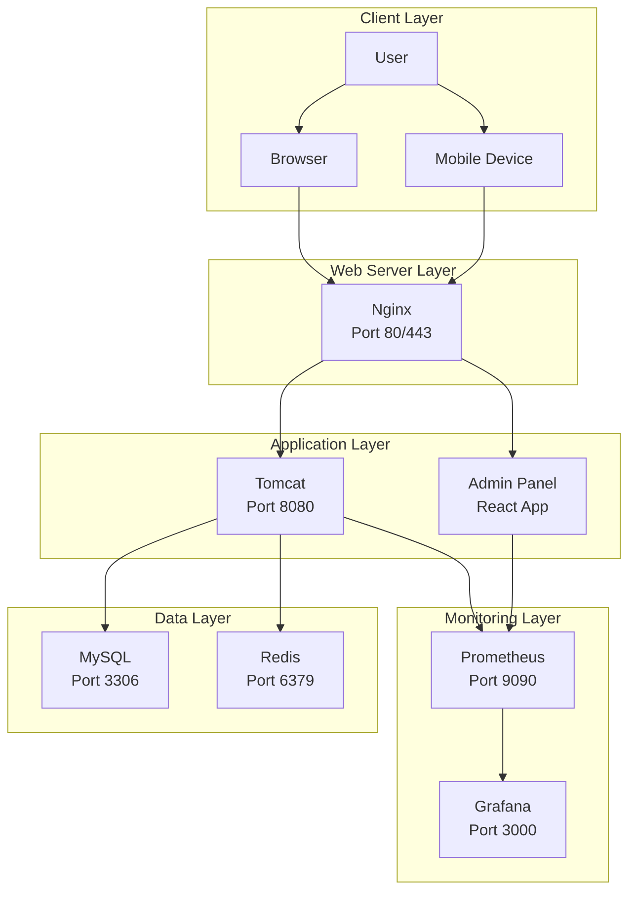

## Backend Architecture

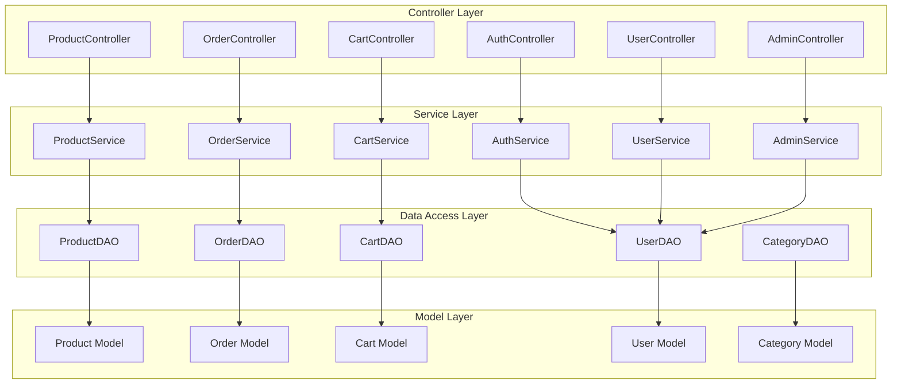

## Frontend Architecture

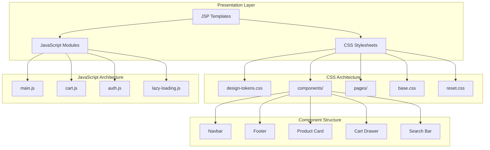

## Data Flow Architecture

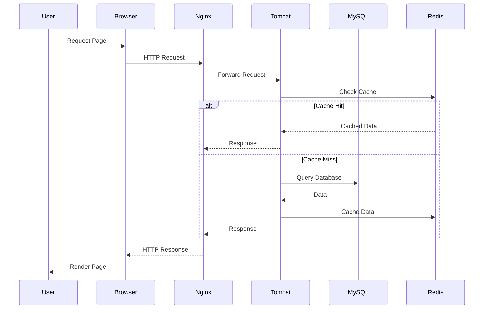

## Authentication Flow

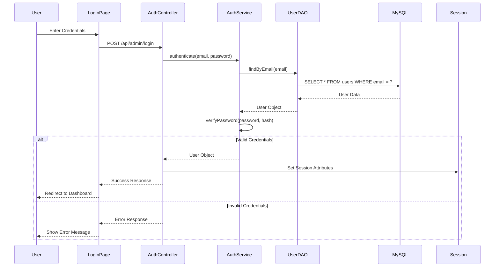

## Deployment Architecture

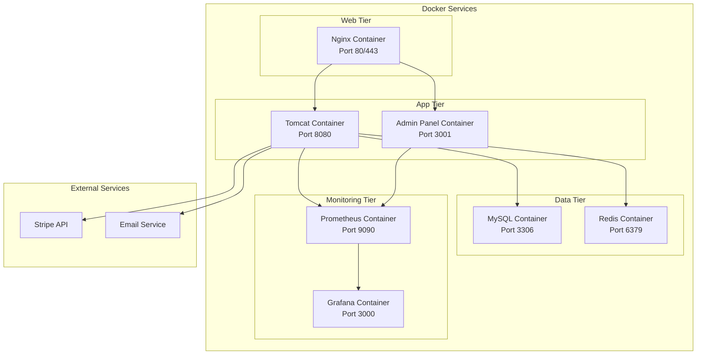

## Security Architecture

```mermaid
graph TB
    subgraph "Security Layers"
        subgraph "Network Layer"
            Firewall[Firewall]
            SSL[TLS/SSL]
        end

        subgraph "Application Layer"
            CSRF[CSRF Protection]
            RateLimit[Rate Limiting]
            AuthFilter[Authentication Filter]
            SecurityFilter[Security Filter]
        end

        subgraph "Data Layer"
            PasswordHash[Password Hashing]
            Encryption[Data Encryption]
            SQLInjection[SQL Injection Prevention]
        end
    end

    Firewall --> SSL
    SSL --> CSRF
    CSRF --> RateLimit
    RateLimit --> AuthFilter
    AuthFilter --> SecurityFilter
    SecurityFilter --> PasswordHash
    PasswordHash --> Encryption
    Encryption --> SQLInjection
```

## Testing Architecture

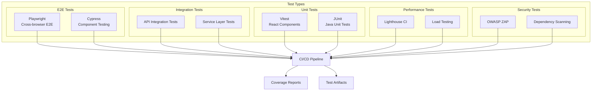

## CI/CD Pipeline

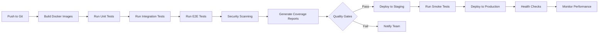

## Component Interaction Diagram

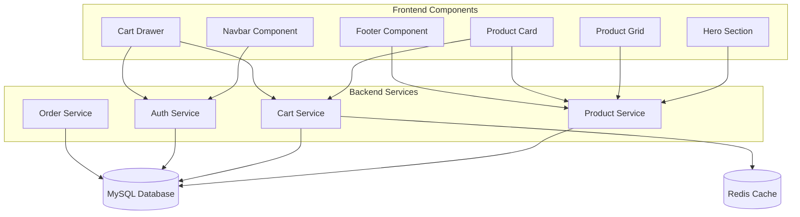

## Database Schema

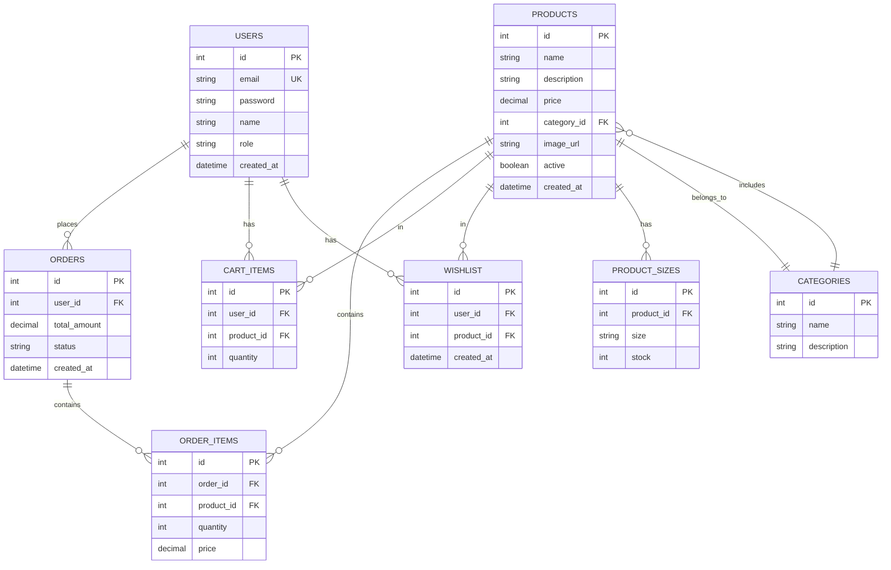

## API Endpoint Structure

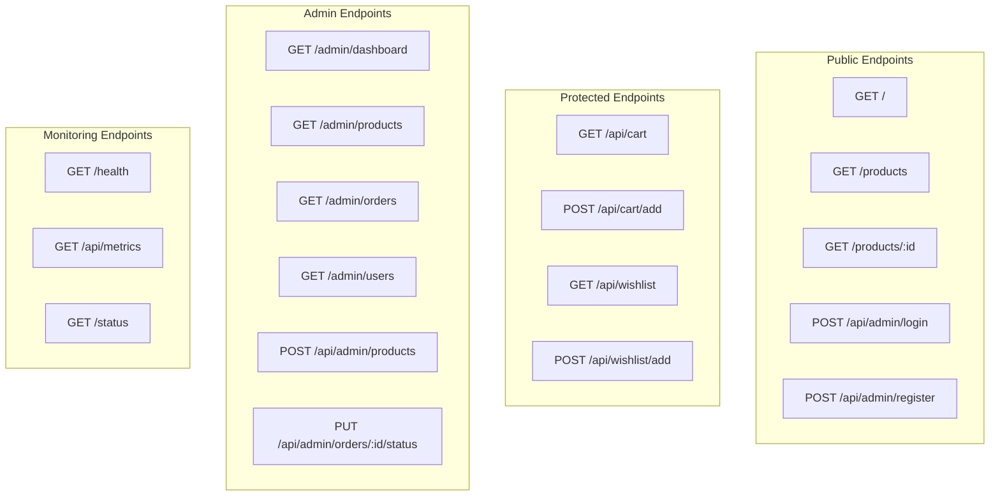

## Design System Architecture

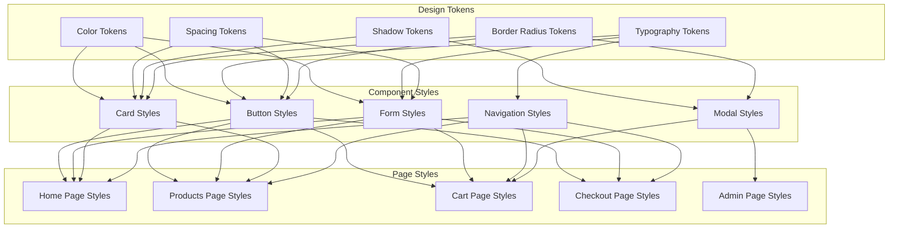

## Responsive Design Breakpoints

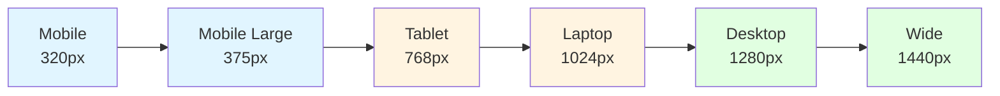

## Cache Architecture

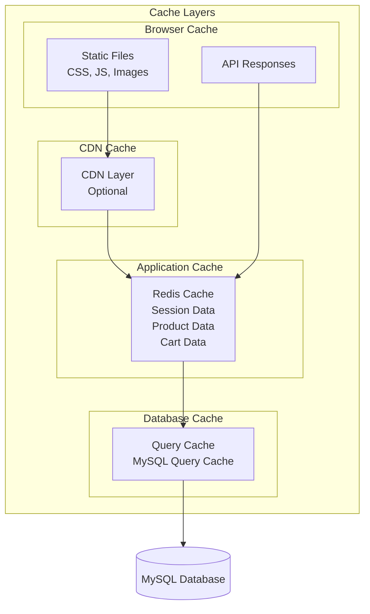

## Error Handling Architecture

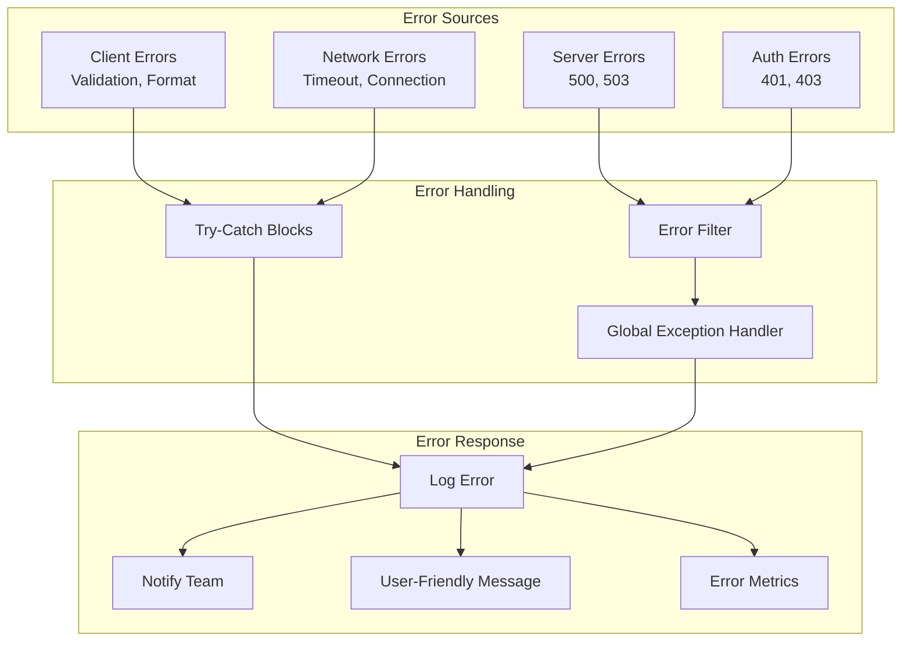

## Monitoring Architecture

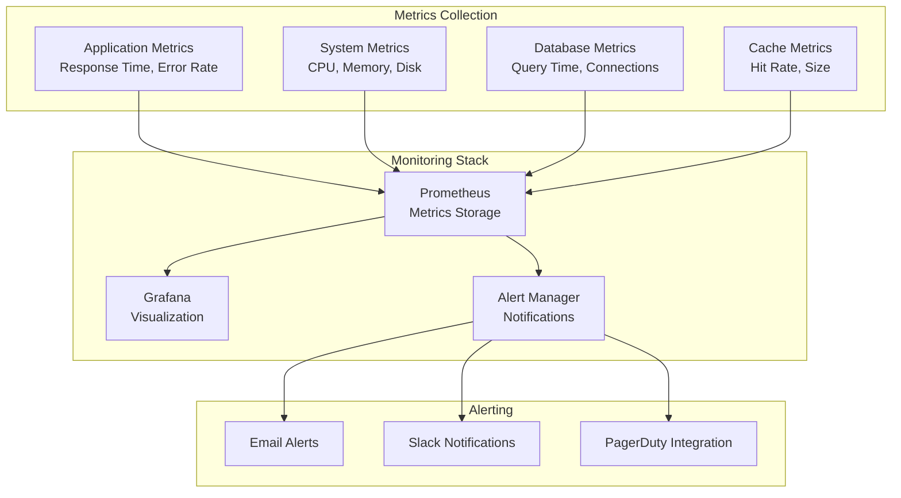

## File Upload Flow

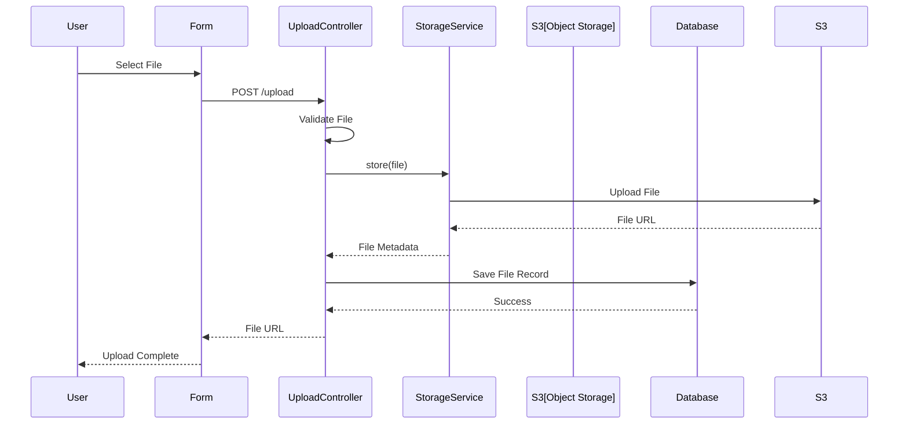

## Search Architecture

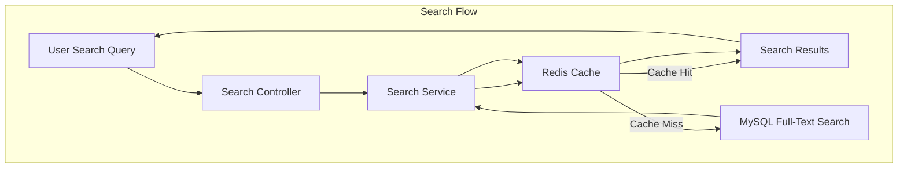

## Payment Flow

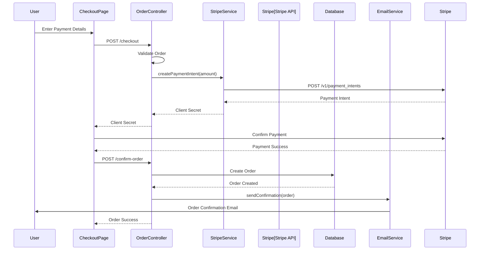

## Session Management

```mermaid
graph TB
    subgraph "Session Lifecycle"
        Create[Create Session<br/>Login]
        Validate[Validate Session<br/>Each Request]
        Refresh[Refresh Session<br/>Activity]
        Invalidate[Invalidate Session<br/>Logout/Timeout]
    end

    subgraph "Session Storage"
        HttpSession[HttpSession<br/>Server-Side]
        RedisSession[Redis Session<br/>Distributed]
        Cookie[Session Cookie<br/>Client-Side]
    end

    Create --> HttpSession
    Create --> RedisSession
    Create --> Cookie

    HttpSession --> Validate
    RedisSession --> Validate
    Cookie --> Validate

    Validate -->|Valid| Refresh
    Validate -->|Invalid| Invalidate

    Refresh --> HttpSession
    Invalidate --> HttpSession
    Invalidate --> RedisSession
    Invalidate --> Cookie
```

## Technology Stack Summary

```mermaid
mindmap
    root((FashionStore))
        Frontend
            HTML5
            CSS3
            JavaScript ES6+
            JSP Templates
            React Admin Panel
        Backend
            Java 17
            Spring Framework
            Tomcat
            Jakarta EE
            Maven
        Database
            MySQL 8.0
            Redis 7.0
            JDBC
        Infrastructure
            Docker
            Docker Compose
            Nginx
        Monitoring
            Prometheus
            Grafana
        Testing
            Playwright
            Cypress
            Vitest
            JUnit
        Security
            CSRF Protection
            Rate Limiting
            Password Hashing
            SSL/TLS
```

## Deployment Environments

```mermaid
graph TB
    subgraph "Development"
        DevLocal[Local Development<br/>Docker Compose]
        DevDatabase[Local Database<br/>MySQL]
        DevCache[Local Cache<br/>Redis]
    end

    subgraph "Staging"
        StageServer[Staging Server<br/>Docker Swarm]
        StageDatabase[Staging Database<br/>MySQL]
        StageCache[Staging Cache<br/>Redis]
        StageMonitoring[Staging Monitoring<br/>Prometheus/Grafana]
    end

    subgraph "Production"
        ProdServer[Production Server<br/>Kubernetes/Docker]
        ProdDatabase[Production Database<br/>MySQL Cluster]
        ProdCache[Production Cache<br/>Redis Cluster]
        ProdMonitoring[Production Monitoring<br/>Prometheus/Grafana]
        ProdCDN[CDN<br/>CloudFlare]
    end

    DevLocal --> DevDatabase
    DevLocal --> DevCache

    StageServer --> StageDatabase
    StageServer --> StageCache
    StageServer --> StageMonitoring

    ProdServer --> ProdDatabase
    ProdServer --> ProdCache
    ProdServer --> ProdMonitoring
    ProdServer --> ProdCDN
```

---

**Note**: This architecture diagram provides a comprehensive view of the FashionStore system architecture. All diagrams use Mermaid syntax and can be rendered in any Markdown viewer that supports Mermaid.
