# FashionStore - Visual Architecture Diagrams

## Document Information
- **Project**: FashionStore E-commerce Platform
- **Document Type**: Visual Architecture Diagrams
- **Version**: 1.0
- **Date**: May 15, 2026
- **Author**: Architecture Team
- **Status**: Production-Ready

---

## 1. System Architecture Overview

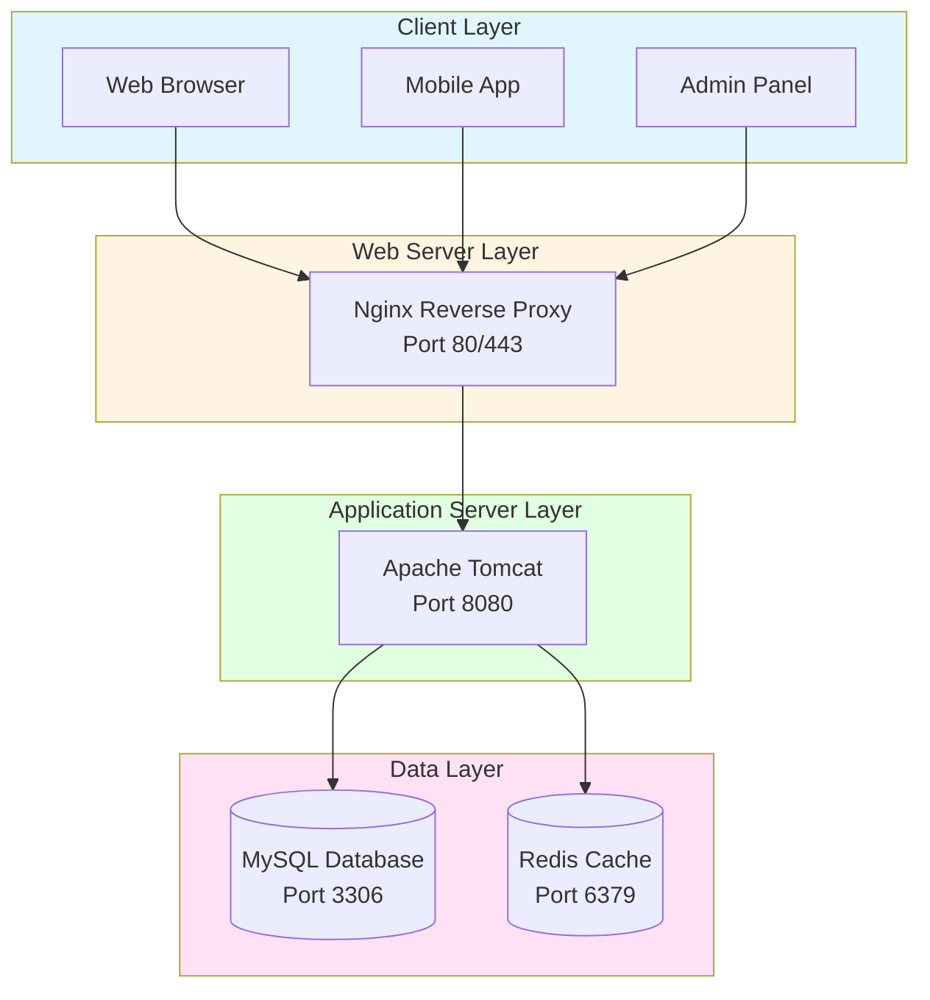

---

## 2. Layered Architecture

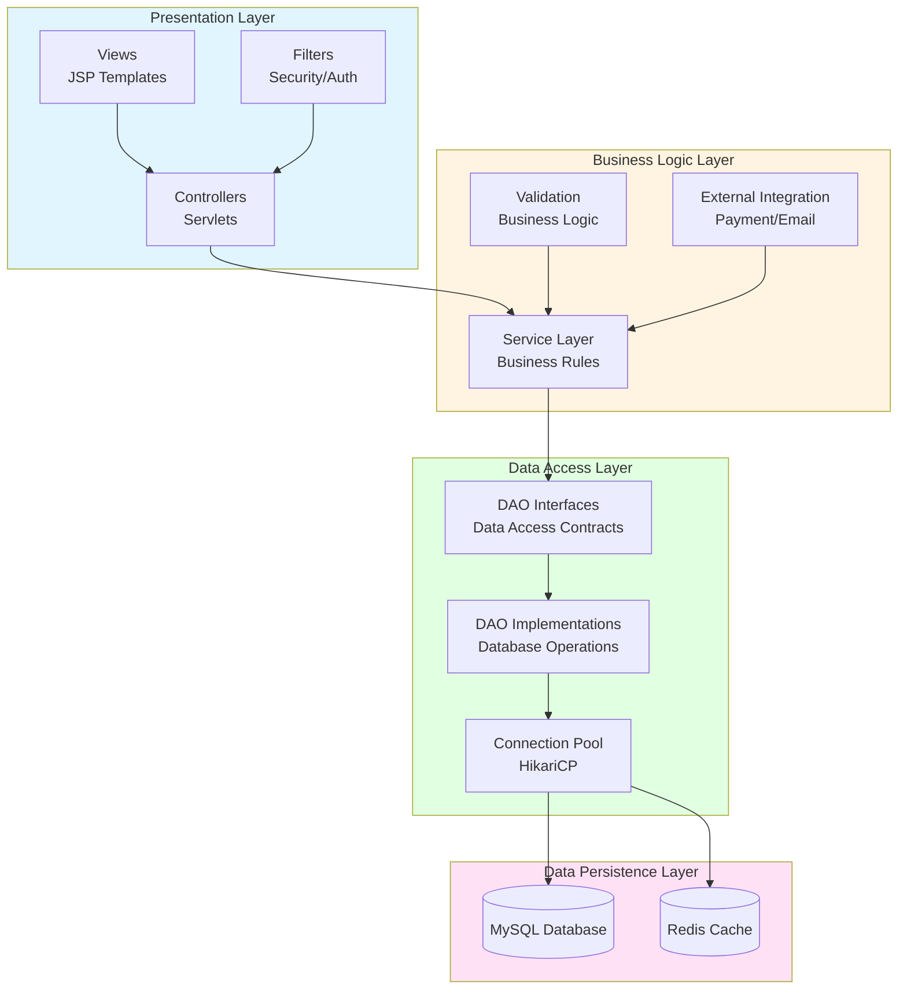

---

## 3. MVC Pattern Architecture

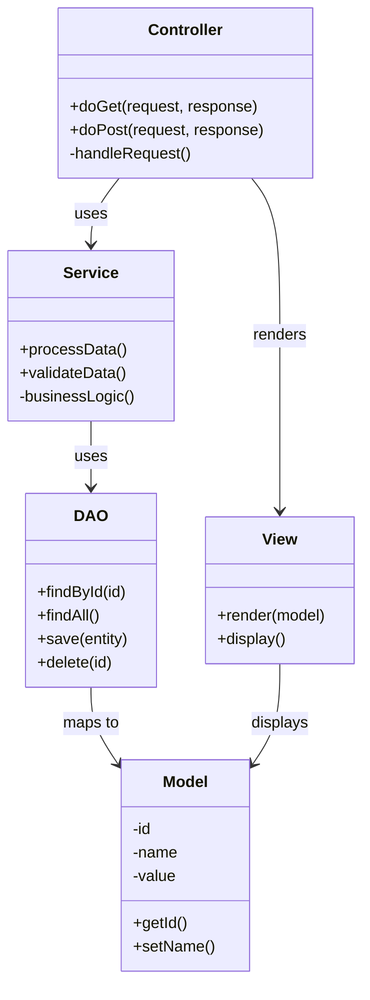

---

## 4. Database Schema Design

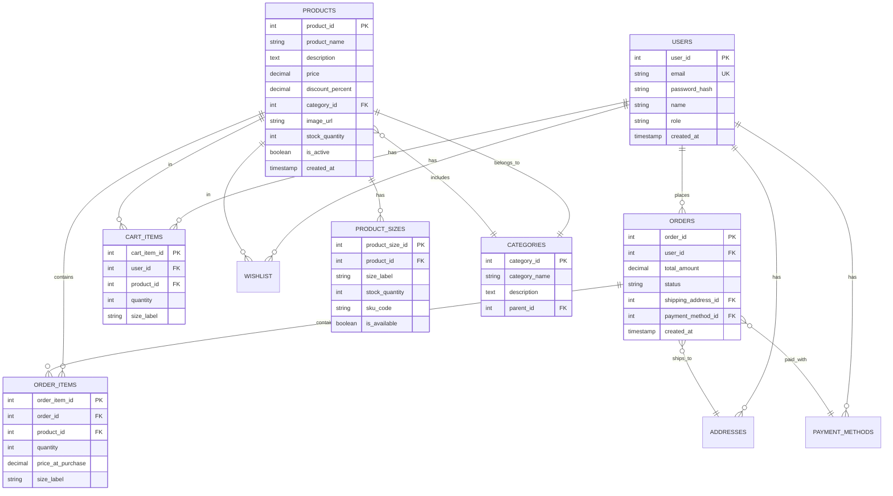

---

## 5. Authentication Flow

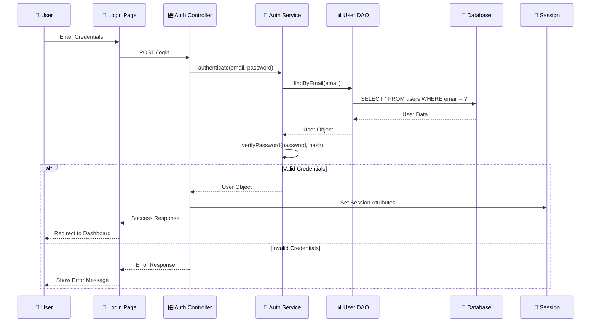

---

## 6. Product Purchase Flow

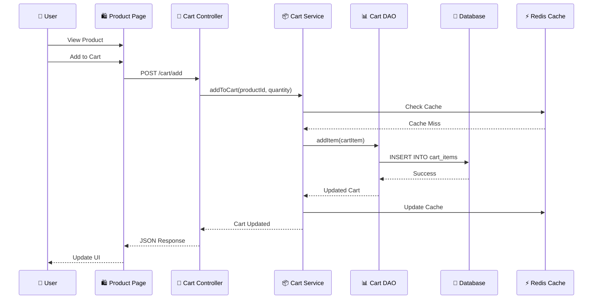

---

## 7. Deployment Architecture

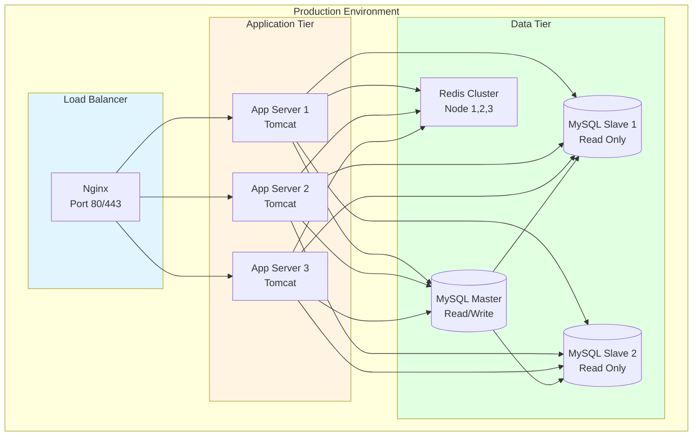

---

## 8. Security Architecture

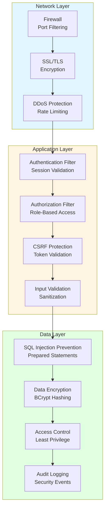

---

## 9. Data Flow Architecture

```mermaid
graph LR
    A[User Request] --> B[Filter Chain]
    B --> C[Controller]
    C --> D[Service Layer]
    D --> E[Cache Check]
    E -->|Cache Hit| F[Return Data]
    E -->|Cache Miss| G[DAO Layer]
    G --> H[Database Query]
    H --> I[Result Mapping]
    I --> J[Cache Update]
    J --> K[Service Processing]
    K --> L[View Rendering]
    L --> M[HTTP Response]
    M --> N[User Browser]
    
    style A fill:#ff6b6b
    style B fill:#feca57
    style C fill:#48dbfb
    style D fill:#ff9ff3
    style E fill:#54a0ff
    style F fill:#5f27cd
    style G fill:#00d2d3
    style H fill:#1dd1a1
    style I fill:#ff6b6b
    style J fill:#feca57
    style K fill:#48dbfb
    style L fill:#ff9ff3
    style M fill:#54a0ff
    style N fill:#5f27cd
```

---

## 10. Technology Stack

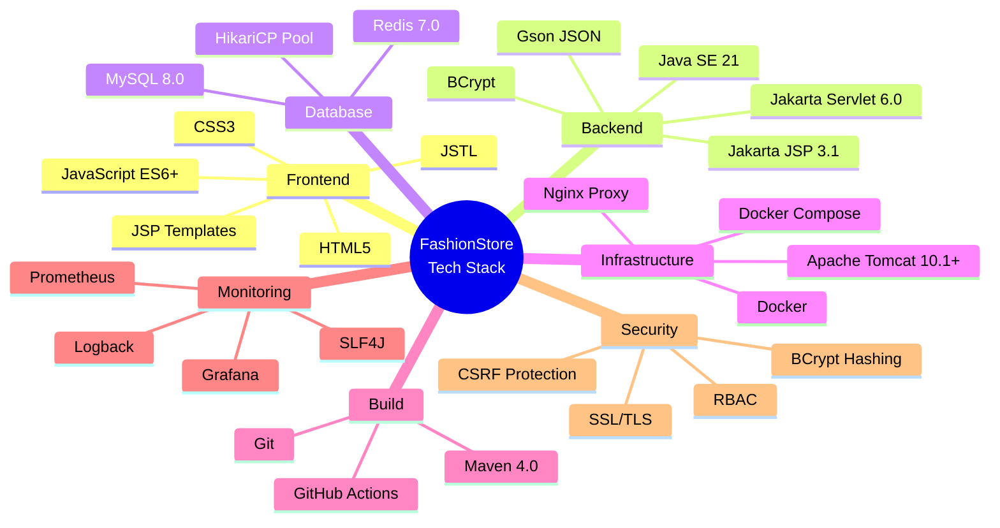

---

## 11. Design Patterns

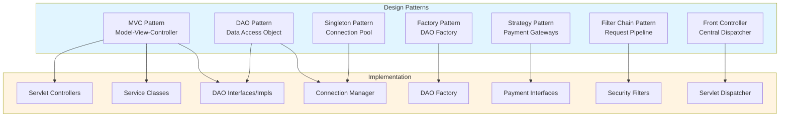

---

## 12. Package Structure

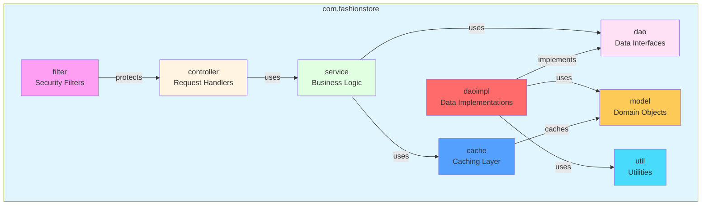

---

## 13. API Architecture

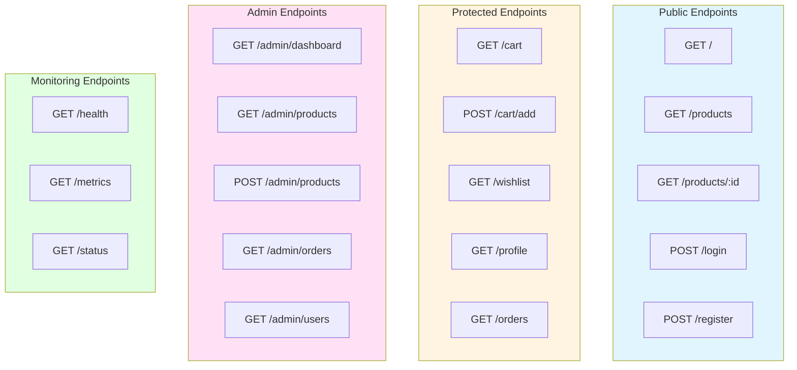

---

## 14. Caching Architecture

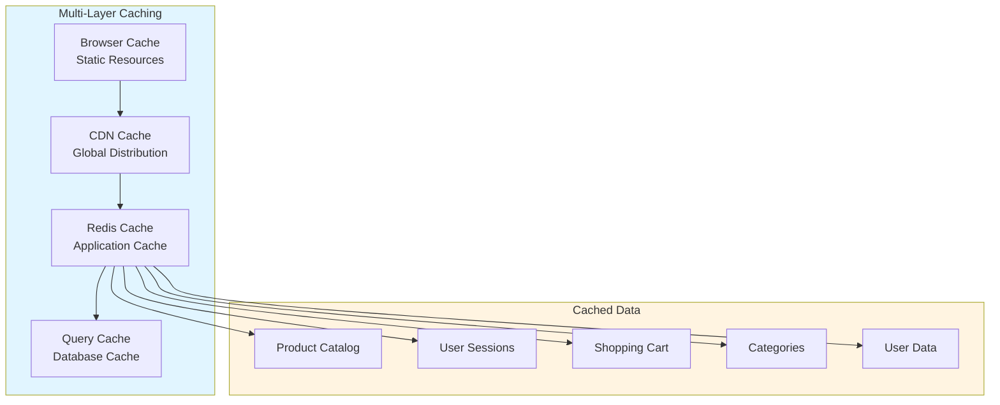

---

## 15. Error Handling Architecture

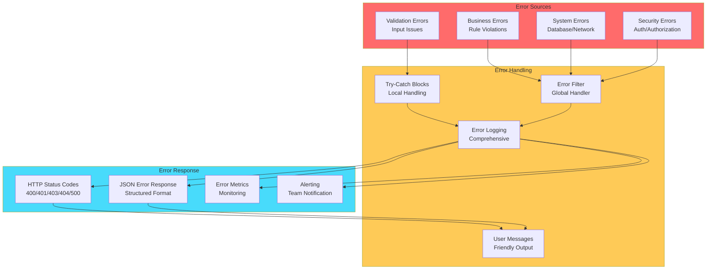

---

## 16. Conclusion

This document provides comprehensive visual architecture diagrams for the FashionStore e-commerce platform. All diagrams use Mermaid syntax and can be rendered in any Markdown viewer that supports Mermaid.

### Key Architectural Highlights:
- **Layered Architecture**: Clear separation of concerns
- **Design Patterns**: Industry-standard patterns (MVC, DAO, Singleton)
- **Security**: Multi-layer security approach
- **Scalability**: Stateless design for horizontal scaling
- **Performance**: Caching and connection pooling

---

**Document Status**: Complete  
**Last Updated**: May 15, 2026  
**Next Review**: June 15, 2026
