# FashionStore - System Architecture Documentation

## Table of Contents
1. [Executive Summary](#executive-summary)
2. [High-Level System Architecture](#high-level-system-architecture)
3. [Multi-Frontend Architecture](#multi-frontend-architecture)
4. [Shared Backend Architecture](#shared-backend-architecture)
5. [Docker Runtime Architecture](#docker-runtime-architecture)
6. [Deployment Architecture](#deployment-architecture)
7. [Request Flow Architecture](#request-flow-architecture)
8. [API Communication Architecture](#api-communication-architecture)
9. [Authentication Architecture](#authentication-architecture)
10. [Session Management Architecture](#session-management-architecture)
11. [Caching Architecture](#caching-architecture)
12. [Security Architecture](#security-architecture)
13. [Performance Architecture](#performance-architecture)

---

## Executive Summary

FashionStore is a full-stack e-commerce platform built with a **multi-frontend architecture** serving both customer-facing and admin interfaces, backed by a **shared Java backend**. The system follows a **classic MVC pattern** for the customer storefront (JSP/Servlet) and a **modern SPA architecture** for the admin dashboard (React/Vite), both communicating with a unified RESTful API layer.

**Key Architectural Principles:**
- **Separation of Concerns**: Clear boundaries between customer frontend, admin frontend, and backend services
- **Shared Backend**: Single Java backend serving both frontends through different API endpoints
- **Security-First**: Multi-layer security with filters, CSRF protection, and session management
- **Performance-Optimized**: Connection pooling, Redis caching, batch loading, and N+1 query prevention
- **Scalability**: Docker containerization, environment-based configuration, and horizontal scaling readiness
- **Maintainability**: Clean architecture with DAO/Service/Controller separation and comprehensive logging

---

## High-Level System Architecture

### System Overview Diagram

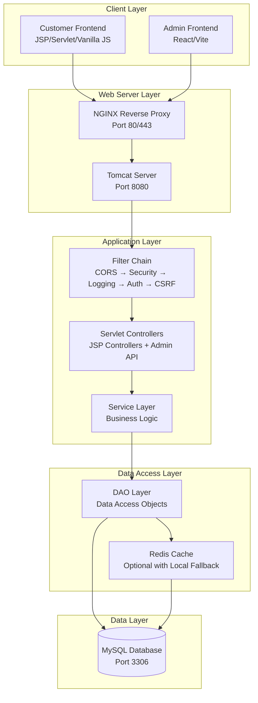

### Architecture Layers

**1. Presentation Layer**
- **Customer Frontend**: JSP templates with Vanilla JavaScript, CSS3
- **Admin Frontend**: React 18 with Vite, TailwindCSS, Lucide Icons
- **Routing**: Customer uses servlet-based routing, Admin uses React Router

**2. Application Layer**
- **Servlet Container**: Tomcat 10.1 (Java 21, Docker)
- **Filter Chain**: CORS → Security Headers → Request Logging → Authentication → CSRF
- **Controllers**: Servlet controllers for JSP views, AdminApiController for React
- **Service Layer**: Business logic separation (ProductService, UserService, etc.)

**3. Data Access Layer**
- **DAO Pattern**: Interface-based DAO implementations
- **Connection Pooling**: HikariCP for high-performance JDBC connections
- **Batch Loading**: N+1 query prevention with batch size loading
- **Cache Service**: Redis with local in-memory fallback

**4. Data Layer**
- **Database**: MySQL 8.0 with InnoDB engine
- **Schema**: Normalized schema with foreign key constraints
- **Indexes**: Strategic indexing for performance optimization

---

## Multi-Frontend Architecture

### Frontend Architecture Diagram

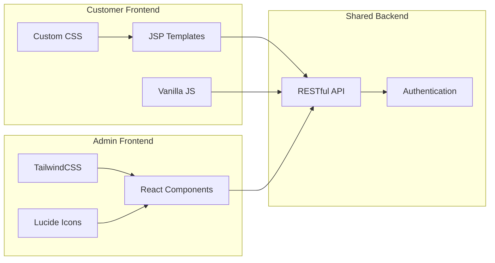

### Customer Frontend (JSP/Servlet)

**Technology Stack:**
- **View Layer**: JSP 3.1 with JSTL 2.0
- **Styling**: Custom CSS with design tokens, luxury design system
- **Scripting**: Vanilla JavaScript (ES6+)
- **Routing**: Servlet-based URL mapping (@WebServlet)

**Architecture Pattern:**
- **Model-View-Controller (MVC)**: Classic servlet-based MVC
- **Request Flow**: Servlet → Service → DAO → Database → JSP View
- **Session Management**: HTTP Session with JSESSIONID cookie
- **Form Handling**: POST requests with CSRF token validation

**Key Components:**
- **HomeServlet**: Homepage with featured products, categories, recommendations
- **ProductController**: Product listing, filtering, search
- **CartController**: Shopping cart management
- **CheckoutController**: Checkout flow and order placement
- **LoginController/RegisterController**: Authentication flows
- **ProfileController**: User profile management

### Admin Frontend (React/Vite)

**Technology Stack:**
- **Framework**: React 18.3.1 with Vite 5.4.10
- **Routing**: React Router DOM 6.27.0
- **Styling**: TailwindCSS 3.4.14 with custom luxury design system
- **Icons**: Lucide React 0.456.0
- **Charts**: Recharts 2.13.3
- **HTTP Client**: Axios 1.7.7

**Architecture Pattern:**
- **Single Page Application (SPA)**: Client-side routing
- **Component-Based Architecture**: Reusable React components
- **API Integration**: RESTful API with session-based authentication
- **State Management**: React Context API for global state
- **Protected Routes**: ProtectedRoute component for authentication

**Key Components:**
- **AdminLayout**: Main layout with sidebar and topbar
- **Sidebar**: Navigation with luxury glassmorphism effects
- **Dashboard**: Analytics dashboard with charts and stats
- **Products**: Product CRUD operations
- **Orders**: Order management and status updates
- **Users**: User management and role assignments
- **Inventory**: Stock management and low-stock alerts
- **Categories/Coupons**: Category and coupon management

### Frontend Communication Architecture

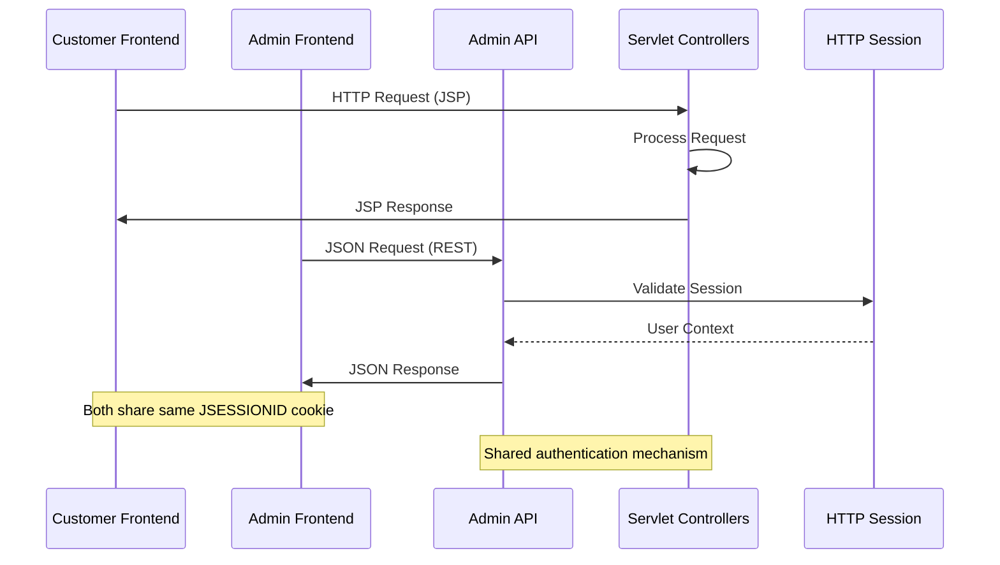

---

## Shared Backend Architecture

### Backend Architecture Diagram

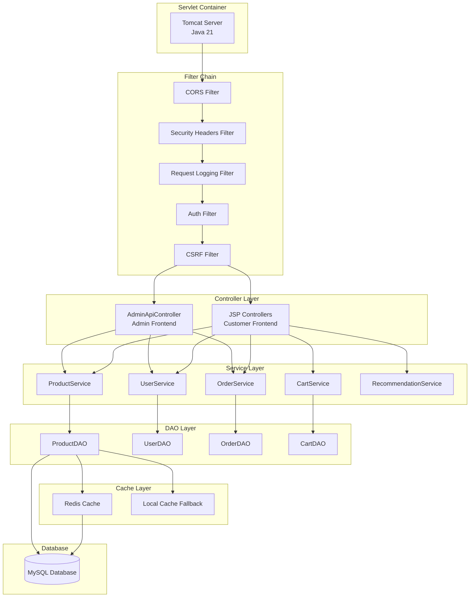

### Controller Layer

**JSP Controllers (Customer Frontend)**
- `HomeServlet`: Homepage with featured products and recommendations
- `ProductController`: Product listing, filtering, search, details
- `CartController`: Add to cart, update quantity, remove items
- `CheckoutController`: Checkout flow, order placement
- `LoginController/RegisterController`: User authentication
- `ProfileController`: User profile management
- `OrderController`: Order history and details
- `WishlistController`: Wishlist management
- `SearchController/SearchSuggestionsController`: Search functionality
- `PaymentController`: Payment processing with Stripe
- `AddressController`: Address management
- `ReviewController`: Product reviews

**Admin API Controller (Admin Frontend)**
- `AdminApiController`: Unified REST API for React admin
  - `/api/admin/me`: Current user info
  - `/api/admin/login`: Admin authentication
  - `/api/admin/logout`: Session invalidation
  - `/api/admin/register`: Admin registration (with secret key)
  - `/api/admin/dashboard`: Dashboard data
  - `/api/admin/stats`: Statistics
  - `/api/admin/orders`: Order management
  - `/api/admin/products`: Product CRUD
  - `/api/admin/users`: User management
  - `/api/admin/inventory`: Inventory management
  - `/api/admin/categories`: Category management
  - `/api/admin/coupons`: Coupon management

### Service Layer

**Service Classes:**
- `ProductService`: Product business logic, filtering, recommendations
- `UserService`: User authentication, registration, profile management
- `OrderService`: Order processing, status updates
- `CartService`: Cart operations, calculations
- `RecommendationService`: Product recommendations, trending products
- `CategoryService`: Category management, active categories
- `CouponService`: Coupon validation, application

**Service Layer Responsibilities:**
- Business logic encapsulation
- Transaction management
- Data transformation
- Cache coordination
- Cross-cutting concerns (logging, validation)

### DAO Layer

**DAO Pattern Implementation:**
- Interface-based DAO contracts
- Implementation classes in `daoimpl` package
- Connection management via HikariCP
- Batch loading for N+1 prevention
- Cache integration

**Key DAOs:**
- `ProductDAO`: Product CRUD, filtering, search
- `UserDAO`: User operations, authentication
- `OrderDAO`: Order management, statistics
- `CartDAO`: Cart operations
- `CategoryDAO`: Category management
- `CouponDAO`: Coupon operations
- `ProductSizeDAO`: Product size management
- `OrderItemDAO`: Order item operations
- `AddressDAO`: Address management
- `ReviewDAO`: Review operations

---

## Docker Runtime Architecture

### Docker Compose Architecture

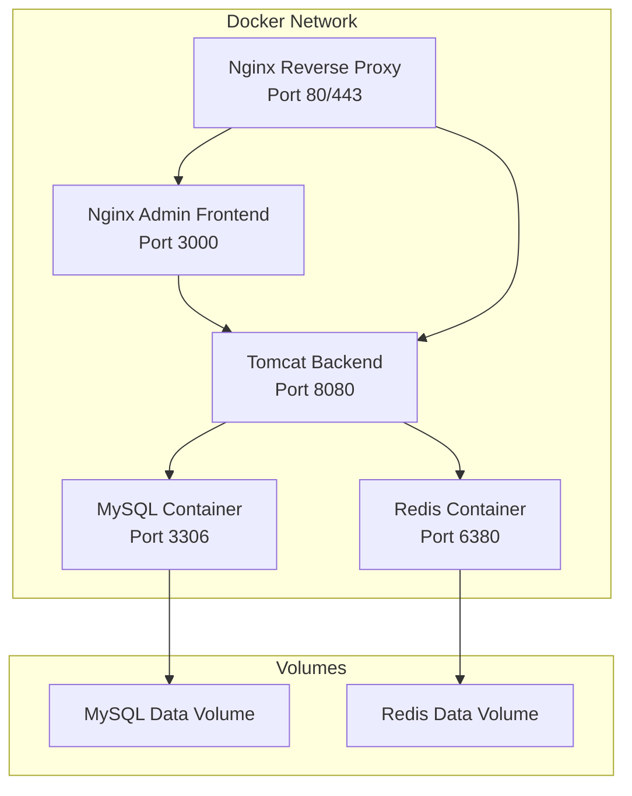

### Docker Services Configuration

**1. MySQL Service**
```yaml
mysql:
  image: mysql:8.0
  container_name: fashionstore-mysql
  restart: unless-stopped
  environment:
    MYSQL_ROOT_PASSWORD: ${MYSQL_ROOT_PASSWORD}
    MYSQL_DATABASE: fashionstore
    MYSQL_USER: fashionstore
    MYSQL_PASSWORD: ${MYSQL_PASSWORD}
  ports:
    - "3306:3306"
  volumes:
    - mysql-data:/var/lib/mysql
    - ./schema.sql:/docker-entrypoint-initdb.d/schema.sql:ro
  networks:
    - fashionstore-network
  healthcheck:
    test: ["CMD", "mysqladmin", "ping", "-h", "localhost"]
    interval: 10s
    timeout: 5s
    retries: 5
```

**2. Redis Service**
```yaml
redis:
  image: redis:7-alpine
  container_name: fashionstore-redis
  restart: unless-stopped
  ports:
    - "6380:6379"
  volumes:
    - redis-data:/data
  networks:
    - fashionstore-network
  healthcheck:
    test: ["CMD", "redis-cli", "ping"]
    interval: 10s
    timeout: 5s
    retries: 5
  command: redis-server --appendonly yes
```

**3. Backend Service**
```yaml
backend:
  build:
    context: .
    dockerfile: Dockerfile
  container_name: fashionstore-backend
  restart: unless-stopped
  environment:
    DB_HOST: mysql
    DB_PORT: 3306
    DB_NAME: fashionstore
    DB_USER: root
    DB_PASSWORD: ${DB_PASSWORD}
    REDIS_HOST: redis
    REDIS_PORT: 6379
    CSRF_ENABLED: true
    RATE_LIMIT_ENABLED: true
    ENV: production
  ports:
    - "8080:8080"
  networks:
    - fashionstore-network
  healthcheck:
    test: ["CMD", "curl", "-f", "http://localhost:8080/home"]
    interval: 30s
    timeout: 10s
    retries: 3
```

**4. Admin Frontend Service**
```yaml
admin-frontend:
  build:
    context: ./fashionstore-admin
    dockerfile: Dockerfile
  container_name: fashionstore-admin-frontend
  restart: unless-stopped
  ports:
    - "3000:80"
  networks:
    - fashionstore-network
  depends_on:
    - backend
```

**5. Nginx Reverse Proxy**
```yaml
nginx:
  image: nginx:alpine
  container_name: fashionstore-nginx
  restart: unless-stopped
  ports:
    - "80:80"
    - "443:443"
  volumes:
    - ./nginx/nginx.conf:/etc/nginx/nginx.conf:ro
    - ./nginx/ssl:/etc/nginx/ssl:ro
  depends_on:
    - backend
    - admin-frontend
  networks:
    - fashionstore-network
  healthcheck:
    test: ["CMD", "wget", "--quiet", "--tries=1", "--spider", "http://localhost/health"]
    interval: 30s
    timeout: 10s
    retries: 3
```

### Docker Network Architecture

**Network Configuration:**
- **Network Name**: `fashionstore-network`
- **Driver**: Bridge
- **Isolation**: Services communicate within the network
- **External Access**: Exposed ports for MySQL, Redis, Backend, Admin

**Service Communication:**
- Backend connects to MySQL via Docker network (mysql service)
- Backend connects to Redis via Docker network (redis service)
- Admin frontend proxies API calls to backend
- Nginx routes traffic to backend and admin frontend

---

## Deployment Architecture

### Deployment Flow Diagram

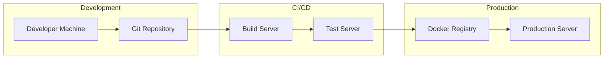

### Development Deployment

**Backend Development:**
```bash
# Using Docker Compose
cd /Users/pc/eclipse-workspace/FashionStore
docker compose up -d backend
# Backend runs on http://localhost:8080
```

**Admin Frontend Development:**
```bash
# Using Vite Dev Server
cd /Users/pc/eclipse-workspace/FashionStore/fashionstore-admin
npm run dev
# Admin frontend runs on http://localhost:5173
```

**Database Setup:**
```bash
# Using Docker Compose
cd /Users/pc/eclipse-workspace/FashionStore
docker compose up mysql redis -d
# MySQL on port 3306, Redis on port 6380
```

### Production Deployment

**Docker Compose Deployment:**
```bash
# Build and deploy all services
cd /Users/pc/eclipse-workspace/FashionStore
mvn clean package -DskipTests
docker compose up -d --build
```

**Environment Variables:**
- `MYSQL_ROOT_PASSWORD`: MySQL root password
- `MYSQL_PASSWORD`: MySQL user password
- `DB_PASSWORD`: Backend database password
- `FASHIONSTORE_ADMIN_KEY`: Admin registration secret key
- `FASHIONSTORE_PROFILE`: Environment profile (dev/prod)

### Deployment Architecture

**Production Stack:**
- **Web Server**: Nginx (SSL termination, reverse proxy)
- **Application Server**: Tomcat 10.1 (Java 21)
- **Database**: MySQL 8.0 (InnoDB, UTF8MB4)
- **Cache**: Redis 7 (persistent with AOF)
- **Containerization**: Docker Compose
- **SSL**: Let's Encrypt (via Nginx)

**Load Balancing (Future):**
- Horizontal scaling of backend containers
- Nginx load balancing
- Redis session clustering
- Database read replicas

---

## Request Flow Architecture

### Customer Request Flow

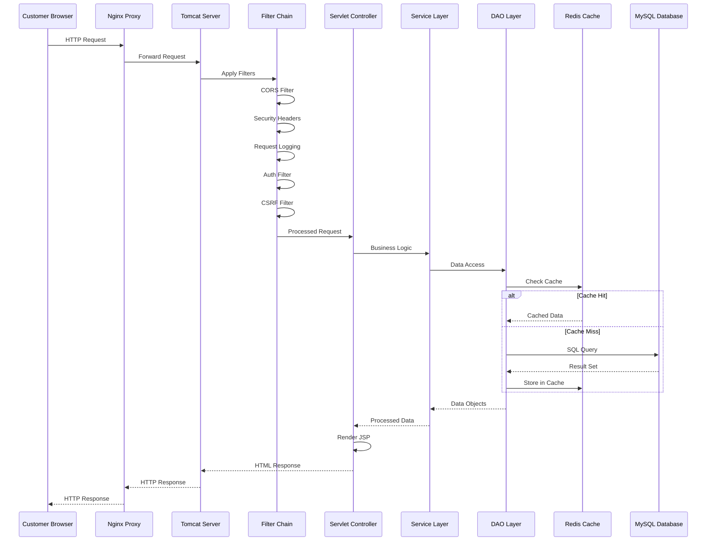

### Admin Request Flow

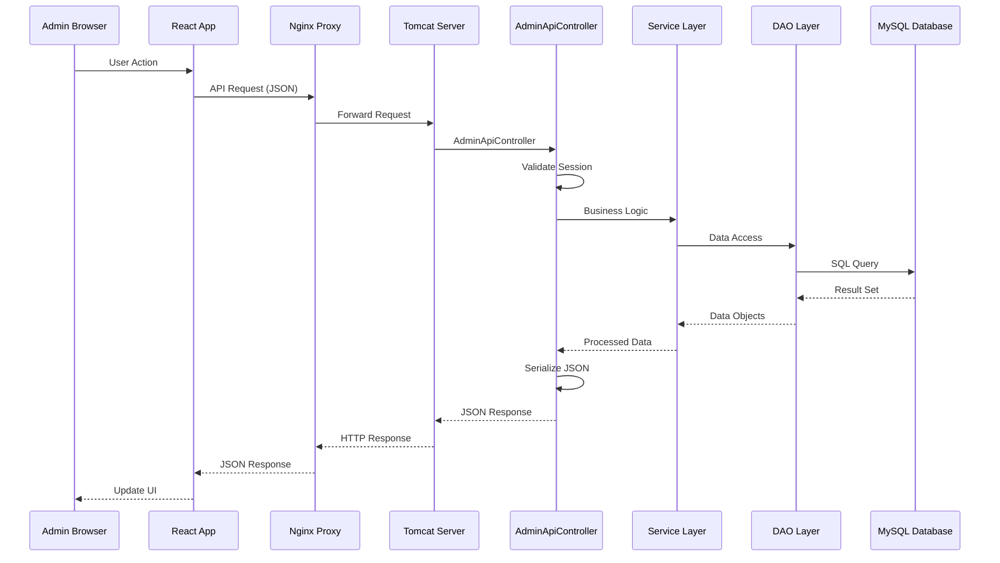

---

## API Communication Architecture

### API Architecture Diagram

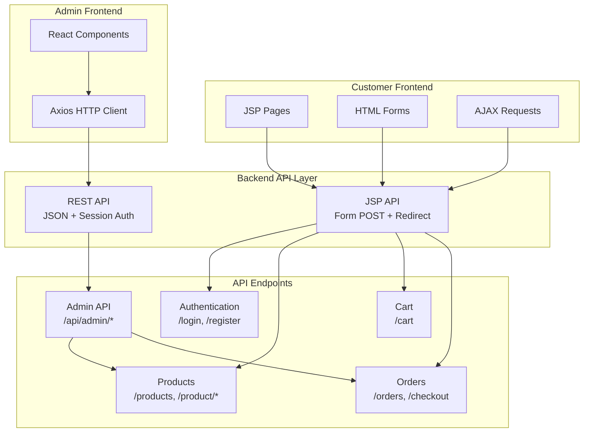

### API Endpoint Categories

**1. Customer-Facing APIs (JSP/Servlet)**
- **Authentication**: `/login`, `/register`, `/logout`, `/forgot-password`, `/reset-password`
- **Products**: `/home`, `/products`, `/product`, `/search`, `/search/suggestions`
- **Cart**: `/cart` (GET, POST, PUT, DELETE)
- **Checkout**: `/checkout`, `/payment`, `/success`, `/payment-failure`
- **Orders**: `/orders`, `/order/*`
- **Profile**: `/profile`, `/account/*`
- **Wishlist**: `/wishlist`
- **Reviews**: `/review`

**2. Admin APIs (RESTful JSON)**
- **Authentication**: `/api/admin/login`, `/api/admin/logout`, `/api/admin/me`, `/api/admin/register`
- **Dashboard**: `/api/admin/dashboard`, `/api/admin/stats`
- **Orders**: `/api/admin/orders`, `/api/admin/orders/*`, `/api/admin/orders/recent`
- **Products**: `/api/admin/products`, `/api/admin/products/*`
- **Users**: `/api/admin/users`, `/api/admin/users/*`, `/api/admin/users/recent`
- **Inventory**: `/api/admin/inventory`, `/api/admin/inventory/low-stock`, `/api/admin/inventory/*/stock`
- **Categories**: `/api/admin/categories`, `/api/admin/categories/*`
- **Coupons**: `/api/admin/coupons`, `/api/admin/coupons/*`

### API Communication Patterns

**1. JSP Form Submission (Customer)**
```
POST /cart
Content-Type: application/x-www-form-urlencoded
CSRF-Token: header
JSESSIONID: cookie
→ Redirect to /cart
```

**2. AJAX Request (Customer)**
```
POST /search/suggestions
Content-Type: application/json
JSESSIONID: cookie
→ JSON Response
```

**3. REST API Call (Admin)**
```
GET /api/admin/products
Content-Type: application/json
JSESSIONID: cookie
→ JSON Response
```

---

## Authentication Architecture

### Authentication Flow Diagram

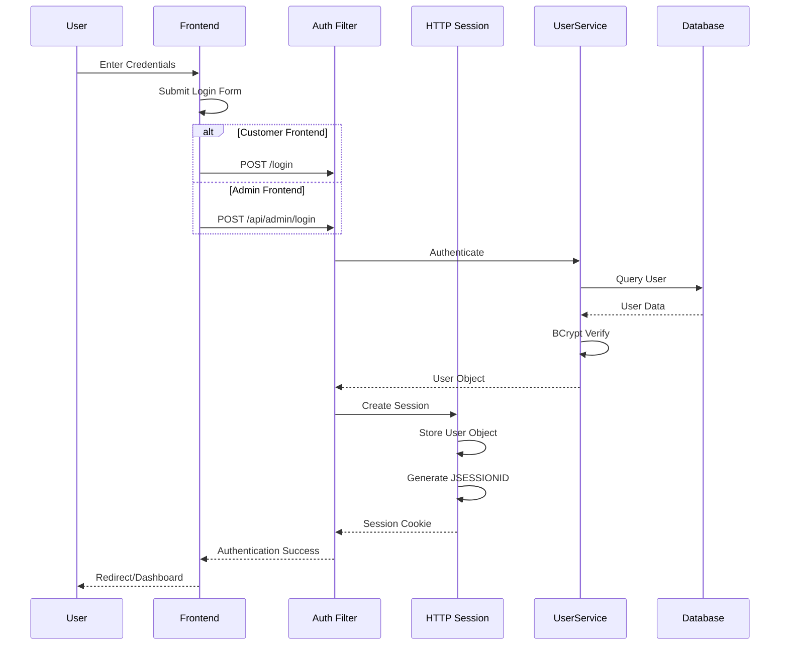

### Authentication Components

**1. AuthFilter**
- **Location**: `com.fashionstore.filter.AuthFilter`
- **Purpose**: Request authentication and authorization
- **Public Paths**: `/home`, `/products`, `/login`, `/register`, `/assets/*`, `/api/admin/login`, `/api/admin/register`
- **Protected Paths**: All other paths require authentication
- **Admin Protection**: `/admin/*` and `/api/admin/*` require admin role

**2. UserService**
- **Location**: `com.fashionstore.service.UserService`
- **Methods**:
  - `loginUser(email, password)`: Authenticate user
  - `registerUser(user)`: Register new user
  - `isEmailExists(email)`: Check email uniqueness
  - `updateUserRole(userId, role)`: Update user role

**3. Password Hashing**
- **Algorithm**: BCrypt (via jbcrypt library)
- **Cost Factor**: 10 (default)
- **Storage**: VARCHAR(255) in users table

### Session Management

**Session Configuration** (web.xml):
```xml
<session-config>
  <session-timeout>30</session-timeout>
  <cookie-config>
    <http-only>true</http-only>
  </cookie-config>
  <tracking-mode>COOKIE</tracking-mode>
</session-config>
```

**Session Attributes**:
- `user`: User object (primary)
- `userId`: Legacy user ID (backward compatibility)
- `role`: Legacy role (backward compatibility)
- `recentlyViewed`: List of recently viewed product IDs

---

## Session Management Architecture

### Session Lifecycle

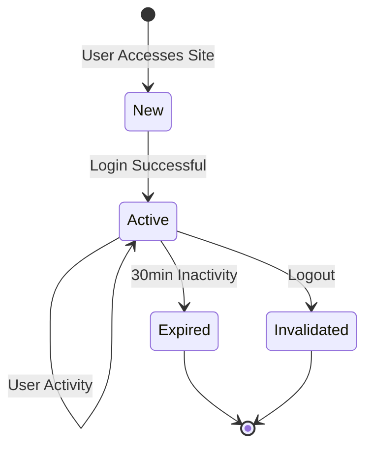

### Session Storage Architecture

**In-Memory Session Storage** (Tomcat Default):
- **Storage**: Tomcat session manager
- **Persistence**: None (volatile)
- **Clustering**: Not configured (single instance)
- **Session Timeout**: 30 minutes

**Session Attributes**:
```java
// Primary session attributes
session.setAttribute("user", user);           // User object
session.setAttribute("userId", user.getId());  // Legacy support
session.setAttribute("role", user.getRole());  // Legacy support

// Optional session attributes
session.setAttribute("recentlyViewed", productIds);
session.setAttribute("cartCount", cartCount);
session.setAttribute("wishlistCount", wishlistCount);
```

### Session Security

**Security Measures**:
1. **HttpOnly Cookie**: Prevents XSS access to session ID
2. **Secure Flag**: HTTPS only (production)
3. **Session Timeout**: 30 minutes inactivity
4. **Session Fixation Protection**: Regenerate session on login
5. **CSRF Protection**: Token validation for state-changing requests

---

## Caching Architecture

### Cache Architecture Diagram

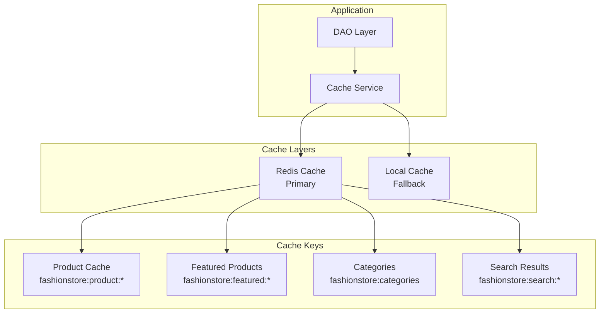

### Cache Service Implementation

**CacheService Class**:
- **Location**: `com.fashionstore.cache.CacheService`
- **Pattern**: Singleton with double-checked locking
- **Primary Cache**: Redis (Jedis client)
- **Fallback Cache**: ConcurrentHashMap (in-memory)
- **TTL Support**: Configurable time-to-live
- **Pattern Invalidation**: Wildcard pattern support

**Cache Configuration**:
```java
// Redis Configuration
REDIS_HOST = "localhost"
REDIS_PORT = 6379
REDIS_PASSWORD = ""
REDIS_ENABLED = true

// Pool Configuration
MaxTotal = 20
MaxIdle = 10
MinIdle = 5
TestOnBorrow = true
```

### Cache Strategies

**1. Product Caching**
- **Cache Key**: `fashionstore:product:{productId}`
- **TTL**: 1 hour
- **Invalidation**: On product update, stock change
- **Strategy**: Cache-aside pattern

**2. Featured Products Caching**
- **Cache Key**: `fashionstore:featured:{limit}`
- **TTL**: 30 minutes
- **Invalidation**: On product status change
- **Strategy**: Cache-aside pattern

**3. Category Caching**
- **Cache Key**: `fashionstore:categories`
- **TTL**: 1 hour
- **Invalidation**: On category update
- **Strategy**: Cache-aside pattern

**4. Search Results Caching**
- **Cache Key**: `fashionstore:search:{query_hash}`
- **TTL**: 15 minutes
- **Invalidation**: On product update
- **Strategy**: Cache-aside pattern

### Cache Invalidation

**Invalidation Triggers**:
- Product update/delete
- Stock quantity change
- Category update
- Coupon update
- Manual cache clear

**Invalidation Methods**:
```java
cacheService.remove(CacheKey.product(productId));
cacheService.invalidatePattern("fashionstore:products:*");
cacheService.invalidatePattern("fashionstore:featured:*");
cacheService.invalidatePattern("fashionstore:categories:*");
```

---

## Security Architecture

### Security Layers

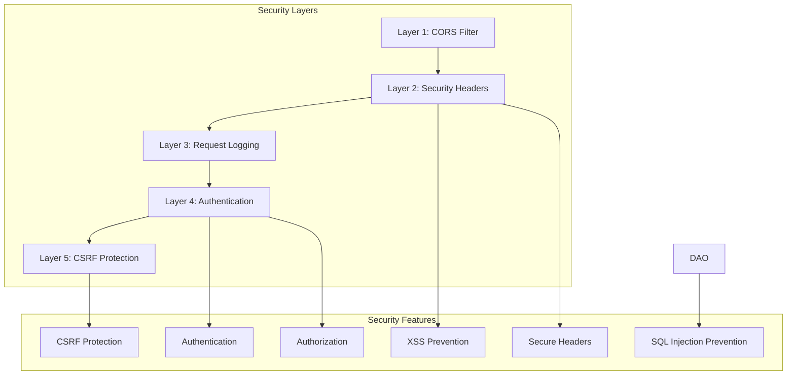

### Security Components

**1. CORS Filter**
- **Location**: `com.fashionstore.filter.CORSFilter`
- **Purpose**: Cross-origin resource sharing
- **Allowed Origins**: Configured for development/production
- **Allowed Methods**: GET, POST, PUT, DELETE, OPTIONS
- **Allowed Headers**: Content-Type, Authorization, X-Requested-With

**2. Security Headers Filter**
- **Location**: `com.fashionstore.filter.SecurityHeadersFilter`
- **Headers**:
  - `X-Content-Type-Options: nosniff`
  - `X-Frame-Options: DENY`
  - `X-XSS-Protection: 1; mode=block`
  - `Strict-Transport-Security: max-age=31536000`
  - `Content-Security-Policy`: Configured CSP

**3. CSRF Filter**
- **Location**: `com.fashionstore.filter.CSRFFilter`
- **Purpose**: Cross-site request forgery protection
- **Token Generation**: Per-session CSRF token
- **Validation**: Token validation for POST/PUT/DELETE
- **Exclusions**: Login, register, public APIs

**4. XSS Prevention**
- **Input Sanitization**: Apache Commons Text
- **Output Encoding**: JSTL EL auto-escaping
- **Content Security Policy**: Restrict script sources
- **HttpOnly Cookies**: Prevent cookie access via JavaScript

**5. SQL Injection Prevention**
- **Prepared Statements**: All queries use PreparedStatement
- **Parameterized Queries**: No string concatenation
- **Input Validation**: ValidationUtil for input sanitization
- **ORM-like Pattern**: DAO pattern with type-safe mappings

---

## Performance Architecture

### Performance Optimization Strategies

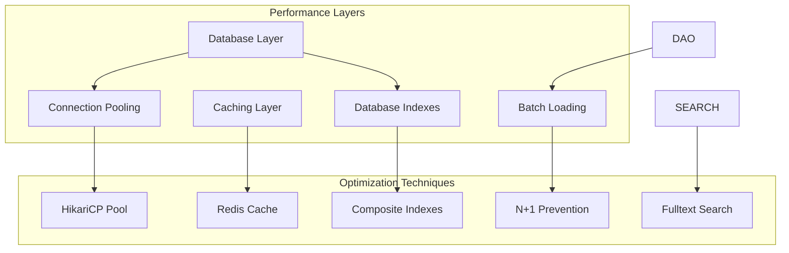

### Performance Components

**1. Connection Pooling (HikariCP)**
- **Configuration**:
  - Maximum Pool Size: 20 (prod) / 10 (dev)
  - Minimum Idle: 5 (prod) / 2 (dev)
  - Connection Timeout: 30s (prod) / 20s (dev)
  - Max Lifetime: 30 minutes
- **Optimizations**:
  - Prepared statement caching
  - Server-side prepared statements
  - Batch statement rewriting
  - Result set metadata caching

**2. N+1 Query Prevention**
- **Problem**: Loading sizes for each product individually
- **Solution**: Batch loading with IN clause
- **Implementation**:
  ```java
  // Collect all product IDs
  List<Integer> productIds = products.stream()
      .map(Product::getProductId)
      .distinct()
      .collect(Collectors.toList());
  
  // Single query for all sizes
  String sql = "SELECT * FROM product_sizes WHERE product_id IN (?)";
  ```

**3. Database Indexing**
- **Product Indexes**:
  - `idx_products_category_active_price` (category_id, active, price)
  - `idx_products_name` (product_name)
  - `idx_products_brand` (brand)
  - `idx_products_active_stock` (active, stock_quantity)
- **Fulltext Search**:
  - `idx_product_name_fulltext` (product_name)
  - `idx_product_description_fulltext` (description)
  - `idx_product_search` (product_name, description, brand)

**4. Caching Strategy**
- **Redis Cache**: Primary cache layer
- **Local Fallback**: In-memory ConcurrentHashMap
- **TTL Configuration**: Based on data volatility
- **Pattern Invalidation**: Wildcard-based cache clearing

**5. Batch Operations**
- **Batch Loading**: Load related data in single query
- **Batch Updates**: Multiple updates in single transaction
- **Batch Inserts**: Multiple inserts in single statement

---

## Conclusion

The FashionStore architecture demonstrates a well-designed, scalable, and maintainable e-commerce platform with:

- **Clear separation of concerns** between customer and admin frontends
- **Shared backend** serving both interfaces efficiently
- **Multi-layer security** with comprehensive protection mechanisms
- **Performance optimization** through caching, pooling, and batch operations
- **Docker-based deployment** for consistent environments
- **Enterprise-grade logging** and monitoring capabilities

This architecture supports the current requirements while providing a solid foundation for future enhancements such as horizontal scaling, microservices migration, and advanced analytics integration.
