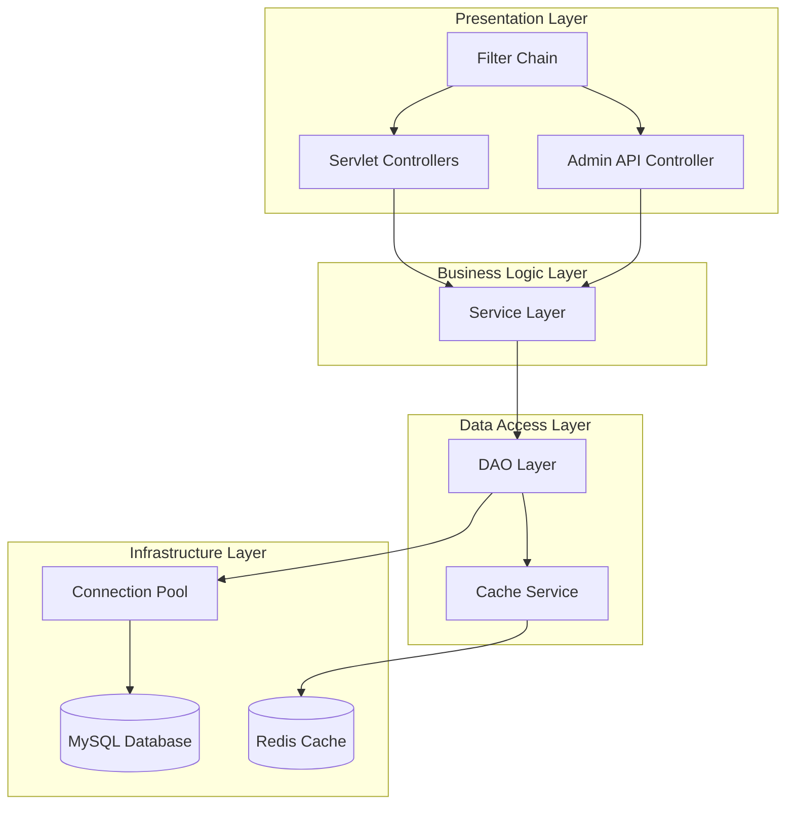
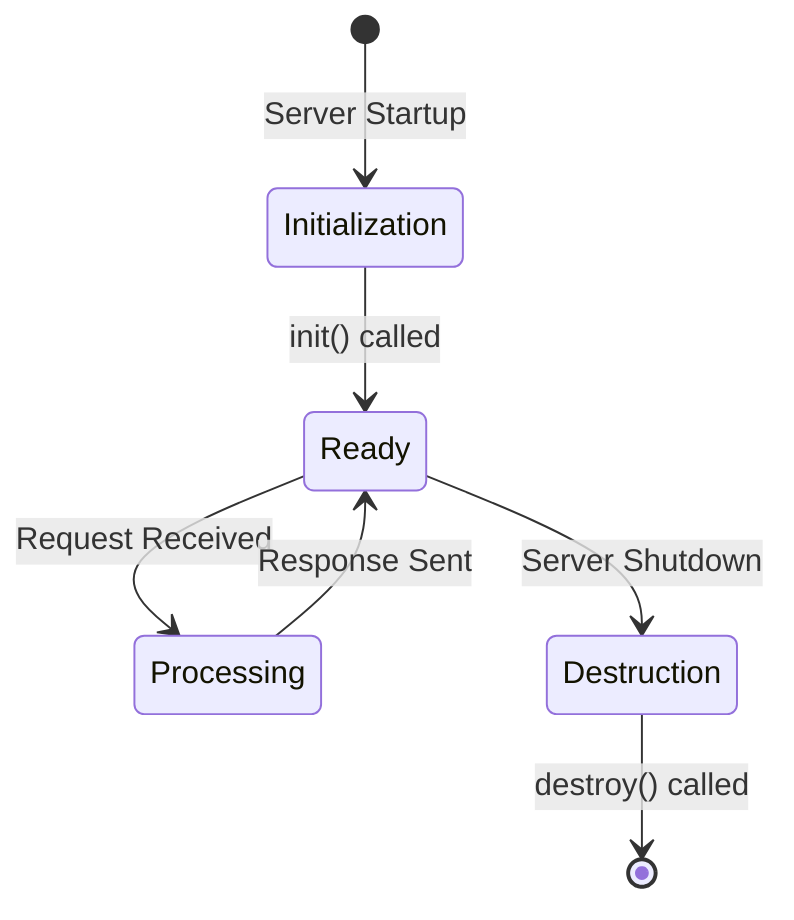
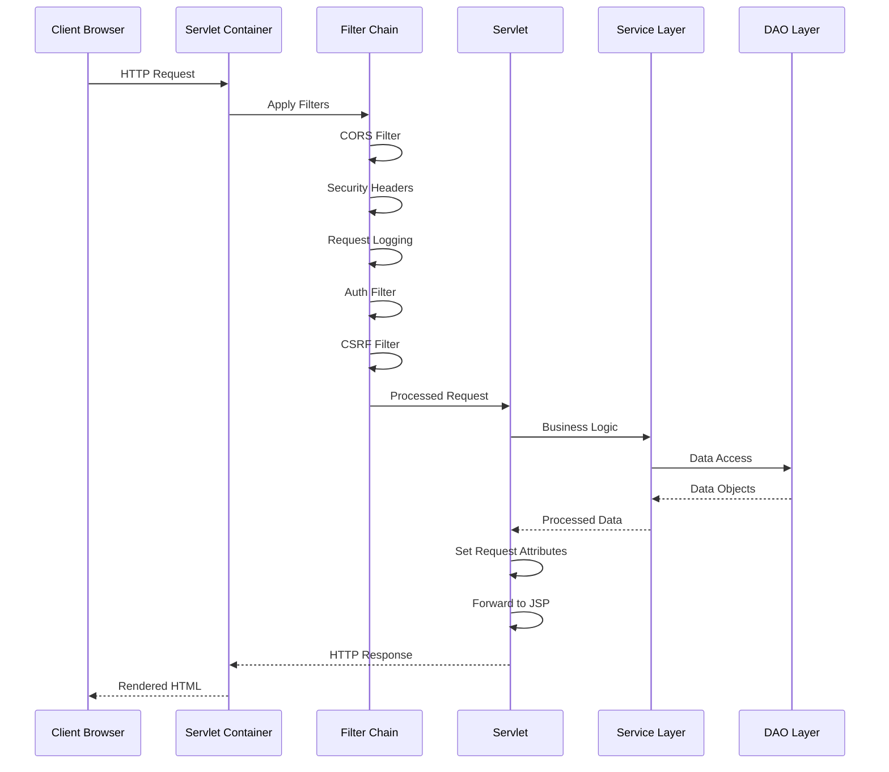
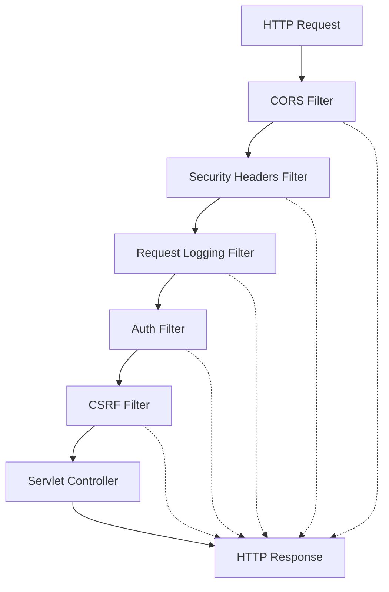
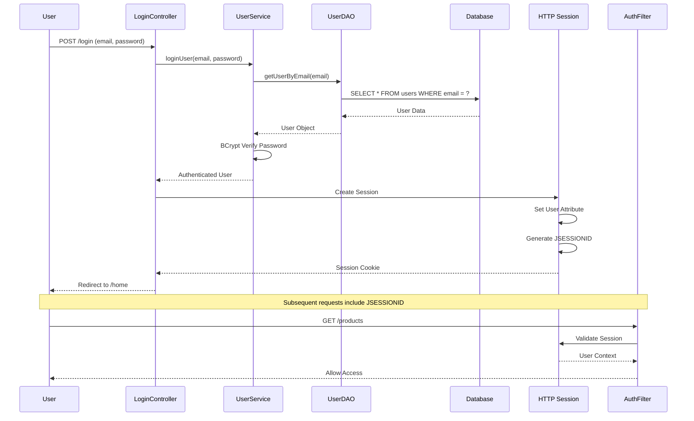

# FashionStore - Backend Documentation

## Table of Contents
1. [Executive Summary](#executive-summary)
2. [Backend Architecture Overview](#backend-architecture-overview)
3. [Servlet Architecture](#servlet-architecture)
4. [Controller Layer](#controller-layer)
5. [Service Layer](#service-layer)
6. [DAO Layer](#dao-layer)
7. [Filter Chain](#filter-chain)
8. [Authentication Flow](#authentication-flow)
9. [CSRF Protection](#csrf-protection)
10. [Session Handling](#session-handling)
11. [API Routing](#api-routing)
12. [Caching Layer](#caching-layer)
13. [Error Handling](#error-handling)
14. [Logging Strategy](#logging-strategy)

---

## Executive Summary

The FashionStore backend is a **Java 21 enterprise application** built with **Jakarta Servlets**, following a **layered architecture** with clear separation of concerns. The backend serves both the customer JSP frontend and the React admin frontend through different API endpoints, sharing the same business logic and data access layers.

**Key Backend Characteristics:**
- **Framework**: Jakarta Servlet API 6.0 with Tomcat 10.1
- **Language**: Java 21 with modern features
- **Architecture**: Layered (Controller → Service → DAO → Database)
- **Database**: MySQL 8.0 with HikariCP connection pooling
- **Caching**: Redis with local in-memory fallback
- **Security**: Multi-layer security with filters and CSRF protection
- **Logging**: SLF4J with Logback

---

## Backend Architecture Overview

### Technology Stack

| Technology | Version | Purpose |
|------------|---------|---------|
| Java | 21 | Programming language |
| Jakarta Servlet API | 6.0 | Web framework |
| Tomcat | 10.1 | Servlet container (Docker) |
| MySQL Connector | 8.0.33 | Database driver |
| HikariCP | 5.0.1 | Connection pooling |
| Jedis | 4.3.1 | Redis client |
| jBCrypt | 0.6 | Password hashing |
| Gson | 2.10.1 | JSON serialization |
| SLF4J | 2.0.9 | Logging facade |
| Logback | 1.4.11 | Logging implementation |
| Stripe SDK | 24.11.0 | Payment processing |

### Architecture Layers



### Package Structure

```
com.fashionstore/
├── cache/                  # Caching layer
│   ├── CacheKey.java
│   ├── CacheService.java
│   └── CacheTTL.java
├── controller/             # Servlet controllers
│   ├── HomeServlet.java
│   ├── ProductController.java
│   ├── CartController.java
│   ├── CheckoutController.java
│   ├── LoginController.java
│   ├── RegisterController.java
│   ├── OrderController.java
│   ├── ProfileController.java
│   ├── SearchController.java
│   ├── WishlistController.java
│   ├── AdminApiController.java
│   └── ...
├── dao/                    # DAO interfaces
│   ├── ProductDAO.java
│   ├── UserDAO.java
│   ├── OrderDAO.java
│   ├── CartDAO.java
│   ├── CategoryDAO.java
│   └── ...
├── daoimpl/                # DAO implementations
│   ├── ProductDAOImpl.java
│   ├── UserDAOImpl.java
│   ├── OrderDAOImpl.java
│   └── ...
├── filter/                 # Servlet filters
│   ├── AuthFilter.java
│   ├── CORSFilter.java
│   ├── SecurityHeadersFilter.java
│   ├── RequestLoggingFilter.java
│   └── CSRFFilter.java
├── model/                  # Domain models
│   ├── User.java
│   ├── Product.java
│   ├── Order.java
│   ├── Category.java
│   └── ...
├── service/                # Service layer
│   ├── ProductService.java
│   ├── UserService.java
│   ├── OrderService.java
│   ├── CartService.java
│   └── ...
└── util/                   # Utilities
    ├── DBConnection.java
    ├── ValidationUtil.java
    ├── PasswordUtil.java
    └── ...
```

---

## Servlet Architecture

### Servlet Lifecycle



### Servlet Configuration

**web.xml Configuration:**
```xml
<servlet>
    <servlet-name>HomeServlet</servlet-name>
    <servlet-class>com.fashionstore.controller.HomeServlet</servlet-class>
</servlet>
<servlet-mapping>
    <servlet-name>HomeServlet</servlet-name>
    <url-pattern>/home</url-pattern>
</servlet-mapping>
```

**Annotation-Based Configuration:**
```java
@WebServlet("/home")
public class HomeServlet extends HttpServlet {
    @Override
    protected void doGet(HttpServletRequest request, HttpServletResponse response)
            throws ServletException, IOException {
        // Servlet logic
    }
}
```

### Request Processing Flow



---

## Controller Layer

### Controller Responsibilities

**1. Request Handling**
- Parse HTTP requests (GET, POST, PUT, DELETE)
- Extract request parameters
- Validate input data
- Handle file uploads

**2. Business Logic Orchestration**
- Call service layer methods
- Transform request data to domain objects
- Handle business logic exceptions

**3. Response Preparation**
- Set request attributes for JSP views
- Prepare JSON responses for API
- Handle redirects and forwards
- Set HTTP status codes

### Controller Categories

**Customer-Facing Controllers:**
- `HomeServlet`: Homepage with featured products
- `ProductController`: Product listing and details
- `CartController`: Shopping cart management
- `CheckoutController`: Checkout flow
- `LoginController`: User authentication
- `RegisterController`: User registration
- `OrderController`: Order history and details
- `ProfileController`: User profile management
- `SearchController`: Product search
- `WishlistController`: Wishlist management
- `ReviewController`: Product reviews
- `AddressController`: Address management
- `PaymentController`: Payment processing

**Admin Controllers:**
- `AdminApiController`: Unified REST API for React admin
- `AdminDashboardController`: Admin dashboard (legacy JSP)
- `AdminProductController`: Product management (legacy JSP)
- `AdminOrderController`: Order management (legacy JSP)
- `AdminUsersController`: User management (legacy JSP)
- `AdminRegisterController`: Admin registration

### Controller Example

**HomeServlet:**
```java
@WebServlet("/home")
public class HomeServlet extends HttpServlet {
    private static final Logger logger = LoggerFactory.getLogger(HomeServlet.class);
    private ProductService productService;
    private CategoryService categoryService;
    
    @Override
    public void init() throws ServletException {
        productService = new ProductService();
        categoryService = new CategoryService();
    }
    
    @Override
    protected void doGet(HttpServletRequest request, HttpServletResponse response)
            throws ServletException, IOException {
        
        try {
            // Fetch data
            List<Product> products = productService.getFeaturedProducts(12);
            List<Category> categories = categoryService.getActiveCategories();
            List<Product> trendingProducts = productService.getTrendingProducts(8);
            
            // Get recently viewed from session
            List<Product> recentlyViewed = getRecentlyViewedProducts(request);
            
            // Set request attributes
            request.setAttribute("products", products);
            request.setAttribute("categories", categories);
            request.setAttribute("trendingProducts", trendingProducts);
            request.setAttribute("recentlyViewed", recentlyViewed);
            
            // Forward to JSP
            request.getRequestDispatcher("/WEB-INF/views/home.jsp")
                   .forward(request, response);
                   
        } catch (Exception e) {
            logger.error("Error loading home page", e);
            response.sendError(HttpServletResponse.SC_INTERNAL_SERVER_ERROR);
        }
    }
    
    private List<Product> getRecentlyViewedProducts(HttpServletRequest request) {
        HttpSession session = request.getSession(false);
        if (session == null) return List.of();
        
        @SuppressWarnings("unchecked")
        List<Integer> productIds = (List<Integer>) session.getAttribute("recentlyViewed");
        if (productIds == null || productIds.isEmpty()) return List.of();
        
        return productService.getProductsByIds(productIds);
    }
}
```

### AdminApiController

**Unified REST API Controller:**
```java
@WebServlet("/api/admin/*")
public class AdminApiController extends HttpServlet {
    private static final Logger logger = LoggerFactory.getLogger(AdminApiController.class);
    
    @Override
    protected void doGet(HttpServletRequest request, HttpServletResponse response)
            throws ServletException, IOException {
        
        String pathInfo = request.getPathInfo();
        
        try {
            switch (pathInfo) {
                case "/me":
                    handleGetCurrentUser(request, response);
                    break;
                case "/dashboard":
                    handleDashboard(request, response);
                    break;
                case "/stats":
                    handleStats(request, response);
                    break;
                case "/products":
                    handleGetProducts(request, response);
                    break;
                case "/orders":
                    handleGetOrders(request, response);
                    break;
                case "/users":
                    handleGetUsers(request, response);
                    break;
                default:
                    sendError(response, HttpServletResponse.SC_NOT_FOUND, "Endpoint not found");
            }
        } catch (Exception e) {
            logger.error("Error processing GET request", e);
            sendError(response, HttpServletResponse.SC_INTERNAL_SERVER_ERROR, "Internal server error");
        }
    }
    
    @Override
    protected void doPost(HttpServletRequest request, HttpServletResponse response)
            throws ServletException, IOException {
        
        String pathInfo = request.getPathInfo();
        
        try {
            switch (pathInfo) {
                case "/login":
                    handleLogin(request, response);
                    break;
                case "/logout":
                    handleLogout(request, response);
                    break;
                case "/register":
                    handleRegister(request, response);
                    break;
                case "/products":
                    handleCreateProduct(request, response);
                    break;
                default:
                    sendError(response, HttpServletResponse.SC_NOT_FOUND, "Endpoint not found");
            }
        } catch (Exception e) {
            logger.error("Error processing POST request", e);
            sendError(response, HttpServletResponse.SC_INTERNAL_SERVER_ERROR, "Internal server error");
        }
    }
}
```

---

## Service Layer

### Service Layer Responsibilities

**1. Business Logic Encapsulation**
- Implement business rules
- Coordinate multiple DAO operations
- Handle transaction management
- Validate business constraints

**2. Data Transformation**
- Transform DAO results to domain objects
- Apply business calculations
- Format data for presentation

**3. Cache Coordination**
- Cache frequently accessed data
- Invalidate cache on updates
- Handle cache fallback

### Service Classes

**ProductService:**
```java
public class ProductService {
    private static final Logger logger = LoggerFactory.getLogger(ProductService.class);
    private ProductDAO productDAO;
    private ProductSizeDAO productSizeDAO;
    private CacheService cacheService;
    
    public ProductService() {
        this.productDAO = new ProductDAOImpl();
        this.productSizeDAO = new ProductSizeDAOImpl();
        this.cacheService = CacheService.getInstance();
    }
    
    public Product getProductById(int productId) {
        String cacheKey = CacheKey.product(productId);
        
        // Try cache first
        Product cached = cacheService.get(cacheKey, Product.class);
        if (cached != null) {
            logger.debug("Product {} found in cache", productId);
            return cached;
        }
        
        // Fetch from database
        Product product = productDAO.getProductById(productId);
        
        if (product != null) {
            // Load sizes
            List<ProductSize> sizes = productSizeDAO.getSizesByProductId(productId);
            product.setSizes(sizes);
            
            // Cache with TTL
            cacheService.put(cacheKey, product, CacheTTL.PRODUCT);
        }
        
        return product;
    }
    
    public List<Product> getFeaturedProducts(int limit) {
        String cacheKey = CacheKey.featured(limit);
        
        List<Product> cached = cacheService.get(cacheKey, List.class);
        if (cached != null) {
            return cached;
        }
        
        List<Product> products = productDAO.getFeaturedProducts(limit);
        
        // Batch load sizes to avoid N+1
        if (!products.isEmpty()) {
            List<Integer> productIds = products.stream()
                .map(Product::getProductId)
                .collect(Collectors.toList());
            Map<Integer, List<ProductSize>> sizesMap = 
                productSizeDAO.getSizesMapByProductIds(productIds);
            
            products.forEach(p -> p.setSizes(sizesMap.get(p.getProductId())));
        }
        
        cacheService.put(cacheKey, products, CacheTTL.FEATURED);
        return products;
    }
    
    public boolean updateStock(int productId, String sizeLabel, int quantityChange) {
        boolean success = productDAO.updateStock(productId, sizeLabel, quantityChange);
        
        if (success) {
            // Invalidate cache
            cacheService.remove(CacheKey.product(productId));
            cacheService.invalidatePattern("fashionstore:featured:*");
            cacheService.invalidatePattern("fashionstore:products:*");
        }
        
        return success;
    }
}
```

**UserService:**
```java
public class UserService {
    private static final Logger logger = LoggerFactory.getLogger(UserService.class);
    private UserDAO userDAO;
    private PasswordUtil passwordUtil;
    
    public UserService() {
        this.userDAO = new UserDAOImpl();
        this.passwordUtil = new PasswordUtil();
    }
    
    public User loginUser(String email, String password) {
        User user = userDAO.getUserByEmail(email);
        
        if (user == null) {
            logger.warn("Login attempt with non-existent email: {}", email);
            return null;
        }
        
        if (!user.isActive()) {
            logger.warn("Login attempt for disabled user: {}", email);
            return null;
        }
        
        if (!passwordUtil.checkPassword(password, user.getPassword())) {
            logger.warn("Login attempt with invalid password for: {}", email);
            return null;
        }
        
        logger.info("User logged in successfully: {}", email);
        return user;
    }
    
    public boolean registerUser(User user) {
        // Check if email exists
        if (userDAO.isEmailExists(user.getEmail())) {
            logger.warn("Registration attempt with existing email: {}", user.getEmail());
            return false;
        }
        
        // Hash password
        String hashedPassword = passwordUtil.hashPassword(user.getPassword());
        user.setPassword(hashedPassword);
        
        // Set default role
        if (user.getRole() == null || user.getRole().isEmpty()) {
            user.setRole("customer");
        }
        
        // Set active status
        user.setActive(true);
        
        return userDAO.createUser(user);
    }
    
    public boolean updateUserRole(int userId, String newRole) {
        return userDAO.updateUserRole(userId, newRole);
    }
}
```

---

## DAO Layer

### DAO Pattern Implementation

**Interface-Based Design:**
```java
public interface ProductDAO {
    Product getProductById(int productId);
    List<Product> getAllProducts();
    List<Product> getActiveProducts();
    List<Product> getFeaturedProducts(int limit);
    List<Product> getProductsByCategory(int categoryId);
    List<Product> searchProducts(String query);
    List<Product> filterProducts(String category, Double minPrice, Double maxPrice, 
                                   List<String> sizes, String sortBy);
    int countProducts(String category, Double minPrice, Double maxPrice, List<String> sizes);
    boolean addProduct(Product product);
    boolean updateProduct(Product product);
    boolean deleteProduct(int productId);
    boolean updateStock(int productId, String sizeLabel, int quantityChange);
    int getLowStockCount(int threshold);
}
```

**Implementation Example:**
```java
public class ProductDAOImpl implements ProductDAO {
    private static final Logger logger = LoggerFactory.getLogger(ProductDAOImpl.class);
    
    @Override
    public Product getProductById(int productId) {
        String sql = "SELECT * FROM products WHERE product_id = ?";
        
        try (Connection conn = DBConnection.getConnection();
             PreparedStatement stmt = conn.prepareStatement(sql)) {
            
            stmt.setInt(1, productId);
            ResultSet rs = stmt.executeQuery();
            
            if (rs.next()) {
                return mapResultSetToProduct(rs);
            }
            
        } catch (SQLException e) {
            logger.error("Error getting product by ID: {}", productId, e);
        }
        
        return null;
    }
    
    @Override
    public List<Product> getFeaturedProducts(int limit) {
        String sql = "SELECT * FROM products WHERE active = TRUE " +
                     "ORDER BY popular_score DESC, created_at DESC LIMIT ?";
        
        List<Product> products = new ArrayList<>();
        
        try (Connection conn = DBConnection.getConnection();
             PreparedStatement stmt = conn.prepareStatement(sql)) {
            
            stmt.setInt(1, limit);
            ResultSet rs = stmt.executeQuery();
            
            while (rs.next()) {
                products.add(mapResultSetToProduct(rs));
            }
            
        } catch (SQLException e) {
            logger.error("Error getting featured products", e);
        }
        
        return products;
    }
    
    @Override
    public boolean updateStock(int productId, String sizeLabel, int quantityChange) {
        String sql = "UPDATE product_sizes SET stock_quantity = stock_quantity + ? " +
                     "WHERE product_id = ? AND size_label = ?";
        
        try (Connection conn = DBConnection.getConnection();
             PreparedStatement stmt = conn.prepareStatement(sql)) {
            
            stmt.setInt(1, quantityChange);
            stmt.setInt(2, productId);
            stmt.setString(3, sizeLabel);
            
            int rowsAffected = stmt.executeUpdate();
            return rowsAffected > 0;
            
        } catch (SQLException e) {
            logger.error("Error updating stock for product {} size {}", productId, sizeLabel, e);
        }
        
        return false;
    }
    
    private Product mapResultSetToProduct(ResultSet rs) throws SQLException {
        Product product = new Product();
        product.setProductId(rs.getInt("product_id"));
        product.setProductName(rs.getString("product_name"));
        product.setDescription(rs.getString("description"));
        product.setPrice(rs.getBigDecimal("price"));
        product.setDiscountPercent(rs.getBigDecimal("discount_percent"));
        product.setImageUrl(rs.getString("image_url"));
        product.setStockQuantity(rs.getInt("stock_quantity"));
        product.setCategoryId(rs.getInt("category_id"));
        product.setBrand(rs.getString("brand"));
        product.setActive(rs.getBoolean("active"));
        product.setNew(rs.getBoolean("is_new"));
        product.setSale(rs.getBoolean("is_sale"));
        product.setTrending(rs.getBoolean("is_trending"));
        product.setPopularScore(rs.getBigDecimal("popular_score"));
        product.setCreatedAt(rs.getTimestamp("created_at"));
        product.setUpdatedAt(rs.getTimestamp("updated_at"));
        return product;
    }
}
```

### Batch Loading Pattern

**N+1 Query Prevention:**
```java
public Map<Integer, List<ProductSize>> getSizesMapByProductIds(List<Integer> productIds) {
    if (productIds == null || productIds.isEmpty()) {
        return Map.of();
    }
    
    // Build IN clause placeholders
    String placeholders = productIds.stream()
        .map(id -> "?")
        .collect(Collectors.joining(","));
    
    String sql = "SELECT * FROM product_sizes WHERE product_id IN (" + placeholders + ")";
    
    Map<Integer, List<ProductSize>> sizesMap = new HashMap<>();
    
    try (Connection conn = DBConnection.getConnection();
         PreparedStatement stmt = conn.prepareStatement(sql)) {
        
        // Set parameters
        for (int i = 0; i < productIds.size(); i++) {
            stmt.setInt(i + 1, productIds.get(i));
        }
        
        ResultSet rs = stmt.executeQuery();
        
        while (rs.next()) {
            int productId = rs.getInt("product_id");
            ProductSize size = mapResultSetToProductSize(rs);
            
            sizesMap.computeIfAbsent(productId, k -> new ArrayList<>())
                    .add(size);
        }
        
    } catch (SQLException e) {
        logger.error("Error batch loading product sizes", e);
    }
    
    return sizesMap;
}
```

---

## Filter Chain

### Filter Chain Architecture



### Filter Configuration (web.xml)

```xml
<filter>
    <filter-name>CORSFilter</filter-name>
    <filter-class>com.fashionstore.filter.CORSFilter</filter-class>
</filter>
<filter-mapping>
    <filter-name>CORSFilter</filter-name>
    <url-pattern>/*</url-pattern>
</filter-mapping>

<filter>
    <filter-name>SecurityHeadersFilter</filter-name>
    <filter-class>com.fashionstore.filter.SecurityHeadersFilter</filter-class>
</filter>
<filter-mapping>
    <filter-name>SecurityHeadersFilter</filter-name>
    <url-pattern>/*</url-pattern>
</filter-mapping>

<filter>
    <filter-name>RequestLoggingFilter</filter-name>
    <filter-class>com.fashionstore.filter.RequestLoggingFilter</filter-class>
</filter>
<filter-mapping>
    <filter-name>RequestLoggingFilter</filter-name>
    <url-pattern>/*</url-pattern>
</filter-mapping>

<filter>
    <filter-name>AuthFilter</filter-name>
    <filter-class>com.fashionstore.filter.AuthFilter</filter-class>
</filter>
<filter-mapping>
    <filter-name>AuthFilter</filter-name>
    <url-pattern>/*</url-pattern>
</filter-mapping>

<filter>
    <filter-name>CSRFFilter</filter-name>
    <filter-class>com.fashionstore.filter.CSRFFilter</filter-class>
</filter-mapping>
    <filter-name>CSRFFilter</filter-name>
    <url-pattern>/*</url-pattern>
</filter-mapping>
```

### Filter Implementations

**CORS Filter:**
```java
@WebFilter("/*")
public class CORSFilter implements Filter {
    @Override
    public void doFilter(ServletRequest request, ServletResponse response, FilterChain chain)
            throws IOException, ServletException {
        
        HttpServletResponse httpResponse = (HttpServletResponse) response;
        HttpServletRequest httpRequest = (HttpServletRequest) request;
        
        // Set CORS headers
        httpResponse.setHeader("Access-Control-Allow-Origin", "*");
        httpResponse.setHeader("Access-Control-Allow-Methods", "GET, POST, PUT, DELETE, OPTIONS");
        httpResponse.setHeader("Access-Control-Allow-Headers", "Content-Type, Authorization, X-Requested-With, X-CSRF-Token");
        httpResponse.setHeader("Access-Control-Max-Age", "3600");
        
        // Handle preflight requests
        if ("OPTIONS".equalsIgnoreCase(httpRequest.getMethod())) {
            httpResponse.setStatus(HttpServletResponse.SC_OK);
            return;
        }
        
        chain.doFilter(request, response);
    }
}
```

**Security Headers Filter:**
```java
@WebFilter("/*")
public class SecurityHeadersFilter implements Filter {
    @Override
    public void doFilter(ServletRequest request, ServletResponse response, FilterChain chain)
            throws IOException, ServletException {
        
        HttpServletResponse httpResponse = (HttpServletResponse) response;
        
        httpResponse.setHeader("X-Content-Type-Options", "nosniff");
        httpResponse.setHeader("X-Frame-Options", "DENY");
        httpResponse.setHeader("X-XSS-Protection", "1; mode=block");
        httpResponse.setHeader("Strict-Transport-Security", "max-age=31536000; includeSubDomains");
        httpResponse.setHeader("Content-Security-Policy", 
            "default-src 'self'; " +
            "script-src 'self' 'unsafe-inline' https://fonts.googleapis.com; " +
            "style-src 'self' 'unsafe-inline' https://fonts.googleapis.com https://fonts.gstatic.com; " +
            "img-src 'self' data: https:; " +
            "font-src 'self' https://fonts.gstatic.com;");
        
        chain.doFilter(request, response);
    }
}
```

**Request Logging Filter:**
```java
@WebFilter("/*")
public class RequestLoggingFilter implements Filter {
    private static final Logger logger = LoggerFactory.getLogger(RequestLoggingFilter.class);
    
    @Override
    public void doFilter(ServletRequest request, ServletResponse response, FilterChain chain)
            throws IOException, ServletException {
        
        HttpServletRequest httpRequest = (HttpServletRequest) request;
        long startTime = System.currentTimeMillis();
        
        String method = httpRequest.getMethod();
        String uri = httpRequest.getRequestURI();
        String remoteAddr = httpRequest.getRemoteAddr();
        
        logger.info("Request: {} {} from {}", method, uri, remoteAddr);
        
        try {
            chain.doFilter(request, response);
        } finally {
            long duration = System.currentTimeMillis() - startTime;
            int status = ((HttpServletResponse) response).getStatus();
            logger.info("Response: {} {} - Status: {} - Duration: {}ms", 
                       method, uri, status, duration);
        }
    }
}
```

---

## Authentication Flow

### Authentication Architecture



### AuthFilter Implementation

```java
@WebFilter("/*")
public class AuthFilter implements Filter {
    private static final Logger logger = LoggerFactory.getLogger(AuthFilter.class);
    
    private static final Set<String> PUBLIC_PATHS = Set.of(
        "/home", "/products", "/product", "/login", "/register", 
        "/forgot-password", "/reset-password", "/assets", "/api/admin/login", "/api/admin/register"
    );
    
    private static final Set<String> ADMIN_PATHS = Set.of(
        "/admin", "/api/admin"
    );
    
    @Override
    public void doFilter(ServletRequest request, ServletResponse response, FilterChain chain)
            throws IOException, ServletException {
        
        HttpServletRequest httpRequest = (HttpServletRequest) request;
        HttpServletResponse httpResponse = (HttpServletResponse) response;
        
        String path = normalizePath(httpRequest.getRequestURI());
        
        // Allow public paths
        if (isPublicPath(path)) {
            chain.doFilter(request, response);
            return;
        }
        
        // Check authentication
        HttpSession session = httpRequest.getSession(false);
        User user = session != null ? (User) session.getAttribute("user") : null;
        
        if (user == null) {
            handleUnauthenticated(httpRequest, httpResponse);
            return;
        }
        
        // Check admin access
        if (isAdminPath(path) && !user.isAdmin()) {
            handleUnauthorized(httpRequest, httpResponse);
            return;
        }
        
        // Allow access
        chain.doFilter(request, response);
    }
    
    private boolean isPublicPath(String path) {
        return PUBLIC_PATHS.stream().anyMatch(path::startsWith);
    }
    
    private boolean isAdminPath(String path) {
        return ADMIN_PATHS.stream().anyMatch(path::startsWith);
    }
    
    private void handleUnauthenticated(HttpServletRequest request, HttpServletResponse response)
            throws IOException {
        
        if (isAjaxRequest(request)) {
            response.setStatus(HttpServletResponse.SC_UNAUTHORIZED);
            response.setContentType("application/json");
            response.getWriter().write("{\"error\":\"Unauthorized\"}");
        } else {
            response.sendRedirect(request.getContextPath() + "/login");
        }
    }
    
    private void handleUnauthorized(HttpServletRequest request, HttpServletResponse response)
            throws IOException {
        
        if (isAjaxRequest(request)) {
            response.setStatus(HttpServletResponse.SC_FORBIDDEN);
            response.setContentType("application/json");
            response.getWriter().write("{\"error\":\"Forbidden\"}");
        } else {
            response.sendError(HttpServletResponse.SC_FORBIDDEN, "Access denied");
        }
    }
    
    private boolean isAjaxRequest(HttpServletRequest request) {
        return "XMLHttpRequest".equals(request.getHeader("X-Requested-With")) ||
               request.getRequestURI().startsWith("/api/");
    }
    
    private String normalizePath(String path) {
        String contextPath = request.getContextPath();
        if (path.startsWith(contextPath)) {
            path = path.substring(contextPath.length());
        }
        return path;
    }
}
```

---

## CSRF Protection

### CSRF Filter Implementation

```java
@WebFilter("/*")
public class CSRFFilter implements Filter {
    private static final Logger logger = LoggerFactory.getLogger(CSRFFilter.class);
    
    private static final Set<String> CSRF_EXCLUDED_PATHS = Set.of(
        "/login", "/register", "/api/admin/login", "/api/admin/register"
    );
    
    @Override
    public void doFilter(ServletRequest request, ServletResponse response, FilterChain chain)
            throws IOException, ServletException {
        
        HttpServletRequest httpRequest = (HttpServletRequest) request;
        HttpServletResponse httpResponse = (HttpServletResponse) response;
        
        String path = httpRequest.getRequestURI();
        
        // Generate CSRF token for GET requests
        if ("GET".equalsIgnoreCase(httpRequest.getMethod())) {
            generateCSRFToken(httpRequest);
        }
        
        // Validate CSRF token for state-changing requests
        if (isStateChangingRequest(httpRequest) && !isExcludedPath(path)) {
            if (!validateCSRFToken(httpRequest)) {
                logger.warn("CSRF token validation failed for: {}", path);
                httpResponse.sendError(HttpServletResponse.SC_FORBIDDEN, "CSRF validation failed");
                return;
            }
        }
        
        chain.doFilter(request, response);
    }
    
    private void generateCSRFToken(HttpServletRequest request) {
        HttpSession session = request.getSession(true);
        String csrfToken = (String) session.getAttribute("csrfToken");
        
        if (csrfToken == null) {
            csrfToken = UUID.randomUUID().toString();
            session.setAttribute("csrfToken", csrfToken);
        }
        
        request.setAttribute("csrfToken", csrfToken);
    }
    
    private boolean validateCSRFToken(HttpServletRequest request) {
        HttpSession session = request.getSession(false);
        if (session == null) return false;
        
        String sessionToken = (String) session.getAttribute("csrfToken");
        String requestToken = request.getHeader("X-CSRF-Token");
        
        if (requestToken == null) {
            requestToken = request.getParameter("csrfToken");
        }
        
        return sessionToken != null && sessionToken.equals(requestToken);
    }
    
    private boolean isStateChangingRequest(HttpServletRequest request) {
        String method = request.getMethod();
        return "POST".equalsIgnoreCase(method) || 
               "PUT".equalsIgnoreCase(method) || 
               "DELETE".equalsIgnoreCase(method);
    }
    
    private boolean isExcludedPath(String path) {
        return CSRF_EXCLUDED_PATHS.stream().anyMatch(path::startsWith);
    }
}
```

---

## Session Handling

### Session Configuration

**web.xml Configuration:**
```xml
<session-config>
    <session-timeout>30</session-timeout>
    <cookie-config>
        <http-only>true</http-only>
        <secure>false</secure> <!-- Set to true in production with HTTPS -->
    </cookie-config>
    <tracking-mode>COOKIE</tracking-mode>
</session-config>
```

### Session Attributes

**Primary Session Attributes:**
```java
// User authentication
session.setAttribute("user", user);
session.setAttribute("userId", user.getUserId());
session.setAttribute("role", user.getRole());

// Shopping data
session.setAttribute("recentlyViewed", productIds);
session.setAttribute("cartCount", cartCount);
session.setAttribute("wishlistCount", wishlistCount);

// CSRF protection
session.setAttribute("csrfToken", UUID.randomUUID().toString());
```

### Session Management

**Session Creation (Login):**
```java
protected void doPost(HttpServletRequest request, HttpServletResponse response)
        throws ServletException, IOException {
    
    String email = request.getParameter("email");
    String password = request.getParameter("password");
    
    User user = userService.loginUser(email, password);
    
    if (user != null) {
        HttpSession session = request.getSession(true);
        session.setAttribute("user", user);
        session.setAttribute("userId", user.getUserId());
        session.setAttribute("role", user.getRole());
        
        // Regenerate session ID to prevent session fixation
        request.changeSessionId();
        
        response.sendRedirect(request.getContextPath() + "/home");
    } else {
        request.setAttribute("error", "Invalid email or password");
        request.getRequestDispatcher("/WEB-INF/views/login.jsp")
               .forward(request, response);
    }
}
```

**Session Invalidation (Logout):**
```java
protected void doPost(HttpServletRequest request, HttpServletResponse response)
        throws ServletException, IOException {
    
    HttpSession session = request.getSession(false);
    if (session != null) {
        session.invalidate();
    }
    
    response.sendRedirect(request.getContextPath() + "/login");
}
```

---

## API Routing

### Admin API Routing

**URL Pattern:** `/api/admin/*`

**Routing Logic:**
```java
String pathInfo = request.getPathInfo();

switch (pathInfo) {
    // Authentication
    case "/me":
        handleGetCurrentUser(request, response);
        break;
    case "/login":
        handleLogin(request, response);
        break;
    case "/logout":
        handleLogout(request, response);
        break;
    case "/register":
        handleRegister(request, response);
        break;
    
    // Dashboard
    case "/dashboard":
        handleDashboard(request, response);
        break;
    case "/stats":
        handleStats(request, response);
        break;
    
    // Products
    case "/products":
        if ("GET".equals(request.getMethod())) {
            handleGetProducts(request, response);
        } else if ("POST".equals(request.getMethod())) {
            handleCreateProduct(request, response);
        }
        break;
    case "/products/{id}":
        if ("GET".equals(request.getMethod())) {
            handleGetProduct(request, response);
        } else if ("PUT".equals(request.getMethod())) {
            handleUpdateProduct(request, response);
        } else if ("DELETE".equals(request.getMethod())) {
            handleDeleteProduct(request, response);
        }
        break;
    
    // Orders
    case "/orders":
        handleGetOrders(request, response);
        break;
    case "/orders/recent":
        handleRecentOrders(request, response);
        break;
    
    // Users
    case "/users":
        handleGetUsers(request, response);
        break;
    case "/users/recent":
        handleRecentUsers(request, response);
        break;
    
    // Inventory
    case "/inventory":
        handleInventory(request, response);
        break;
    case "/inventory/low-stock":
        handleLowStock(request, response);
        break;
    
    // Categories
    case "/categories":
        handleCategories(request, response);
        break;
    
    // Coupons
    case "/coupons":
        handleCoupons(request, response);
        break;
}
```

### JSON Response Helper

```java
private void sendJsonResponse(HttpServletResponse response, Object data)
        throws IOException {
    
    response.setContentType("application/json");
    response.setCharacterEncoding("UTF-8");
    
    Gson gson = new Gson();
    String json = gson.toJson(data);
    
    response.getWriter().write(json);
}

private void sendError(HttpServletResponse response, int status, String message)
        throws IOException {
    
    response.setStatus(status);
    response.setContentType("application/json");
    response.setCharacterEncoding("UTF-8");
    
    Map<String, String> error = Map.of("error", message);
    Gson gson = new Gson();
    String json = gson.toJson(error);
    
    response.getWriter().write(json);
}
```

---

## Caching Layer

### CacheService Implementation

**Singleton Pattern:**
```java
public class CacheService {
    private static final Logger logger = LoggerFactory.getLogger(CacheService.class);
    private static volatile CacheService instance;
    
    private JedisPool jedisPool;
    private Map<String, CacheEntry> localCache;
    private boolean redisAvailable;
    
    private CacheService() {
        initializeRedis();
        this.localCache = new ConcurrentHashMap<>();
    }
    
    public static CacheService getInstance() {
        if (instance == null) {
            synchronized (CacheService.class) {
                if (instance == null) {
                    instance = new CacheService();
                }
            }
        }
        return instance;
    }
    
    private void initializeRedis() {
        try {
            JedisPoolConfig poolConfig = new JedisPoolConfig();
            poolConfig.setMaxTotal(20);
            poolConfig.setMaxIdle(10);
            poolConfig.setMinIdle(5);
            poolConfig.setTestOnBorrow(true);
            
            String redisHost = System.getenv().getOrDefault("REDIS_HOST", "localhost");
            int redisPort = Integer.parseInt(System.getenv().getOrDefault("REDIS_PORT", "6379"));
            
            jedisPool = new JedisPool(poolConfig, redisHost, redisPort);
            
            // Test connection
            try (Jedis jedis = jedisPool.getResource()) {
                jedis.ping();
                redisAvailable = true;
                logger.info("Redis cache initialized successfully");
            }
        } catch (Exception e) {
            logger.warn("Redis not available, using local cache: {}", e.getMessage());
            redisAvailable = false;
        }
    }
    
    public void put(String key, Object value, long ttlSeconds) {
        try {
            if (redisAvailable) {
                try (Jedis jedis = jedisPool.getResource()) {
                    Gson gson = new Gson();
                    String json = gson.toJson(value);
                    jedis.setex(key, ttlSeconds, json);
                }
            } else {
                // Local cache fallback
                localCache.put(key, new CacheEntry(value, System.currentTimeMillis() + ttlSeconds * 1000));
            }
            logger.debug("Cached key: {}", key);
        } catch (Exception e) {
            logger.error("Error caching key: {}", key, e);
            // Fallback to local cache
            localCache.put(key, new CacheEntry(value, System.currentTimeMillis() + ttlSeconds * 1000));
        }
    }
    
    public <T> T get(String key, Class<T> type) {
        try {
            if (redisAvailable) {
                try (Jedis jedis = jedisPool.getResource()) {
                    String json = jedis.get(key);
                    if (json != null) {
                        Gson gson = new Gson();
                        return gson.fromJson(json, type);
                    }
                }
            } else {
                // Local cache fallback
                CacheEntry entry = localCache.get(key);
                if (entry != null && !entry.isExpired()) {
                    return type.cast(entry.getValue());
                }
            }
        } catch (Exception e) {
            logger.error("Error retrieving from cache: {}", key, e);
        }
        return null;
    }
    
    public void remove(String key) {
        try {
            if (redisAvailable) {
                try (Jedis jedis = jedisPool.getResource()) {
                    jedis.del(key);
                }
            } else {
                localCache.remove(key);
            }
            logger.debug("Removed from cache: {}", key);
        } catch (Exception e) {
            logger.error("Error removing from cache: {}", key, e);
        }
    }
    
    public void invalidatePattern(String pattern) {
        try {
            if (redisAvailable) {
                try (Jedis jedis = jedisPool.getResource()) {
                    Set<String> keys = jedis.keys(pattern);
                    if (!keys.isEmpty()) {
                        jedis.del(keys.toArray(new String[0]));
                    }
                }
            } else {
                // Local cache pattern invalidation
                localCache.keySet().removeIf(key -> key.matches(pattern.replace("*", ".*")));
            }
            logger.debug("Invalidated cache pattern: {}", pattern);
        } catch (Exception e) {
            logger.error("Error invalidating cache pattern: {}", pattern, e);
        }
    }
    
    private static class CacheEntry {
        private final Object value;
        private final long expiryTime;
        
        CacheEntry(Object value, long expiryTime) {
            this.value = value;
            this.expiryTime = expiryTime;
        }
        
        Object getValue() {
            return value;
        }
        
        boolean isExpired() {
            return System.currentTimeMillis() > expiryTime;
        }
    }
}
```

---

## Error Handling

### Error Handling Strategy

**1. Try-Catch Blocks**
- Wrap database operations
- Catch specific exceptions
- Log errors with context
- Provide user-friendly messages

**2. Error Pages**
```xml
<error-page>
    <error-code>404</error-code>
    <location>/WEB-INF/views/404.jsp</location>
</error-page>
<error-page>
    <exception-type>java.lang.Exception</exception-type>
    <location>/WEB-INF/views/error.jsp</location>
</error-page>
```

**3. Global Exception Handler**
```java
@Override
protected void service(HttpServletRequest request, HttpServletResponse response)
        throws ServletException, IOException {
    
    try {
        super.service(request, response);
    } catch (Exception e) {
        logger.error("Unhandled exception in servlet", e);
        request.setAttribute("error", "An unexpected error occurred");
        request.getRequestDispatcher("/WEB-INF/views/error.jsp")
               .forward(request, response);
    }
}
```

---

## Logging Strategy

### Logging Configuration

**Logback Configuration:**
```xml
<configuration>
    <appender name="CONSOLE" class="ch.qos.logback.core.ConsoleAppender">
        <encoder>
            <pattern>%d{yyyy-MM-dd HH:mm:ss} [%thread] %-5level %logger{36} - %msg%n</pattern>
        </encoder>
    </appender>
    
    <appender name="FILE" class="ch.qos.logback.core.rolling.RollingFileAppender">
        <file>logs/fashionstore.log</file>
        <rollingPolicy class="ch.qos.logback.core.rolling.TimeBasedRollingPolicy">
            <fileNamePattern>logs/fashionstore.%d{yyyy-MM-dd}.log</fileNamePattern>
            <maxHistory>30</maxHistory>
        </rollingPolicy>
        <encoder>
            <pattern>%d{yyyy-MM-dd HH:mm:ss} [%thread] %-5level %logger{36} - %msg%n</pattern>
        </encoder>
    </appender>
    
    <root level="INFO">
        <appender-ref ref="CONSOLE" />
        <appender-ref ref="FILE" />
    </root>
    
    <logger name="com.fashionstore" level="DEBUG" />
    <logger name="com.fashionstore.controller" level="DEBUG" />
    <logger name="com.fashionstore.dao" level="DEBUG" />
</configuration>
```

### Logging Best Practices

**1. Log Levels:**
- **ERROR**: Application errors, exceptions
- **WARN**: Potentially harmful situations
- **INFO**: Important application events
- **DEBUG**: Detailed diagnostic information

**2. Structured Logging:**
```java
logger.info("User logged in: {}", email);
logger.warn("Failed login attempt for email: {}", email);
logger.error("Error processing order: {}", orderId, exception);
logger.debug("Cache hit for product: {}", productId);
```

**3. Contextual Information:**
- Include user ID when available
- Include request parameters for debugging
- Include timing information for performance monitoring

---

## Conclusion

The FashionStore backend demonstrates a **well-architected, layered enterprise application** with:

- **Clear separation of concerns** through Controller → Service → DAO layers
- **Comprehensive security** with multi-layer filters and CSRF protection
- **Performance optimization** through caching, connection pooling, and batch loading
- **Robust error handling** and logging for maintainability
- **Flexible API routing** supporting both JSP and React frontends

The backend architecture provides a solid foundation for the e-commerce platform while maintaining flexibility for future enhancements.
