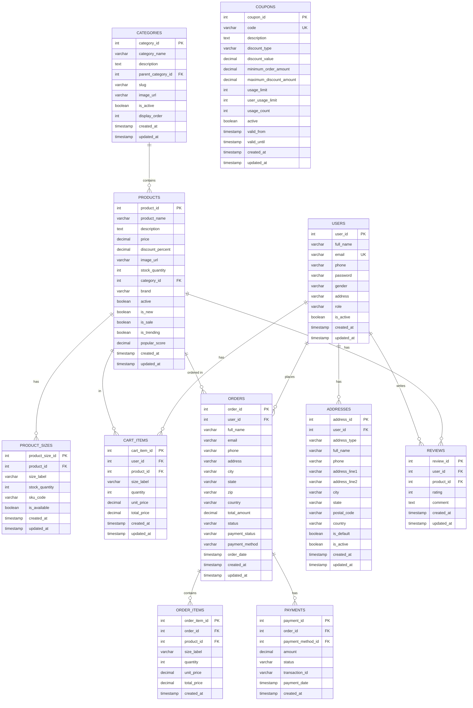
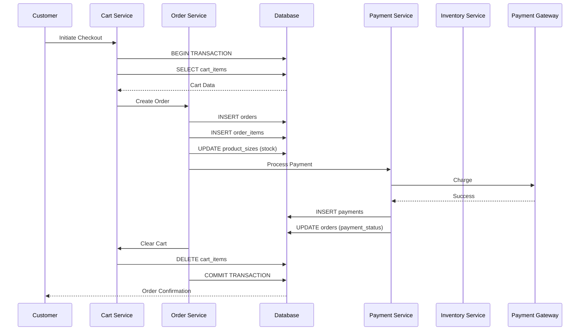

# FashionStore - Database Documentation

## Table of Contents
1. [Executive Summary](#executive-summary)
2. [Database Overview](#database-overview)
3. [ER Diagram](#er-diagram)
4. [Table Documentation](#table-documentation)
5. [Table Relationships](#table-relationships)
6. [Foreign Key Mapping](#foreign-key-mapping)
7. [Database Design Explanation](#database-design-explanation)
8. [Constraints Documentation](#constraints-documentation)
9. [Index Documentation](#index-documentation)
10. [Views Documentation](#views-documentation)
11. [Stored Procedures](#stored-procedures)
12. [Triggers Documentation](#triggers-documentation)
13. [Transaction Flow](#transaction-flow)
14. [Data Migration Strategy](#data-migration-strategy)
15. [Performance Optimization](#performance-optimization)

---

## Executive Summary

The FashionStore database is a **relational database** built on **MySQL 8.0** with **InnoDB** storage engine. It follows a **normalized schema design** with clear separation of concerns across multiple functional areas: user management, product catalog, shopping cart, orders, payments, analytics, and administrative features.

**Key Database Characteristics:**
- **Engine**: MySQL 8.0 with InnoDB (ACID compliant)
- **Character Set**: UTF8MB4 (full Unicode support including emojis)
- **Collation**: utf8mb4_unicode_ci (case-insensitive Unicode)
- **Total Tables**: 32 tables
- **Total Views**: 6 optimized views
- **Stored Procedures**: 3 procedures
- **Triggers**: 2 triggers
- **Indexes**: 30+ strategic indexes for performance

---

## Database Overview

### Database Configuration

```sql
CREATE DATABASE IF NOT EXISTS fashionstore
CHARACTER SET utf8mb4
COLLATE utf8mb4_unicode_ci;

USE fashionstore;
```

### Database Statistics

| Metric | Value |
|--------|-------|
| Total Tables | 32 |
| Core Tables | 12 |
| Shopping Tables | 4 |
| Order Tables | 5 |
| Payment Tables | 6 |
| Analytics Tables | 6 |
| Administrative Tables | 4 |
| Views | 6 |
| Stored Procedures | 3 |
| Triggers | 2 |

---

## ER Diagram

### High-Level ER Diagram

```mermaid
erDiagram
    USERS ||--o{ ADDRESSES : "has"
    USERS ||--o{ ORDERS : "places"
    USERS ||--o{ CART_ITEMS : "has"
    USERS ||--o{ WISHLIST_ITEMS : "has"
    USERS ||--o{ SAVED_ITEMS : "has"
    USERS ||--o{ REVIEWS : "writes"
    USERS ||--o{ PASSWORD_RESET_TOKENS : "has"
    USERS ||--|| USER_SETTINGS : "has"
    USERS ||--|| USER_PROFILES : "has"
    USERS ||--o{ COUPON_USAGE : "uses"
    
    CATEGORIES ||--o{ PRODUCTS : "contains"
    PRODUCTS ||--o{ PRODUCT_SIZES : "has"
    PRODUCTS ||--o{ CART_ITEMS : "in"
    PRODUCTS ||--o{ WISHLIST_ITEMS : "in"
    PRODUCTS ||--o{ SAVED_ITEMS : "in"
    PRODUCTS ||--o{ ORDER_ITEMS : "in"
    PRODUCTS ||--o{ REVIEWS : "has"
    PRODUCTS ||--o{ PRODUCT_ATTRIBUTES : "has"
    PRODUCTS ||--o{ PRODUCT_RECOMMENDATIONS : "has"
    
    ORDERS ||--o{ ORDER_ITEMS : "contains"
    ORDERS ||--o{ PAYMENTS : "has"
    ORDERS ||--o{ ORDER_STATUS_HISTORY : "has"
    ORDERS ||--o{ REFUNDS : "may have"
    ORDERS ||--o{ INVOICES : "has"
    ORDERS ||--o{ COUPON_USAGE : "may use"
    
    PAYMENT_METHODS ||--o{ PAYMENTS : "processes"
    PAYMENT_METHODS ||--o{ PAYMENT_TRANSACTIONS : "records"
    
    COUPONS ||--o{ COUPON_USAGE : "used in"
    
    USERS ||--o{ SEARCH_HISTORY : "searches"
    USERS ||--o{ RECENTLY_VIEWED : "views"
    PRODUCTS ||--o{ SEARCH_HISTORY : "searched"
    PRODUCTS ||--o{ RECENTLY_VIEWED : "viewed"
    
    SHIPPING_ZONES ||--o{ SHIPPING_RATES : "has"
    
    USERS ||--o{ EMAIL_LOGS : "receives"
    USERS ||--o{ EMAIL_NOTIFICATIONS : "has"
    
    STRIPE_CUSTOMERS ||--o{ STRIPE_WEBHOOK_EVENTS : "has"
```



### Detailed ER Diagram - Core Tables



---

## Table Documentation

### 1. Core Tables

#### 1.1 users

**Purpose**: Stores user account information including authentication credentials and basic profile data.

| Column | Type | Constraints | Description |
|--------|------|-------------|-------------|
| user_id | INT | PK, AUTO_INCREMENT | Unique user identifier |
| full_name | VARCHAR(100) | NOT NULL | User's full name |
| email | VARCHAR(100) | NOT NULL, UNIQUE | User's email address (login identifier) |
| phone | VARCHAR(20) | NULL | User's phone number |
| password | VARCHAR(255) | NOT NULL | BCrypt hashed password |
| gender | VARCHAR(20) | NULL | User's gender (male, female, other) |
| address | VARCHAR(255) | NULL | Legacy address field (deprecated) |
| role | VARCHAR(20) | NOT NULL | User role (customer, admin, disabled) |
| is_active | BOOLEAN | DEFAULT TRUE | Account active status |
| created_at | TIMESTAMP | DEFAULT CURRENT_TIMESTAMP | Account creation timestamp |
| updated_at | TIMESTAMP | DEFAULT CURRENT_TIMESTAMP ON UPDATE | Last update timestamp |

**Indexes:**
- PRIMARY KEY (user_id)
- UNIQUE INDEX (email)
- INDEX (role, is_active)

**Relationships:**
- One-to-Many with addresses
- One-to-Many with orders
- One-to-Many with cart_items
- One-to-Many with wishlist_items
- One-to-Many with saved_items
- One-to-Many with reviews
- One-to-One with user_settings
- One-to-One with user_profiles

#### 1.2 categories

**Purpose**: Product category hierarchy for organizing products.

| Column | Type | Constraints | Description |
|--------|------|-------------|-------------|
| category_id | INT | PK, AUTO_INCREMENT | Unique category identifier |
| category_name | VARCHAR(100) | NOT NULL | Category name |
| description | TEXT | NULL | Category description |
| parent_category_id | INT | FK, NULL | Parent category for hierarchical structure |
| slug | VARCHAR(100) | NOT NULL, UNIQUE | URL-friendly category slug |
| image_url | VARCHAR(500) | NULL | Category image URL |
| is_active | BOOLEAN | DEFAULT TRUE | Category active status |
| display_order | INT | DEFAULT 0 | Display order for sorting |
| created_at | TIMESTAMP | DEFAULT CURRENT_TIMESTAMP | Creation timestamp |
| updated_at | TIMESTAMP | DEFAULT CURRENT_TIMESTAMP ON UPDATE | Last update timestamp |

**Indexes:**
- PRIMARY KEY (category_id)
- UNIQUE INDEX (slug)
- INDEX (parent_category_id)
- INDEX (is_active, display_order)

**Relationships:**
- Self-referencing (parent_category_id) for hierarchy
- One-to-Many with products

#### 1.3 products

**Purpose**: Product catalog with pricing, inventory, and metadata.

| Column | Type | Constraints | Description |
|--------|------|-------------|-------------|
| product_id | INT | PK, AUTO_INCREMENT | Unique product identifier |
| product_name | VARCHAR(255) | NOT NULL | Product name |
| description | TEXT | NULL | Product description |
| price | DECIMAL(10,2) | NOT NULL | Base price |
| discount_percent | DECIMAL(5,2) | DEFAULT 0.00 | Discount percentage |
| image_url | VARCHAR(500) | NULL | Product image URL |
| stock_quantity | INT | DEFAULT 0 | Total stock across all sizes |
| category_id | INT | FK, NOT NULL | Product category |
| brand | VARCHAR(100) | NULL | Product brand |
| active | BOOLEAN | DEFAULT TRUE | Product active status |
| is_new | BOOLEAN | DEFAULT FALSE | New arrival flag |
| is_sale | BOOLEAN | DEFAULT FALSE | Sale flag |
| is_trending | BOOLEAN | DEFAULT FALSE | Trending flag |
| popular_score | DECIMAL(3,1) | DEFAULT 0.0 | Popularity score for recommendations |
| created_at | TIMESTAMP | DEFAULT CURRENT_TIMESTAMP | Creation timestamp |
| updated_at | TIMESTAMP | DEFAULT CURRENT_TIMESTAMP ON UPDATE | Last update timestamp |

**Indexes:**
- PRIMARY KEY (product_id)
- INDEX (category_id, active)
- INDEX (brand, active)
- INDEX (is_trending, popular_score)
- INDEX (is_sale, active)
- INDEX (is_new, active)
- FULLTEXT INDEX (product_name, description, brand)

**Relationships:**
- Many-to-One with categories
- One-to-Many with product_sizes
- One-to-Many with cart_items
- One-to-Many with wishlist_items
- One-to-Many with saved_items
- One-to-Many with order_items
- One-to-Many with reviews

#### 1.4 product_sizes

**Purpose**: Product size variants with individual stock tracking.

| Column | Type | Constraints | Description |
|--------|------|-------------|-------------|
| product_size_id | INT | PK, AUTO_INCREMENT | Unique size identifier |
| product_id | INT | FK, NOT NULL | Parent product |
| size_label | VARCHAR(20) | NOT NULL | Size label (S, M, L, XL, etc.) |
| stock_quantity | INT | DEFAULT 0 | Stock quantity for this size |
| sku_code | VARCHAR(50) | NULL | SKU code for inventory |
| is_available | BOOLEAN | DEFAULT TRUE | Availability status |
| created_at | TIMESTAMP | DEFAULT CURRENT_TIMESTAMP | Creation timestamp |
| updated_at | TIMESTAMP | DEFAULT CURRENT_TIMESTAMP ON UPDATE | Last update timestamp |

**Indexes:**
- PRIMARY KEY (product_size_id)
- INDEX (product_id, size_label)
- INDEX (is_available, stock_quantity)

**Relationships:**
- Many-to-One with products

### 2. Shopping Tables

#### 2.1 cart_items

**Purpose**: Shopping cart items for logged-in users.

| Column | Type | Constraints | Description |
|--------|------|-------------|-------------|
| cart_item_id | INT | PK, AUTO_INCREMENT | Unique cart item identifier |
| user_id | INT | FK, NOT NULL | User who owns the cart |
| product_id | INT | FK, NOT NULL | Product in cart |
| size_label | VARCHAR(20) | NOT NULL | Selected size |
| quantity | INT | NOT NULL, DEFAULT 1 | Quantity |
| unit_price | DECIMAL(10,2) | NOT NULL | Unit price at time of adding |
| total_price | DECIMAL(10,2) | NOT NULL | Total price (quantity × unit_price) |
| created_at | TIMESTAMP | DEFAULT CURRENT_TIMESTAMP | Creation timestamp |
| updated_at | TIMESTAMP | DEFAULT CURRENT_TIMESTAMP ON UPDATE | Last update timestamp |

**Indexes:**
- PRIMARY KEY (cart_item_id)
- UNIQUE INDEX (user_id, product_id, size_label)
- INDEX (user_id)

**Relationships:**
- Many-to-One with users
- Many-to-One with products

#### 2.2 wishlist_items

**Purpose**: User wishlist for saved products.

| Column | Type | Constraints | Description |
|--------|------|-------------|-------------|
| wishlist_item_id | INT | PK, AUTO_INCREMENT | Unique wishlist item identifier |
| user_id | INT | FK, NOT NULL | User who owns the wishlist |
| product_id | INT | FK, NOT NULL | Product in wishlist |
| created_at | TIMESTAMP | DEFAULT CURRENT_TIMESTAMP | Creation timestamp |

**Indexes:**
- PRIMARY KEY (wishlist_item_id)
- UNIQUE INDEX (user_id, product_id)
- INDEX (user_id)

**Relationships:**
- Many-to-One with users
- Many-to-One with products

#### 2.3 saved_items

**Purpose**: Items saved for later (similar to wishlist but with metadata).

| Column | Type | Constraints | Description |
|--------|------|-------------|-------------|
| saved_item_id | INT | PK, AUTO_INCREMENT | Unique saved item identifier |
| user_id | INT | FK, NOT NULL | User who saved the item |
| product_id | INT | FK, NOT NULL | Saved product |
| notes | TEXT | NULL | User notes |
| created_at | TIMESTAMP | DEFAULT CURRENT_TIMESTAMP | Creation timestamp |

**Indexes:**
- PRIMARY KEY (saved_item_id)
- UNIQUE INDEX (user_id, product_id)
- INDEX (user_id)

**Relationships:**
- Many-to-One with users
- Many-to-One with products

### 3. Order Tables

#### 3.1 addresses

**Purpose**: User shipping and billing addresses.

| Column | Type | Constraints | Description |
|--------|------|-------------|-------------|
| address_id | INT | PK, AUTO_INCREMENT | Unique address identifier |
| user_id | INT | FK, NOT NULL | User who owns the address |
| address_type | VARCHAR(20) | NOT NULL | Address type (shipping, billing) |
| full_name | VARCHAR(100) | NOT NULL | Recipient name |
| phone | VARCHAR(20) | NOT NULL | Recipient phone |
| address_line1 | VARCHAR(255) | NOT NULL | Address line 1 |
| address_line2 | VARCHAR(255) | NULL | Address line 2 |
| city | VARCHAR(100) | NOT NULL | City |
| state | VARCHAR(100) | NOT NULL | State/Province |
| postal_code | VARCHAR(20) | NOT NULL | Postal/ZIP code |
| country | VARCHAR(100) | NOT NULL | Country |
| is_default | BOOLEAN | DEFAULT FALSE | Default address flag |
| is_active | BOOLEAN | DEFAULT TRUE | Active status |
| created_at | TIMESTAMP | DEFAULT CURRENT_TIMESTAMP | Creation timestamp |
| updated_at | TIMESTAMP | DEFAULT CURRENT_TIMESTAMP ON UPDATE | Last update timestamp |

**Indexes:**
- PRIMARY KEY (address_id)
- INDEX (user_id, address_type, is_default)
- INDEX (user_id)

**Relationships:**
- Many-to-One with users

#### 3.2 orders

**Purpose**: Order header information.

| Column | Type | Constraints | Description |
|--------|------|-------------|-------------|
| order_id | INT | PK, AUTO_INCREMENT | Unique order identifier |
| user_id | INT | FK, NOT NULL | Customer who placed the order |
| full_name | VARCHAR(100) | NOT NULL | Customer name |
| email | VARCHAR(100) | NOT NULL | Customer email |
| phone | VARCHAR(20) | NOT NULL | Customer phone |
| address | VARCHAR(255) | NOT NULL | Shipping address |
| city | VARCHAR(100) | NOT NULL | City |
| state | VARCHAR(100) | NOT NULL | State |
| zip | VARCHAR(20) | NOT NULL | ZIP code |
| country | VARCHAR(100) | NOT NULL | Country |
| total_amount | DECIMAL(10,2) | NOT NULL | Order total |
| status | VARCHAR(50) | NOT NULL | Order status (Pending, Processing, Shipped, Delivered, Cancelled) |
| payment_status | VARCHAR(50) | NOT NULL | Payment status (Pending, Paid, Failed, Refunded) |
| payment_method | VARCHAR(50) | NOT NULL | Payment method (COD, Card, UPI, Wallet) |
| order_date | TIMESTAMP | DEFAULT CURRENT_TIMESTAMP | Order date |
| created_at | TIMESTAMP | DEFAULT CURRENT_TIMESTAMP | Creation timestamp |
| updated_at | TIMESTAMP | DEFAULT CURRENT_TIMESTAMP ON UPDATE | Last update timestamp |

**Indexes:**
- PRIMARY KEY (order_id)
- INDEX (user_id)
- INDEX (status, created_at)
- INDEX (payment_status)
- INDEX (order_date)

**Relationships:**
- Many-to-One with users
- One-to-Many with order_items
- One-to-Many with payments
- One-to-Many with order_status_history

#### 3.3 order_items

**Purpose**: Individual items within an order.

| Column | Type | Constraints | Description |
|--------|------|-------------|-------------|
| order_item_id | INT | PK, AUTO_INCREMENT | Unique order item identifier |
| order_id | INT | FK, NOT NULL | Parent order |
| product_id | INT | FK, NOT NULL | Product |
| size_label | VARCHAR(20) | NOT NULL | Selected size |
| quantity | INT | NOT NULL | Quantity ordered |
| unit_price | DECIMAL(10,2) | NOT NULL | Unit price at time of order |
| total_price | DECIMAL(10,2) | NOT NULL | Total price (quantity × unit_price) |
| created_at | TIMESTAMP | DEFAULT CURRENT_TIMESTAMP | Creation timestamp |

**Indexes:**
- PRIMARY KEY (order_item_id)
- INDEX (order_id)
- INDEX (product_id)

**Relationships:**
- Many-to-One with orders
- Many-to-One with products

#### 3.4 order_status_history

**Purpose**: Order status change history for tracking.

| Column | Type | Constraints | Description |
|--------|------|-------------|-------------|
| history_id | INT | PK, AUTO_INCREMENT | Unique history identifier |
| order_id | INT | FK, NOT NULL | Order |
| status | VARCHAR(50) | NOT NULL | Status value |
| changed_by | INT | FK, NULL | User who changed status |
| notes | TEXT | NULL | Change notes |
| changed_at | TIMESTAMP | DEFAULT CURRENT_TIMESTAMP | Change timestamp |

**Indexes:**
- PRIMARY KEY (history_id)
- INDEX (order_id)
- INDEX (changed_at)

**Relationships:**
- Many-to-One with orders
- Many-to-One with users (changed_by)

### 4. Payment Tables

#### 4.1 payment_methods

**Purpose**: Available payment methods.

| Column | Type | Constraints | Description |
|--------|------|-------------|-------------|
| payment_method_id | INT | PK, AUTO_INCREMENT | Unique payment method identifier |
| method_name | VARCHAR(50) | NOT NULL | Method name (Card, UPI, Wallet, COD) |
| description | TEXT | NULL | Method description |
| is_active | BOOLEAN | DEFAULT TRUE | Active status |
| created_at | TIMESTAMP | DEFAULT CURRENT_TIMESTAMP | Creation timestamp |
| updated_at | TIMESTAMP | DEFAULT CURRENT_TIMESTAMP ON UPDATE | Last update timestamp |

**Indexes:**
- PRIMARY KEY (payment_method_id)
- INDEX (is_active)

**Relationships:**
- One-to-Many with payments

#### 4.2 payments

**Purpose**: Payment transaction records.

| Column | Type | Constraints | Description |
|--------|------|-------------|-------------|
| payment_id | INT | PK, AUTO_INCREMENT | Unique payment identifier |
| order_id | INT | FK, NOT NULL | Order |
| payment_method_id | INT | FK, NOT NULL | Payment method |
| amount | DECIMAL(10,2) | NOT NULL | Payment amount |
| status | VARCHAR(50) | NOT NULL | Payment status |
| transaction_id | VARCHAR(100) | NULL | Gateway transaction ID |
| payment_date | TIMESTAMP | DEFAULT CURRENT_TIMESTAMP | Payment date |
| created_at | TIMESTAMP | DEFAULT CURRENT_TIMESTAMP | Creation timestamp |

**Indexes:**
- PRIMARY KEY (payment_id)
- INDEX (order_id)
- INDEX (transaction_id)
- INDEX (payment_date)

**Relationships:**
- Many-to-One with orders
- Many-to-One with payment_methods

#### 4.3 payment_transactions

**Purpose**: Detailed payment transaction logs.

| Column | Type | Constraints | Description |
|--------|------|-------------|-------------|
| transaction_id | INT | PK, AUTO_INCREMENT | Unique transaction identifier |
| payment_id | INT | FK, NOT NULL | Payment |
| gateway_response | TEXT | NULL | Gateway response data |
| status_code | VARCHAR(20) | NULL | Gateway status code |
| error_message | TEXT | NULL | Error message if failed |
| created_at | TIMESTAMP | DEFAULT CURRENT_TIMESTAMP | Creation timestamp |

**Indexes:**
- PRIMARY KEY (transaction_id)
- INDEX (payment_id)

**Relationships:**
- Many-to-One with payments

#### 4.4 password_reset_tokens

**Purpose**: Password reset tokens for authentication.

| Column | Type | Constraints | Description |
|--------|------|-------------|-------------|
| token_id | INT | PK, AUTO_INCREMENT | Unique token identifier |
| user_id | INT | FK, NOT NULL | User |
| token | VARCHAR(255) | NOT NULL, UNIQUE | Reset token |
| expires_at | TIMESTAMP | NOT NULL | Token expiry |
| used | BOOLEAN | DEFAULT FALSE | Token used flag |
| created_at | TIMESTAMP | DEFAULT CURRENT_TIMESTAMP | Creation timestamp |

**Indexes:**
- PRIMARY KEY (token_id)
- UNIQUE INDEX (token)
- INDEX (user_id)
- INDEX (expires_at)

**Relationships:**
- Many-to-One with users

#### 4.5 stripe_customers

**Purpose**: Stripe customer records for payment integration.

| Column | Type | Constraints | Description |
|--------|------|-------------|-------------|
| stripe_customer_id | INT | PK, AUTO_INCREMENT | Unique customer identifier |
| user_id | INT | FK, NOT NULL, UNIQUE | User |
| stripe_customer_key | VARCHAR(255) | NOT NULL, UNIQUE | Stripe customer ID |
| default_payment_method | VARCHAR(255) | NULL | Default payment method ID |
| created_at | TIMESTAMP | DEFAULT CURRENT_TIMESTAMP | Creation timestamp |
| updated_at | TIMESTAMP | DEFAULT CURRENT_TIMESTAMP ON UPDATE | Last update timestamp |

**Indexes:**
- PRIMARY KEY (stripe_customer_id)
- UNIQUE INDEX (user_id)
- UNIQUE INDEX (stripe_customer_key)

**Relationships:**
- Many-to-One with users

#### 4.6 stripe_webhook_events

**Purpose**: Stripe webhook event logs.

| Column | Type | Constraints | Description |
|--------|------|-------------|-------------|
| event_id | INT | PK, AUTO_INCREMENT | Unique event identifier |
| stripe_customer_id | INT | FK, NULL | Stripe customer |
| event_type | VARCHAR(100) | NOT NULL | Event type |
| event_data | JSON | NULL | Event payload |
| processed | BOOLEAN | DEFAULT FALSE | Processed flag |
| created_at | TIMESTAMP | DEFAULT CURRENT_TIMESTAMP | Creation timestamp |

**Indexes:**
- PRIMARY KEY (event_id)
- INDEX (stripe_customer_id)
- INDEX (event_type)
- INDEX (processed)

**Relationships:**
- Many-to-One with stripe_customers

### 5. User Profile Tables

#### 5.1 user_settings

**Purpose**: User preferences and settings.

| Column | Type | Constraints | Description |
|--------|------|-------------|-------------|
| setting_id | INT | PK, AUTO_INCREMENT | Unique setting identifier |
| user_id | INT | FK, NOT NULL, UNIQUE | User |
| email_notifications | BOOLEAN | DEFAULT TRUE | Email notification preference |
| sms_notifications | BOOLEAN | DEFAULT FALSE | SMS notification preference |
| order_updates | BOOLEAN | DEFAULT TRUE | Order update notifications |
| promotional_emails | BOOLEAN | DEFAULT FALSE | Promotional email preference |
| newsletter_subscription | BOOLEAN | DEFAULT FALSE | Newsletter subscription |
| language | VARCHAR(10) | DEFAULT 'en' | Preferred language |
| currency | VARCHAR(10) | DEFAULT 'INR' | Preferred currency |
| theme_preference | VARCHAR(20) | DEFAULT 'auto' | Theme preference (light, dark, auto) |
| created_at | TIMESTAMP | DEFAULT CURRENT_TIMESTAMP | Creation timestamp |
| updated_at | TIMESTAMP | DEFAULT CURRENT_TIMESTAMP ON UPDATE | Last update timestamp |

**Indexes:**
- PRIMARY KEY (setting_id)
- UNIQUE INDEX (user_id)

**Relationships:**
- Many-to-One with users

#### 5.2 user_profiles

**Purpose**: Extended user profile information.

| Column | Type | Constraints | Description |
|--------|------|-------------|-------------|
| profile_id | INT | PK, AUTO_INCREMENT | Unique profile identifier |
| user_id | INT | FK, NOT NULL, UNIQUE | User |
| date_of_birth | DATE | NULL | Date of birth |
| profile_image_url | VARCHAR(500) | NULL | Profile image URL |
| bio | TEXT | NULL | User bio |
| preferred_shipping_address_id | INT | FK, NULL | Preferred shipping address |
| preferred_billing_address_id | INT | FK, NULL | Preferred billing address |
| created_at | TIMESTAMP | DEFAULT CURRENT_TIMESTAMP | Creation timestamp |
| updated_at | TIMESTAMP | DEFAULT CURRENT_TIMESTAMP ON UPDATE | Last update timestamp |

**Indexes:**
- PRIMARY KEY (profile_id)
- UNIQUE INDEX (user_id)

**Relationships:**
- Many-to-One with users
- Many-to-One with addresses (preferred_shipping_address_id)
- Many-to-One with addresses (preferred_billing_address_id)

### 6. Coupon Tables

#### 6.1 coupons

**Purpose**: Discount coupons and promotional codes.

| Column | Type | Constraints | Description |
|--------|------|-------------|-------------|
| coupon_id | INT | PK, AUTO_INCREMENT | Unique coupon identifier |
| code | VARCHAR(50) | NOT NULL, UNIQUE | Coupon code |
| description | TEXT | NULL | Coupon description |
| discount_type | VARCHAR(20) | NOT NULL | Discount type (PERCENTAGE, FIXED_AMOUNT) |
| discount_value | DECIMAL(10,2) | NOT NULL | Discount value |
| minimum_order_amount | DECIMAL(10,2) | DEFAULT 0.00 | Minimum order amount |
| maximum_discount_amount | DECIMAL(10,2) | NULL | Maximum discount cap |
| usage_limit | INT | NULL | Total usage limit |
| user_usage_limit | INT | DEFAULT 1 | Per-user usage limit |
| usage_count | INT | DEFAULT 0 | Current usage count |
| active | BOOLEAN | DEFAULT TRUE | Active status |
| valid_from | TIMESTAMP | NOT NULL | Valid from date |
| valid_until | TIMESTAMP | NOT NULL | Valid until date |
| created_at | TIMESTAMP | DEFAULT CURRENT_TIMESTAMP | Creation timestamp |
| updated_at | TIMESTAMP | DEFAULT CURRENT_TIMESTAMP ON UPDATE | Last update timestamp |

**Indexes:**
- PRIMARY KEY (coupon_id)
- UNIQUE INDEX (code)
- INDEX (active, valid_from, valid_until)

**Relationships:**
- One-to-Many with coupon_usage

#### 6.2 coupon_usage

**Purpose**: Coupon usage tracking.

| Column | Type | Constraints | Description |
|--------|------|-------------|-------------|
| usage_id | INT | PK, AUTO_INCREMENT | Unique usage identifier |
| coupon_id | INT | FK, NOT NULL | Coupon |
| user_id | INT | FK, NOT NULL | User |
| order_id | INT | FK, NULL | Order where coupon was used |
| discount_amount | DECIMAL(10,2) | NOT NULL | Discount applied |
| used_at | TIMESTAMP | DEFAULT CURRENT_TIMESTAMP | Usage timestamp |

**Indexes:**
- PRIMARY KEY (usage_id)
- INDEX (coupon_id)
- INDEX (user_id)
- INDEX (order_id)

**Relationships:**
- Many-to-One with coupons
- Many-to-One with users
- Many-to-One with orders

### 7. Review Tables

#### 7.1 reviews

**Purpose**: Product reviews and ratings.

| Column | Type | Constraints | Description |
|--------|------|-------------|-------------|
| review_id | INT | PK, AUTO_INCREMENT | Unique review identifier |
| user_id | INT | FK, NOT NULL | Review author |
| product_id | INT | FK, NOT NULL | Reviewed product |
| rating | INT | NOT NULL, CHECK (1-5) | Rating (1-5 stars) |
| comment | TEXT | NULL | Review comment |
| created_at | TIMESTAMP | DEFAULT CURRENT_TIMESTAMP | Creation timestamp |
| updated_at | TIMESTAMP | DEFAULT CURRENT_TIMESTAMP ON UPDATE | Last update timestamp |

**Indexes:**
- PRIMARY KEY (review_id)
- INDEX (product_id)
- INDEX (user_id)
- INDEX (rating)
- UNIQUE INDEX (user_id, product_id)

**Relationships:**
- Many-to-One with users
- Many-to-One with products

### 8. Analytics Tables

#### 8.1 search_history

**Purpose**: User search history for analytics.

| Column | Type | Constraints | Description |
|--------|------|-------------|-------------|
| search_id | INT | PK, AUTO_INCREMENT | Unique search identifier |
| user_id | INT | FK, NULL | User who searched |
| search_query | VARCHAR(255) | NOT NULL | Search query |
| result_count | INT | DEFAULT 0 | Number of results |
| clicked_product_id | INT | FK, NULL | Product clicked |
| created_at | TIMESTAMP | DEFAULT CURRENT_TIMESTAMP | Search timestamp |

**Indexes:**
- PRIMARY KEY (search_id)
- INDEX (user_id)
- INDEX (search_query)
- INDEX (created_at)

**Relationships:**
- Many-to-One with users
- Many-to-One with products (clicked_product_id)

#### 8.2 recently_viewed

**Purpose**: Recently viewed products tracking.

| Column | Type | Constraints | Description |
|--------|------|-------------|-------------|
| view_id | INT | PK, AUTO_INCREMENT | Unique view identifier |
| user_id | INT | FK, NULL | User who viewed |
| product_id | INT | FK, NOT NULL | Viewed product |
| created_at | TIMESTAMP | DEFAULT CURRENT_TIMESTAMP | View timestamp |

**Indexes:**
- PRIMARY KEY (view_id)
- INDEX (user_id)
- INDEX (product_id)
- INDEX (created_at)

**Relationships:**
- Many-to-One with users
- Many-to-One with products

#### 8.3 search_analytics

**Purpose**: Aggregated search analytics.

| Column | Type | Constraints | Description |
|--------|------|-------------|-------------|
| analytics_id | INT | PK, AUTO_INCREMENT | Unique analytics identifier |
| search_query | VARCHAR(255) | NOT NULL, UNIQUE | Search query |
| search_count | INT | DEFAULT 0 | Total search count |
| result_count_avg | DECIMAL(5,1) | DEFAULT 0.0 | Average result count |
| click_through_rate | DECIMAL(5,2) | DEFAULT 0.00 | Click-through rate |
| last_searched | TIMESTAMP | DEFAULT CURRENT_TIMESTAMP | Last search timestamp |

**Indexes:**
- PRIMARY KEY (analytics_id)
- UNIQUE INDEX (search_query)
- INDEX (search_count DESC)

#### 8.4 product_attributes

**Purpose**: Extended product attributes.

| Column | Type | Constraints | Description |
|--------|------|-------------|-------------|
| attribute_id | INT | PK, AUTO_INCREMENT | Unique attribute identifier |
| product_id | INT | FK, NOT NULL | Product |
| attribute_name | VARCHAR(100) | NOT NULL | Attribute name |
| attribute_value | VARCHAR(255) | NOT NULL | Attribute value |
| created_at | TIMESTAMP | DEFAULT CURRENT_TIMESTAMP | Creation timestamp |

**Indexes:**
- PRIMARY KEY (attribute_id)
- INDEX (product_id)
- INDEX (attribute_name)

**Relationships:**
- Many-to-One with products

#### 8.5 product_recommendations

**Purpose**: Product recommendation data.

| Column | Type | Constraints | Description |
|--------|------|-------------|-------------|
| recommendation_id | INT | PK, AUTO_INCREMENT | Unique recommendation identifier |
| product_id | INT | FK, NOT NULL | Source product |
| recommended_product_id | INT | FK, NOT NULL | Recommended product |
| recommendation_type | VARCHAR(50) | NOT NULL | Recommendation type (similar, trending, purchased_together) |
| score | DECIMAL(5,2) | DEFAULT 0.00 | Recommendation score |
| created_at | TIMESTAMP | DEFAULT CURRENT_TIMESTAMP | Creation timestamp |

**Indexes:**
- PRIMARY KEY (recommendation_id)
- INDEX (product_id)
- INDEX (recommended_product_id)
- INDEX (recommendation_type, score DESC)

**Relationships:**
- Many-to-One with products (product_id)
- Many-to-One with products (recommended_product_id)

### 9. Shipping & Tax Tables

#### 9.1 shipping_zones

**Purpose**: Shipping zone definitions.

| Column | Type | Constraints | Description |
|--------|------|-------------|-------------|
| zone_id | INT | PK, AUTO_INCREMENT | Unique zone identifier |
| zone_name | VARCHAR(100) | NOT NULL | Zone name |
| countries | JSON | NOT NULL | Countries in zone |
| base_fee | DECIMAL(10,2) | DEFAULT 0.00 | Base shipping fee |
| free_shipping_threshold | DECIMAL(10,2) | NULL | Free shipping threshold |
| created_at | TIMESTAMP | DEFAULT CURRENT_TIMESTAMP | Creation timestamp |
| updated_at | TIMESTAMP | DEFAULT CURRENT_TIMESTAMP ON UPDATE | Last update timestamp |

**Indexes:**
- PRIMARY KEY (zone_id)

#### 9.2 shipping_rates

**Purpose**: Shipping rate configurations.

| Column | Type | Constraints | Description |
|--------|------|-------------|-------------|
| rate_id | INT | PK, AUTO_INCREMENT | Unique rate identifier |
| zone_id | INT | FK, NOT NULL | Shipping zone |
| weight_from | DECIMAL(10,2) | DEFAULT 0.00 | Weight range from |
| weight_to | DECIMAL(10,2) | NULL | Weight range to |
| rate | DECIMAL(10,2) | NOT NULL | Shipping rate |
| created_at | TIMESTAMP | DEFAULT CURRENT_TIMESTAMP | Creation timestamp |

**Indexes:**
- PRIMARY KEY (rate_id)
- INDEX (zone_id)

**Relationships:**
- Many-to-One with shipping_zones

#### 9.3 tax_rates

**Purpose**: Tax rate configurations by region.

| Column | Type | Constraints | Description |
|--------|------|-------------|-------------|
| tax_id | INT | PK, AUTO_INCREMENT | Unique tax identifier |
| country | VARCHAR(100) | NOT NULL | Country |
| state | VARCHAR(100) | NULL | State/Province |
| tax_rate | DECIMAL(5,4) | NOT NULL | Tax rate |
| tax_name | VARCHAR(50) | NOT NULL | Tax name (GST, VAT, Sales Tax) |
| created_at | TIMESTAMP | DEFAULT CURRENT_TIMESTAMP | Creation timestamp |

**Indexes:**
- PRIMARY KEY (tax_id)
- INDEX (country, state)

### 10. Administrative Tables

#### 10.1 email_logs

**Purpose**: Email sending logs.

| Column | Type | Constraints | Description |
|--------|------|-------------|-------------|
| log_id | INT | PK, AUTO_INCREMENT | Unique log identifier |
| user_id | INT | FK, NULL | Recipient user |
| email_type | VARCHAR(50) | NOT NULL | Email type |
| subject | VARCHAR(255) | NOT NULL | Email subject |
| status | VARCHAR(20) | NOT NULL | Send status |
| error_message | TEXT | NULL | Error message if failed |
| sent_at | TIMESTAMP | DEFAULT CURRENT_TIMESTAMP | Send timestamp |

**Indexes:**
- PRIMARY KEY (log_id)
- INDEX (user_id)
- INDEX (email_type)
- INDEX (sent_at)

**Relationships:**
- Many-to-One with users

#### 10.2 email_notifications

**Purpose**: Email notification preferences and queue.

| Column | Type | Constraints | Description |
|--------|------|-------------|-------------|
| notification_id | INT | PK, AUTO_INCREMENT | Unique notification identifier |
| user_id | INT | FK, NOT NULL | User |
| notification_type | VARCHAR(50) | NOT NULL | Notification type |
| is_enabled | BOOLEAN | DEFAULT TRUE | Enabled status |
| last_sent_at | TIMESTAMP | NULL | Last sent timestamp |
| created_at | TIMESTAMP | DEFAULT CURRENT_TIMESTAMP | Creation timestamp |

**Indexes:**
- PRIMARY KEY (notification_id)
- INDEX (user_id, notification_type)

**Relationships:**
- Many-to-One with users

#### 10.3 refunds

**Purpose**: Refund transaction records.

| Column | Type | Constraints | Description |
|--------|------|-------------|-------------|
| refund_id | INT | PK, AUTO_INCREMENT | Unique refund identifier |
| order_id | INT | FK, NOT NULL | Order |
| amount | DECIMAL(10,2) | NOT NULL | Refund amount |
| reason | TEXT | NULL | Refund reason |
| status | VARCHAR(50) | NOT NULL | Refund status |
| refund_date | TIMESTAMP | DEFAULT CURRENT_TIMESTAMP | Refund date |
| created_at | TIMESTAMP | DEFAULT CURRENT_TIMESTAMP | Creation timestamp |

**Indexes:**
- PRIMARY KEY (refund_id)
- INDEX (order_id)

**Relationships:**
- Many-to-One with orders

#### 10.4 invoices

**Purpose**: Invoice generation and tracking.

| Column | Type | Constraints | Description |
|--------|------|-------------|-------------|
| invoice_id | INT | PK, AUTO_INCREMENT | Unique invoice identifier |
| order_id | INT | FK, NOT NULL, UNIQUE | Order |
| invoice_number | VARCHAR(50) | NOT NULL, UNIQUE | Invoice number |
| invoice_date | DATE | NOT NULL | Invoice date |
| due_date | DATE | NULL | Due date |
| total_amount | DECIMAL(10,2) | NOT NULL | Invoice total |
| status | VARCHAR(50) | NOT NULL | Invoice status |
| pdf_url | VARCHAR(500) | NULL | PDF file URL |
| created_at | TIMESTAMP | DEFAULT CURRENT_TIMESTAMP | Creation timestamp |

**Indexes:**
- PRIMARY KEY (invoice_id)
- UNIQUE INDEX (order_id)
- UNIQUE INDEX (invoice_number)
- INDEX (invoice_date)

**Relationships:**
- Many-to-One with orders

---

## Table Relationships

### Relationship Summary

| Table | Related Table | Relationship Type | Cardinality |
|-------|---------------|-------------------|-------------|
| users | addresses | One-to-Many | 1:N |
| users | orders | One-to-Many | 1:N |
| users | cart_items | One-to-Many | 1:N |
| users | wishlist_items | One-to-Many | 1:N |
| users | saved_items | One-to-Many | 1:N |
| users | reviews | One-to-Many | 1:N |
| users | user_settings | One-to-One | 1:1 |
| users | user_profiles | One-to-One | 1:1 |
| categories | products | One-to-Many | 1:N |
| products | product_sizes | One-to-Many | 1:N |
| products | cart_items | One-to-Many | 1:N |
| products | wishlist_items | One-to-Many | 1:N |
| products | saved_items | One-to-Many | 1:N |
| products | order_items | One-to-Many | 1:N |
| products | reviews | One-to-Many | 1:N |
| orders | order_items | One-to-Many | 1:N |
| orders | payments | One-to-Many | 1:N |
| orders | order_status_history | One-to-Many | 1:N |
| orders | refunds | One-to-Many | 1:N |
| orders | invoices | One-to-One | 1:1 |
| orders | coupon_usage | One-to-Many | 1:N |
| coupons | coupon_usage | One-to-Many | 1:N |
| payment_methods | payments | One-to-Many | 1:N |
| payment_methods | payment_transactions | One-to-Many | 1:N |
| shipping_zones | shipping_rates | One-to-Many | 1:N |

---

## Foreign Key Mapping

### Foreign Key Constraints

```sql
-- Category hierarchy
ALTER TABLE categories ADD CONSTRAINT fk_categories_parent 
FOREIGN KEY (parent_category_id) REFERENCES categories(category_id) ON DELETE SET NULL;

-- Product relationships
ALTER TABLE products ADD CONSTRAINT fk_products_category 
FOREIGN KEY (category_id) REFERENCES categories(category_id) ON DELETE RESTRICT;

ALTER TABLE product_sizes ADD CONSTRAINT fk_product_sizes_product 
FOREIGN KEY (product_id) REFERENCES products(product_id) ON DELETE CASCADE;

-- Shopping cart
ALTER TABLE cart_items ADD CONSTRAINT fk_cart_items_user 
FOREIGN KEY (user_id) REFERENCES users(user_id) ON DELETE CASCADE;

ALTER TABLE cart_items ADD CONSTRAINT fk_cart_items_product 
FOREIGN KEY (product_id) REFERENCES products(product_id) ON DELETE CASCADE;

-- Wishlist
ALTER TABLE wishlist_items ADD CONSTRAINT fk_wishlist_items_user 
FOREIGN KEY (user_id) REFERENCES users(user_id) ON DELETE CASCADE;

ALTER TABLE wishlist_items ADD CONSTRAINT fk_wishlist_items_product 
FOREIGN KEY (product_id) REFERENCES products(product_id) ON DELETE CASCADE;

-- Saved items
ALTER TABLE saved_items ADD CONSTRAINT fk_saved_items_user 
FOREIGN KEY (user_id) REFERENCES users(user_id) ON DELETE CASCADE;

ALTER TABLE saved_items ADD CONSTRAINT fk_saved_items_product 
FOREIGN KEY (product_id) REFERENCES products(product_id) ON DELETE CASCADE;

-- Addresses
ALTER TABLE addresses ADD CONSTRAINT fk_addresses_user 
FOREIGN KEY (user_id) REFERENCES users(user_id) ON DELETE CASCADE;

ALTER TABLE user_profiles ADD CONSTRAINT fk_user_profiles_shipping 
FOREIGN KEY (preferred_shipping_address_id) REFERENCES addresses(address_id) ON DELETE SET NULL;

ALTER TABLE user_profiles ADD CONSTRAINT fk_user_profiles_billing 
FOREIGN KEY (preferred_billing_address_id) REFERENCES addresses(address_id) ON DELETE SET NULL;

-- Orders
ALTER TABLE orders ADD CONSTRAINT fk_orders_user 
FOREIGN KEY (user_id) REFERENCES users(user_id) ON DELETE RESTRICT;

ALTER TABLE order_items ADD CONSTRAINT fk_order_items_order 
FOREIGN KEY (order_id) REFERENCES orders(order_id) ON DELETE CASCADE;

ALTER TABLE order_items ADD CONSTRAINT fk_order_items_product 
FOREIGN KEY (product_id) REFERENCES products(product_id) ON DELETE RESTRICT;

ALTER TABLE order_status_history ADD CONSTRAINT fk_order_status_history_order 
FOREIGN KEY (order_id) REFERENCES orders(order_id) ON DELETE CASCADE;

ALTER TABLE order_status_history ADD CONSTRAINT fk_order_status_history_user 
FOREIGN KEY (changed_by) REFERENCES users(user_id) ON DELETE SET NULL;

-- Payments
ALTER TABLE payments ADD CONSTRAINT fk_payments_order 
FOREIGN KEY (order_id) REFERENCES orders(order_id) ON DELETE RESTRICT;

ALTER TABLE payments ADD CONSTRAINT fk_payments_method 
FOREIGN KEY (payment_method_id) REFERENCES payment_methods(payment_method_id) ON DELETE RESTRICT;

ALTER TABLE payment_transactions ADD CONSTRAINT fk_payment_transactions_payment 
FOREIGN KEY (payment_id) REFERENCES payments(payment_id) ON DELETE CASCADE;

-- Password reset
ALTER TABLE password_reset_tokens ADD CONSTRAINT fk_password_reset_tokens_user 
FOREIGN KEY (user_id) REFERENCES users(user_id) ON DELETE CASCADE;

-- User settings and profiles
ALTER TABLE user_settings ADD CONSTRAINT fk_user_settings_user 
FOREIGN KEY (user_id) REFERENCES users(user_id) ON DELETE CASCADE;

ALTER TABLE user_profiles ADD CONSTRAINT fk_user_profiles_user 
FOREIGN KEY (user_id) REFERENCES users(user_id) ON DELETE CASCADE;

-- Coupons
ALTER TABLE coupon_usage ADD CONSTRAINT fk_coupon_usage_coupon 
FOREIGN KEY (coupon_id) REFERENCES coupons(coupon_id) ON DELETE RESTRICT;

ALTER TABLE coupon_usage ADD CONSTRAINT fk_coupon_usage_user 
FOREIGN KEY (user_id) REFERENCES users(user_id) ON DELETE CASCADE;

ALTER TABLE coupon_usage ADD CONSTRAINT fk_coupon_usage_order 
FOREIGN KEY (order_id) REFERENCES orders(order_id) ON DELETE SET NULL;

-- Reviews
ALTER TABLE reviews ADD CONSTRAINT fk_reviews_user 
FOREIGN KEY (user_id) REFERENCES users(user_id) ON DELETE CASCADE;

ALTER TABLE reviews ADD CONSTRAINT fk_reviews_product 
FOREIGN KEY (product_id) REFERENCES products(product_id) ON DELETE CASCADE;

-- Analytics
ALTER TABLE search_history ADD CONSTRAINT fk_search_history_user 
FOREIGN KEY (user_id) REFERENCES users(user_id) ON DELETE CASCADE;

ALTER TABLE search_history ADD CONSTRAINT fk_search_history_product 
FOREIGN KEY (clicked_product_id) REFERENCES products(product_id) ON DELETE SET NULL;

ALTER TABLE recently_viewed ADD CONSTRAINT fk_recently_viewed_user 
FOREIGN KEY (user_id) REFERENCES users(user_id) ON DELETE CASCADE;

ALTER TABLE recently_viewed ADD CONSTRAINT fk_recently_viewed_product 
FOREIGN KEY (product_id) REFERENCES products(product_id) ON DELETE CASCADE;

ALTER TABLE product_attributes ADD CONSTRAINT fk_product_attributes_product 
FOREIGN KEY (product_id) REFERENCES products(product_id) ON DELETE CASCADE;

ALTER TABLE product_recommendations ADD CONSTRAINT fk_product_recommendations_product 
FOREIGN KEY (product_id) REFERENCES products(product_id) ON DELETE CASCADE;

ALTER TABLE product_recommendations ADD CONSTRAINT fk_product_recommendations_recommended 
FOREIGN KEY (recommended_product_id) REFERENCES products(product_id) ON DELETE CASCADE;

-- Shipping
ALTER TABLE shipping_rates ADD CONSTRAINT fk_shipping_rates_zone 
FOREIGN KEY (zone_id) REFERENCES shipping_zones(zone_id) ON DELETE CASCADE;

-- Email
ALTER TABLE email_logs ADD CONSTRAINT fk_email_logs_user 
FOREIGN KEY (user_id) REFERENCES users(user_id) ON DELETE SET NULL;

ALTER TABLE email_notifications ADD CONSTRAINT fk_email_notifications_user 
FOREIGN KEY (user_id) REFERENCES users(user_id) ON DELETE CASCADE;

-- Refunds and invoices
ALTER TABLE refunds ADD CONSTRAINT fk_refunds_order 
FOREIGN KEY (order_id) REFERENCES orders(order_id) ON DELETE RESTRICT;

ALTER TABLE invoices ADD CONSTRAINT fk_invoices_order 
FOREIGN KEY (order_id) REFERENCES orders(order_id) ON DELETE CASCADE;

-- Stripe integration
ALTER TABLE stripe_customers ADD CONSTRAINT fk_stripe_customers_user 
FOREIGN KEY (user_id) REFERENCES users(user_id) ON DELETE CASCADE;

ALTER TABLE stripe_webhook_events ADD CONSTRAINT fk_stripe_webhook_events_customer 
FOREIGN KEY (stripe_customer_id) REFERENCES stripe_customers(stripe_customer_id) ON DELETE SET NULL;
```

---

## Database Design Explanation

### Design Principles

**1. Normalization**
- Database follows **Third Normal Form (3NF)** to minimize redundancy
- Each table has a clear, single purpose
- Foreign key relationships maintain referential integrity

**2. Data Integrity**
- Primary keys use AUTO_INCREMENT for unique identification
- Foreign keys enforce referential integrity
- CHECK constraints validate data (e.g., rating 1-5)
- UNIQUE constraints prevent duplicate entries

**3. Performance Optimization**
- Strategic indexing on frequently queried columns
- Composite indexes for common query patterns
- Fulltext indexes for search functionality
- Materialized views for complex queries

**4. Scalability Considerations**
- Separation of hot data (orders, cart) from cold data (analytics)
- Archive strategy for historical data
- Partitioning capability for large tables
- Read replica support architecture

### Design Decisions

**1. Product Size Architecture**
- **Decision**: Separate `product_sizes` table instead of JSON column
- **Rationale**: Enables individual stock tracking per size, efficient size-based filtering, and proper inventory management
- **Trade-off**: Additional JOIN required for product queries, mitigated by batch loading

**2. Order Status History**
- **Decision**: Separate `order_status_history` table instead of status column only
- **Rationale**: Complete audit trail of status changes, enables analytics on fulfillment times
- **Trade-off**: Additional storage, but critical for business intelligence

**3. User Profile Separation**
- **Decision**: Separate `user_settings` and `user_profiles` tables
- **Rationale**: Separates preferences from profile data, allows selective updates
- **Trade-off**: Additional JOINs for complete user data, mitigated by views

**4. Coupon Usage Tracking**
- **Decision**: Separate `coupon_usage` table with per-user tracking
- **Rationale**: Prevents coupon abuse, enables analytics on coupon effectiveness
- **Trade-off**: Additional storage, but essential for business logic

**5. Search Analytics**
- **Decision**: Separate aggregated `search_analytics` table
- **Rationale**: Pre-aggregated data for fast dashboard queries, reduces real-time computation
- **Trade-off**: Stale data if not refreshed regularly, mitigated by scheduled updates

---

## Constraints Documentation

### Primary Key Constraints

All tables use `AUTO_INCREMENT` primary keys for:
- Guaranteed uniqueness
- Efficient indexing
- Simplified foreign key relationships

### Unique Constraints

| Table | Column(s) | Purpose |
|-------|-----------|---------|
| users | email | Ensure unique email addresses |
| categories | slug | URL-friendly unique identifiers |
| coupons | code | Unique coupon codes |
| cart_items | (user_id, product_id, size_label) | Prevent duplicate cart items |
| wishlist_items | (user_id, product_id) | Prevent duplicate wishlist entries |
| saved_items | (user_id, product_id) | Prevent duplicate saved items |
| reviews | (user_id, product_id) | One review per user per product |
| password_reset_tokens | token | Unique reset tokens |
| stripe_customers | user_id | One Stripe customer per user |
| stripe_customers | stripe_customer_key | Unique Stripe customer ID |
| invoices | order_id | One invoice per order |
| invoices | invoice_number | Unique invoice numbers |
| search_analytics | search_query | Unique search queries for analytics |

### Check Constraints

| Table | Column | Constraint | Description |
|-------|--------|------------|-------------|
| reviews | rating | CHECK (rating >= 1 AND rating <= 5) | Rating must be 1-5 stars |
| products | price | CHECK (price >= 0) | Price must be non-negative |
| products | discount_percent | CHECK (discount_percent >= 0 AND discount_percent <= 100) | Discount 0-100% |
| cart_items | quantity | CHECK (quantity > 0) | Quantity must be positive |
| order_items | quantity | CHECK (quantity > 0) | Quantity must be positive |

### Foreign Key Constraints

Foreign keys use the following delete strategies:
- **CASCADE**: Child records deleted when parent deleted (cart_items, wishlist_items, etc.)
- **RESTRICT**: Prevent deletion if child records exist (products in orders, active users)
- **SET NULL**: Set foreign key to NULL when parent deleted (optional relationships)

### NOT NULL Constraints

Critical fields enforce NOT NULL to ensure data completeness:
- Authentication: email, password
- Orders: user_id, total_amount, status
- Products: product_name, price, category_id
- Addresses: full_name, phone, address_line1, city, state, postal_code, country

---

## Index Documentation

### Performance Indexes

#### Product Indexes

```sql
-- Category-based filtering
CREATE INDEX idx_products_category_active_price 
ON products(category_id, active, price);

-- Brand-based filtering
CREATE INDEX idx_products_brand_active 
ON products(brand, active);

-- Trending products
CREATE INDEX idx_products_trending_score 
ON products(is_trending DESC, popular_score DESC, active);

-- Sale products
CREATE INDEX idx_products_sale_active 
ON products(is_sale DESC, active);

-- New arrivals
CREATE INDEX idx_products_new_active 
ON products(is_new DESC, active, created_at DESC);

-- Low stock alert
CREATE INDEX idx_products_active_stock 
ON products(active, stock_quantity);

-- Fulltext search
CREATE FULLTEXT INDEX idx_products_search 
ON products(product_name, description, brand);
```

#### Order Indexes

```sql
-- User orders
CREATE INDEX idx_orders_user_date 
ON orders(user_id, order_date DESC);

-- Order status tracking
CREATE INDEX idx_orders_status_date 
ON orders(status, created_at);

-- Payment status tracking
CREATE INDEX idx_orders_payment_status 
ON orders(payment_status, created_at);

-- Order items
CREATE INDEX idx_order_items_order 
ON order_items(order_id);

CREATE INDEX idx_order_items_product 
ON order_items(product_id);
```

#### User Indexes

```sql
-- User lookup by email
CREATE INDEX idx_users_email 
ON users(email);

-- User lookup by role
CREATE INDEX idx_users_role_active 
ON users(role, is_active);

-- Address lookup
CREATE INDEX idx_addresses_user_type 
ON addresses(user_id, address_type, is_default);
```

#### Cart and Wishlist Indexes

```sql
-- Cart items
CREATE INDEX idx_cart_items_user 
ON cart_items(user_id);

-- Wishlist items
CREATE INDEX idx_wishlist_items_user 
ON cart_items(user_id);
```

### Index Strategy

**1. Composite Indexes**
- Used for multi-column WHERE clauses
- Order columns by selectivity (most selective first)
- Include sorting columns for ORDER BY optimization

**2. Covering Indexes**
- Include all columns needed for query in index
- Avoid table lookups for common queries
- Trade-off: Larger index size

**3. Fulltext Indexes**
- Enable natural language search
- Support relevance ranking
- Used for product search functionality

**4. Partial Indexes**
- Filter indexes on active records only
- Reduce index size
- Improve query performance

---

## Views Documentation

### 1. vw_products_with_category

**Purpose**: Optimized view for product listings with category names.

```sql
CREATE OR REPLACE VIEW vw_products_with_category AS
SELECT
    p.product_id,
    p.product_name,
    p.description,
    p.price,
    p.stock_quantity,
    p.image_url,
    p.active,
    p.created_at,
    p.updated_at,
    c.category_id,
    c.category_name,
    c.parent_category_id
FROM products p
LEFT JOIN categories c ON p.category_id = c.category_id
WHERE p.active = 1;
```

**Usage**: Product listing pages, admin product management.

### 2. vw_order_details

**Purpose**: Order details with customer information and item counts.

```sql
CREATE OR REPLACE VIEW vw_order_details AS
SELECT
    o.order_id,
    o.user_id,
    u.full_name as customer_name,
    u.email as customer_email,
    o.status as order_status,
    o.payment_status,
    o.total_amount,
    o.created_at,
    o.updated_at,
    COUNT(oi.order_item_id) as item_count
FROM orders o
INNER JOIN users u ON o.user_id = u.user_id
LEFT JOIN order_items oi ON o.order_id = oi.order_id
GROUP BY o.order_id, o.user_id, u.full_name, u.email, o.status,
         o.payment_status, o.total_amount, o.created_at, o.updated_at;
```

**Usage**: Order management dashboard, customer order history.

### 3. vw_top_products

**Purpose**: Top-selling products with revenue analytics.

```sql
CREATE OR REPLACE VIEW vw_top_products AS
SELECT
    p.product_id,
    p.product_name,
    p.price,
    p.image_url,
    c.category_name,
    COALESCE(SUM(oi.quantity), 0) as total_sold,
    COALESCE(SUM(oi.total_price), 0) as total_revenue,
    COUNT(DISTINCT o.order_id) as order_count
FROM products p
LEFT JOIN categories c ON p.category_id = c.category_id
LEFT JOIN order_items oi ON p.product_id = oi.product_id
LEFT JOIN orders o ON oi.order_id = o.order_id
    AND o.status NOT IN ('cancelled', 'returned')
WHERE p.active = 1
GROUP BY p.product_id, p.product_name, p.price, p.image_url, c.category_name
ORDER BY total_sold DESC;
```

**Usage**: Admin dashboard analytics, product performance tracking.

### 4. v_user_addresses

**Purpose**: User addresses with user information.

```sql
CREATE OR REPLACE VIEW v_user_addresses AS
SELECT
    a.address_id,
    a.user_id,
    u.email,
    a.address_type,
    a.full_name,
    a.phone,
    a.address_line1,
    a.address_line2,
    a.city,
    a.state,
    a.postal_code,
    a.country,
    a.is_default,
    a.created_at,
    a.updated_at
FROM addresses a
JOIN users u ON a.user_id = u.user_id
WHERE a.is_active = TRUE;
```

**Usage**: Address management, checkout flow.

### 5. v_user_complete_profile

**Purpose**: Complete user profile with settings and preferences.

```sql
CREATE OR REPLACE VIEW v_user_complete_profile AS
SELECT
    u.user_id,
    u.full_name,
    u.email,
    u.phone,
    u.gender,
    u.role,
    u.is_active,
    u.created_at as user_created_at,
    us.email_notifications,
    us.sms_notifications,
    us.order_updates,
    us.promotional_emails,
    us.newsletter_subscription,
    us.language,
    us.currency,
    us.theme_preference,
    up.date_of_birth,
    up.profile_image_url,
    up.bio,
    up.preferred_shipping_address_id,
    up.preferred_billing_address_id,
    (SELECT COUNT(*) FROM addresses WHERE user_id = u.user_id AND is_active = TRUE) as total_addresses
FROM users u
LEFT JOIN user_settings us ON u.user_id = us.user_id
LEFT JOIN user_profiles up ON u.user_id = up.user_id;
```

**Usage**: User profile management, admin user overview.

---

## Stored Procedures

### 1. sp_get_products_paginated

**Purpose**: Paginated product listing with dynamic filtering and sorting.

```sql
CREATE PROCEDURE sp_get_products_paginated(
    IN p_page INT,
    IN p_limit INT,
    IN p_category_id INT,
    IN p_search VARCHAR(255),
    IN p_sort_by VARCHAR(50),
    IN p_sort_order VARCHAR(10)
)
```

**Parameters**:
- `p_page`: Page number (1-based)
- `p_limit`: Items per page
- `p_category_id`: Filter by category (optional)
- `p_search`: Search query (optional)
- `p_sort_by`: Sort column
- `p_sort_order`: Sort direction (ASC/DESC)

**Returns**: Paginated product list with total count.

**Usage**: Product listing pages, admin product management.

### 2. sp_get_user_orders_with_items

**Purpose**: Get user orders with item summaries.

```sql
CREATE PROCEDURE sp_get_user_orders_with_items(
    IN p_user_id INT,
    IN p_page INT,
    IN p_limit INT
)
```

**Parameters**:
- `p_user_id`: User ID
- `p_page`: Page number (1-based)
- `p_limit`: Items per page

**Returns**: User orders with concatenated item summaries.

**Usage**: Customer order history page.

### 3. sp_optimize_tables

**Purpose**: Optimize all tables in the database.

```sql
CREATE PROCEDURE sp_optimize_tables()
```

**Operations**:
- Runs OPTIMIZE TABLE on all tables
- Runs ANALYZE TABLE on all tables
- Improves query performance and updates statistics

**Usage**: Scheduled maintenance task.

---

## Triggers Documentation

### 1. ensure_single_default_address

**Purpose**: Ensure only one default address per user per address type.

```sql
CREATE TRIGGER ensure_single_default_address
BEFORE UPDATE ON addresses
FOR EACH ROW
BEGIN
    IF NEW.is_default = TRUE AND (OLD.is_default = FALSE OR OLD.is_default IS NULL) THEN
        UPDATE addresses SET is_default = FALSE
        WHERE user_id = NEW.user_id
        AND address_type = NEW.address_type
        AND address_id != NEW.address_id;
    END IF;
END;
```

**Behavior**: When an address is set as default, all other addresses of the same type for the same user are unset as default.

**Usage**: Address management, checkout flow.

### 2. set_default_on_first_address

**Purpose**: Automatically set first address as default.

```sql
CREATE TRIGGER set_default_on_first_address
BEFORE INSERT ON addresses
FOR EACH ROW
BEGIN
    DECLARE address_count INT;
    SELECT COUNT(*) INTO address_count FROM addresses WHERE user_id = NEW.user_id AND address_type = NEW.address_type;
    IF address_count = 0 THEN
        SET NEW.is_default = TRUE;
    END IF;
END;
```

**Behavior**: When a user adds their first address of a type, it's automatically set as default.

**Usage**: Address creation, user onboarding.

---

## Transaction Flow

### Order Placement Transaction



### Transaction Isolation Levels

- **Default**: REPEATABLE READ (MySQL default)
- **Order Processing**: SERIALIZABLE for critical financial transactions
- **Inventory Updates**: READ COMMITTED for performance
- **Analytics**: READ UNCOMMITTED for reporting

### Transaction Rollback Scenarios

1. **Payment Failure**: Rollback order creation, restore inventory
2. **Inventory Insufficient**: Rollback order creation, notify user
3. **Database Error**: Rollback entire transaction, log error
4. **Validation Failure**: Rollback, return error to user

---

## Data Migration Strategy

### Version Control

- **Schema Version**: Tracked in `schema_version` table
- **Migration Scripts**: Numbered migration files (001_, 002_, etc.)
- **Rollback Scripts**: Corresponding rollback scripts for each migration

### Migration Process

1. **Development**: Apply migrations to development database
2. **Testing**: Verify migrations on staging database
3. **Production**: Apply migrations during maintenance window
4. **Verification**: Run data integrity checks post-migration

### Backup Strategy

- **Pre-Migration**: Full database backup
- **Incremental**: Binary log backup during migration
- **Post-Migration**: Validation backup
- **Retention**: 30-day backup retention

---

## Performance Optimization

### Query Optimization

**1. EXPLAIN ANALYZE**
- Analyze query execution plans
- Identify slow queries
- Optimize index usage

**2. Query Caching**
- Enable MySQL query cache
- Cache frequently accessed data
- Invalidate cache on data changes

**3. Connection Pooling**
- HikariCP configuration
- Optimal pool size (20 prod, 10 dev)
- Connection timeout settings

### Database Optimization

**1. Table Optimization**
- Regular OPTIMIZE TABLE
- ANALYZE TABLE for statistics
- REPAIR TABLE for corruption

**2. Index Maintenance**
- Rebuild fragmented indexes
- Remove unused indexes
- Monitor index usage

**3. Partitioning Strategy**
- Partition orders by date
- Partition search_history by date
- Partition analytics by month

### Monitoring

**1. Slow Query Log**
- Enable slow query log
- Set threshold to 1 second
- Review and optimize slow queries

**2. Performance Schema**
- Monitor query performance
- Track index usage
- Identify bottlenecks

**3. Metrics Collection**
- Query execution time
- Connection pool metrics
- Cache hit ratios

---

## Conclusion

The FashionStore database design represents a **well-architected, normalized schema** optimized for:
- **Data integrity** through constraints and foreign keys
- **Performance** through strategic indexing and views
- **Scalability** through separation of concerns and optimization strategies
- **Maintainability** through clear naming conventions and documentation

The database supports the full e-commerce lifecycle from product catalog to order fulfillment, with comprehensive analytics and administrative features. The design balances normalization for data integrity with performance optimizations for query efficiency.
