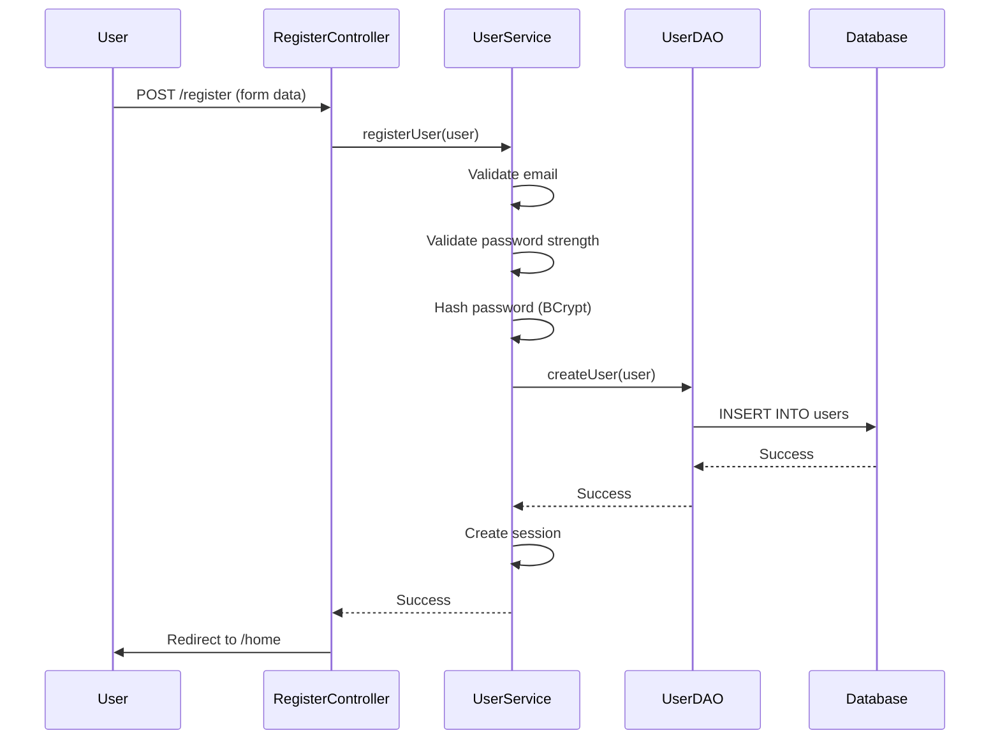
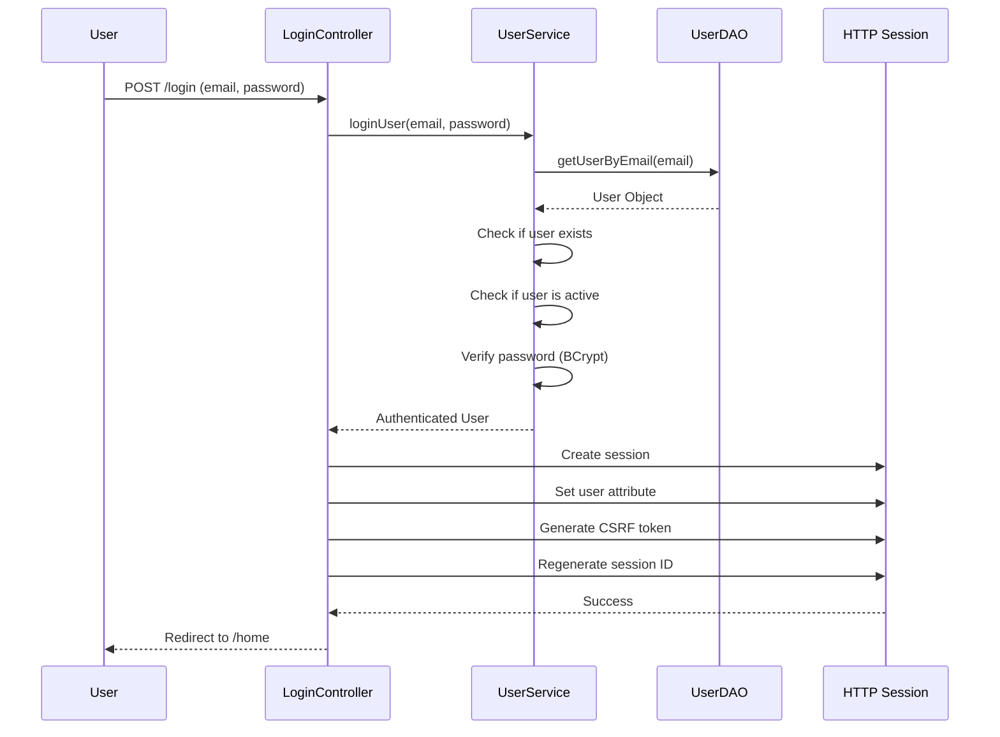
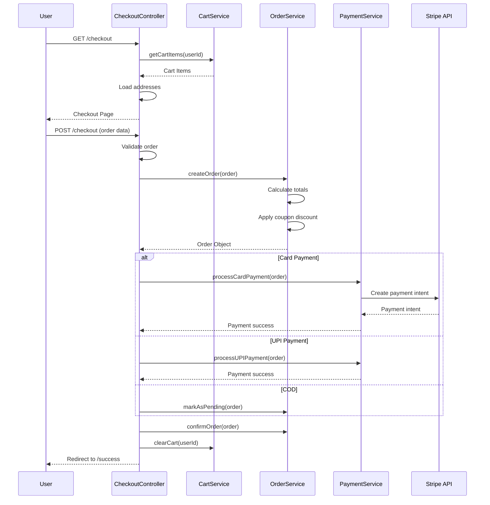
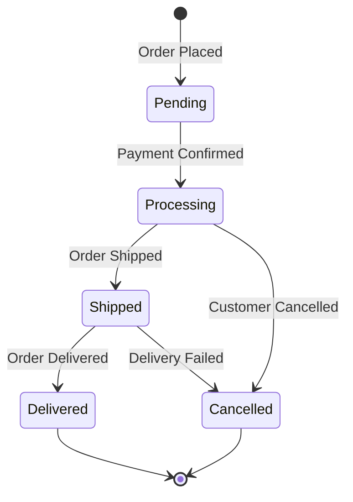
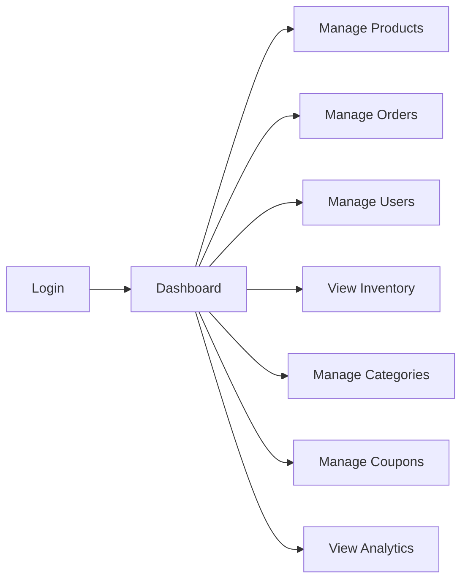

# FashionStore - Feature Documentation

## Table of Contents
1. [Executive Summary](#executive-summary)
2. [Customer Features Overview](#customer-features-overview)
3. [Authentication & Profile](#authentication--profile)
4. [Product Browsing](#product-browsing)
5. [Search & Discovery](#search--discovery)
6. [Shopping Cart](#shopping-cart)
7. [Wishlist](#wishlist)
8. [Checkout & Payment](#checkout--payment)
9. [Order Management](#order-management)
10. [Address Management](#address-management)
11. [Reviews & Ratings](#reviews--ratings)
12. [Admin Features Overview](#admin-features-overview)
13. [Dashboard](#dashboard)
14. [Product Management](#product-management)
15. [Inventory Management](#inventory-management)
16. [Order Management](#order-management-1)
17. [User Management](#user-management)
18. [Category Management](#category-management)
19. [Coupon Management](#coupon-management)
20. [Analytics & Reports](#analytics--reports)

---

## Executive Summary

The FashionStore platform provides a comprehensive set of features for both customers and administrators. Customer features focus on a seamless shopping experience with authentication, product discovery, cart management, checkout, and order tracking. Admin features provide powerful tools for managing products, inventory, orders, users, categories, coupons, and viewing analytics.

**Customer Features:**
- User authentication with role-based access
- Product browsing with filtering and sorting
- Advanced search with suggestions
- Shopping cart with quantity management
- Wishlist for saved items
- Secure checkout with multiple payment methods
- Order tracking and history
- Address management
- Product reviews and ratings

**Admin Features:**
- Dashboard with key metrics
- Full product CRUD operations
- Inventory management with low stock alerts
- Order processing and status updates
- User management with role assignment
- Category management
- Coupon creation and management
- Analytics and reporting

---

## Customer Features Overview

### Customer User Journey


### Feature Categories

1. **Authentication & Profile**: User registration, login, profile management
2. **Product Browsing**: Category navigation, product listings, product details
3. **Search & Discovery**: Search functionality, filters, sorting
4. **Shopping Cart**: Add/remove items, quantity management
5. **Wishlist**: Save favorite items for later
6. **Checkout & Payment**: Secure checkout, multiple payment options
7. **Order Management**: Order history, order tracking
8. **Address Management**: Multiple addresses, default address
9. **Reviews & Ratings**: Product reviews, star ratings

---

## Authentication & Profile

### User Registration

**Features:**
- Email-based registration
- Password strength validation
- Profile information collection (name, phone, address, gender)
- Automatic customer role assignment
- Session creation on successful registration

**Registration Flow:**


**Registration Form Fields:**
- Full Name (required)
- Email (required, unique)
- Phone (optional)
- Password (required, min 8 chars, mixed case, digit, special char)
- Address (optional)
- Gender (optional: Male, Female, Other)

### User Login

**Features:**
- Email/password authentication
- BCrypt password verification
- Session creation with CSRF token
- Session fixation prevention
- Remember me functionality (future)

**Login Flow:**


### Profile Management

**Features:**
- View profile information
- Edit profile details
- Change password
- Manage account settings
- View order history
- Manage saved addresses

**Profile Fields:**
- Full Name
- Email (read-only)
- Phone
- Address
- Gender
- Account Settings (notifications, preferences)

---

## Product Browsing

### Homepage

**Features:**
- Hero section with featured collection
- Category grid with navigation
- Featured products carousel
- Trending products section
- Brand story/editorial content
- Value propositions
- Newsletter signup

**Homepage Components:**
```jsp
<%-- Hero Section --%>
<section class="home-hero">
    <h1>Luxury Everyday Essentials</h1>
    <p>A cinematic edit of tailored separates...</p>
    <a href="/products?tag=new">Explore Collection</a>
</section>

<%-- Category Grid --%>
<section class="home-categories">
    <div class="category-grid">
        <a href="/products?category=men">Men</a>
        <a href="/products?category=women">Women</a>
        <a href="/products?category=footwear">Footwear</a>
    </div>
</section>

<%-- Featured Products --%>
<section class="home-featured">
    <div class="product-grid">
        <% for (Product p : featuredProducts) { %>
            <article class="product-card">
                <!-- Product card content -->
            </article>
        <% } %>
    </div>
</section>
```

### Product Listing

**Features:**
- Category-based browsing
- Tag-based filtering (new, sale, trending)
- Price range filtering
- Size filtering
- Sorting options (price, popularity, newest)
- Pagination
- Product count display

**URL Patterns:**
```
/products                          # All products
/products?category=men             # By category
/products?tag=new                  # By tag (new, sale, trending)
/products?minPrice=500&maxPrice=2000  # Price range
/products?size=M&size=L            # Size filter
/products?sortBy=price_asc        # Sorting
/products?page=1                  # Pagination
```

**Product Card Features:**
- Product image with lazy loading
- Product name and brand
- Category display
- Price with discount calculation
- Sale/New/Trending badges
- Wishlist toggle button
- View details link

### Product Details

**Features:**
- Large product images
- Product information (name, brand, description)
- Price with discount
- Size selection with stock availability
- Add to cart functionality
- Add to wishlist
- Product reviews and ratings
- Related products
- Recently viewed tracking

**Product Details Page:**
```jsp
<article class="product-detail">
    <div class="product-gallery">
        " alt="<%= product.getProductName() %>">
    </div>
    
    <div class="product-info">
        <h1><%= product.getProductName() %></h1>
        <span class="brand"><%= product.getBrand() %></span>
        <span class="category"><%= product.getCategoryName() %></span>
        
        <div class="price">
            <span class="current">₹<%= discountedPrice %></span>
            <span class="original">₹<%= product.getPrice() %></span>
            <span class="discount"><%= product.getDiscountPercent() %>% off</span>
        </div>
        
        <div class="sizes">
            <% for (ProductSize size : product.getSizes()) { %>
                <button class="size-btn <%= size.getStockQuantity() == 0 ? 'out-of-stock' : '' %>"
                        data-size="<%= size.getSizeLabel() %>"
                        data-stock="<%= size.getStockQuantity() %>">
                    <%= size.getSizeLabel() %>
                </button>
            <% } %>
        </div>
        
        <div class="actions">
            <button class="btn btn-primary" onclick="addToCart()">Add to Cart</button>
            <button class="btn btn-outline" onclick="toggleWishlist()">
                <svg><!-- Heart icon --></svg>
            </button>
        </div>
        
        <p class="description"><%= product.getDescription() %></p>
    </div>
</article>
```

---

## Search & Discovery

### Search Functionality

**Features:**
- Full-text product search
- Search by product name, brand, description
- Real-time search suggestions
- Search history tracking
- Search analytics (admin)

**Search Controller:**
```java
@WebServlet("/search")
public class SearchController extends HttpServlet {
    private ProductService productService;
    
    @Override
    protected void doGet(HttpServletRequest request, HttpServletResponse response)
            throws ServletException, IOException {
        
        String query = request.getParameter("q");
        int page = parseInt(request.getParameter("page"), 1);
        int limit = 20;
        
        if (query != null && !query.trim().isEmpty()) {
            List<Product> results = productService.searchProducts(query, page, limit);
            int totalCount = productService.countSearchResults(query);
            
            request.setAttribute("products", results);
            request.setAttribute("query", query);
            request.setAttribute("totalCount", totalCount);
            request.setAttribute("currentPage", page);
            request.setAttribute("totalPages", (int) Math.ceil((double) totalCount / limit));
            
            // Track search history
            trackSearchHistory(request, query);
        }
        
        request.getRequestDispatcher("/WEB-INF/views/products.jsp")
               .forward(request, response);
    }
}
```

### Search Suggestions

**Features:**
- AJAX-based autocomplete
- Real-time suggestions as user types
- Product name and category suggestions
- Click to navigate to product

**Search Suggestions API:**
```java
@WebServlet("/api/search/suggestions")
public class SearchSuggestionsController extends HttpServlet {
    @Override
    protected void doGet(HttpServletRequest request, HttpServletResponse response)
            throws ServletException, IOException {
        
        String query = request.getParameter("q");
        List<String> suggestions = productService.getSearchSuggestions(query);
        
        response.setContentType("application/json");
        Gson gson = new Gson();
        response.getWriter().write(gson.toJson(suggestions));
    }
}
```

---

## Shopping Cart

### Cart Features

**Features:**
- Add products to cart
- Remove items from cart
- Update item quantities
- View cart summary
- Persistent cart (session-based)
- Cart count in navbar
- Stock validation
- Price calculation with discounts

### Cart Controller

**CartController Implementation:**
```java
@WebServlet("/cart")
public class CartController extends HttpServlet {
    private CartService cartService;
    private ProductService productService;
    
    @Override
    protected void doPost(HttpServletRequest request, HttpServletResponse response)
            throws ServletException, IOException {
        
        String action = request.getParameter("action");
        
        switch (action) {
            case "add":
                addToCart(request);
                break;
            case "update":
                updateCartItem(request);
                break;
            case "remove":
                removeCartItem(request);
                break;
        }
        
        response.sendRedirect(request.getContextPath() + "/cart");
    }
    
    private void addToCart(HttpServletRequest request) {
        int productId = parseInt(request.getParameter("productId"));
        String size = request.getParameter("size");
        int quantity = parseInt(request.getParameter("quantity"), 1);
        
        User user = (User) request.getSession().getAttribute("user");
        cartService.addToCart(user.getUserId(), productId, size, quantity);
    }
    
    @Override
    protected void doGet(HttpServletRequest request, HttpServletResponse response)
            throws ServletException, IOException {
        
        User user = (User) request.getSession().getAttribute("user");
        List<CartItem> cartItems = cartService.getCartItems(user.getUserId());
        
        BigDecimal total = cartService.calculateCartTotal(user.getUserId());
        
        request.setAttribute("cartItems", cartItems);
        request.setAttribute("cartTotal", total);
        
        request.getRequestDispatcher("/WEB-INF/views/cart.jsp")
               .forward(request, response);
    }
}
```

### Cart JavaScript

**Add to Cart:**
```javascript
FashionStore.addToCart = async function(productId, size, quantity) {
    const response = await fetch(`${window.contextPath}/cart`, {
        method: 'POST',
        headers: {
            'Content-Type': 'application/x-www-form-urlencoded',
            'X-CSRF-Token': window.csrfToken
        },
        body: `action=add&productId=${productId}&size=${size}&quantity=${quantity}`
    });
    
    if (response.ok) {
        FashionStore.updateCartCount();
        FashionStore.showToast('Added to cart');
    }
};
```

---

## Wishlist

### Wishlist Features

**Features:**
- Add products to wishlist
- Remove from wishlist
- View wishlist
- Move to cart from wishlist
- Wishlist count in navbar
- Persistent wishlist (database)

### Wishlist Controller

**WishlistController Implementation:**
```java
@WebServlet("/wishlist")
public class WishlistController extends HttpServlet {
    private WishlistService wishlistService;
    
    @Override
    protected void doPost(HttpServletRequest request, HttpServletResponse response)
            throws ServletException, IOException {
        
        String action = request.getParameter("action");
        int productId = parseInt(request.getParameter("productId"));
        
        User user = (User) request.getSession().getAttribute("user");
        
        if ("add".equals(action)) {
            wishlistService.addToWishlist(user.getUserId(), productId);
        } else if ("remove".equals(action)) {
            wishlistService.removeFromWishlist(user.getUserId(), productId);
        } else if ("moveToCart".equals(action)) {
            wishlistService.moveToCart(user.getUserId(), productId);
        }
        
        response.sendRedirect(request.getContextPath() + "/wishlist");
    }
    
    @Override
    protected void doGet(HttpServletRequest request, HttpServletResponse response)
            throws ServletException, IOException {
        
        User user = (User) request.getSession().getAttribute("user");
        List<Product> wishlistItems = wishlistService.getWishlistItems(user.getUserId());
        
        request.setAttribute("wishlistItems", wishlistItems);
        
        request.getRequestDispatcher("/WEB-INF/views/wishlist.jsp")
               .forward(request, response);
    }
}
```

---

## Checkout & Payment

### Checkout Features

**Features:**
- Review cart items
- Select shipping address
- Add new address
- Select payment method (Card, UPI, COD)
- Apply coupon codes
- Order summary with totals
- Secure payment processing
- Order confirmation

### Checkout Flow



### Checkout Controller

**CheckoutController Implementation:**
```java
@WebServlet("/checkout")
public class CheckoutController extends HttpServlet {
    private OrderService orderService;
    private PaymentService paymentService;
    private CartService cartService;
    
    @Override
    protected void doGet(HttpServletRequest request, HttpServletResponse response)
            throws ServletException, IOException {
        
        User user = (User) request.getSession().getAttribute("user");
        
        List<CartItem> cartItems = cartService.getCartItems(user.getUserId());
        if (cartItems.isEmpty()) {
            response.sendRedirect(request.getContextPath() + "/cart");
            return;
        }
        
        List<Address> addresses = addressService.getAddressesByUserId(user.getUserId());
        BigDecimal cartTotal = cartService.calculateCartTotal(user.getUserId());
        
        request.setAttribute("cartItems", cartItems);
        request.setAttribute("addresses", addresses);
        request.setAttribute("cartTotal", cartTotal);
        
        request.getRequestDispatcher("/WEB-INF/views/checkout.jsp")
               .forward(request, response);
    }
    
    @Override
    protected void doPost(HttpServletRequest request, HttpServletResponse response)
            throws ServletException, IOException {
        
        User user = (User) request.getSession().getAttribute("user");
        
        // Create order
        Order order = new Order();
        order.setUserId(user.getUserId());
        order.setShippingAddressId(parseInt(request.getParameter("addressId")));
        order.setPaymentMethod(request.getParameter("paymentMethod"));
        order.setCouponCode(request.getParameter("couponCode"));
        
        // Process order
        Order createdOrder = orderService.createOrder(order);
        
        // Process payment
        boolean paymentSuccess = paymentService.processPayment(createdOrder);
        
        if (paymentSuccess) {
            orderService.confirmOrder(createdOrder.getOrderId());
            cartService.clearCart(user.getUserId());
            response.sendRedirect(request.getContextPath() + "/success?orderId=" + createdOrder.getOrderId());
        } else {
            request.setAttribute("error", "Payment failed");
            request.getRequestDispatcher("/WEB-INF/views/payment-failure.jsp")
                   .forward(request, response);
        }
    }
}
```

---

## Order Management

### Order Features

**Features:**
- View order history
- View order details
- Track order status
- Cancel orders (if allowed)
- Download invoice (future)
- Reorder items (future)

### Order Controller

**OrderController Implementation:**
```java
@WebServlet("/orders")
public class OrderController extends HttpServlet {
    private OrderService orderService;
    
    @Override
    protected void doGet(HttpServletRequest request, HttpServletResponse response)
            throws ServletException, IOException {
        
        User user = (User) request.getSession().getAttribute("user");
        String orderId = request.getParameter("id");
        
        if (orderId != null) {
            // View single order
            Order order = orderService.getOrderById(parseInt(orderId));
            
            if (order.getUserId() != user.getUserId()) {
                response.sendError(HttpServletResponse.SC_FORBIDDEN);
                return;
            }
            
            request.setAttribute("order", order);
            request.getRequestDispatcher("/WEB-INF/views/order-details.jsp")
                   .forward(request, response);
        } else {
            // View order history
            List<Order> orders = orderService.getOrdersByUserId(user.getUserId());
            request.setAttribute("orders", orders);
            request.getRequestDispatcher("/WEB-INF/views/orders.jsp")
                   .forward(request, response);
        }
    }
}
```

### Order Status Flow



---

## Address Management

### Address Features

**Features:**
- Add new address
- Edit existing address
- Delete address
- Set default address
- Multiple addresses per user

### Address Controller

**AddressController Implementation:**
```java
@WebServlet("/account/addresses")
public class AddressController extends HttpServlet {
    private AddressService addressService;
    
    @Override
    protected void doPost(HttpServletRequest request, HttpServletResponse response)
            throws ServletException, IOException {
        
        String action = request.getParameter("action");
        User user = (User) request.getSession().getAttribute("user");
        
        if ("add".equals(action)) {
            Address address = new Address();
            address.setUserId(user.getUserId());
            address.setFullName(request.getParameter("fullName"));
            address.setAddressLine1(request.getParameter("addressLine1"));
            address.setAddressLine2(request.getParameter("addressLine2"));
            address.setCity(request.getParameter("city"));
            address.setState(request.getParameter("state"));
            address.setZipCode(request.getParameter("zipCode"));
            address.setCountry(request.getParameter("country"));
            address.setPhone(request.getParameter("phone"));
            
            addressService.createAddress(address);
        } else if ("delete".equals(action)) {
            int addressId = parseInt(request.getParameter("addressId"));
            addressService.deleteAddress(addressId, user.getUserId());
        } else if ("setDefault".equals(action)) {
            int addressId = parseInt(request.getParameter("addressId"));
            addressService.setDefaultAddress(addressId, user.getUserId());
        }
        
        response.sendRedirect(request.getContextPath() + "/account/addresses");
    }
    
    @Override
    protected void doGet(HttpServletRequest request, HttpServletResponse response)
            throws ServletException, IOException {
        
        User user = (User) request.getSession().getAttribute("user");
        List<Address> addresses = addressService.getAddressesByUserId(user.getUserId());
        
        request.setAttribute("addresses", addresses);
        request.getRequestDispatcher("/WEB-INF/views/account/address-management.jsp")
               .forward(request, response);
    }
}
```

---

## Reviews & Ratings

### Review Features

**Features:**
- Submit product reviews
- Star ratings (1-5)
- Text reviews
- View product reviews
- Average rating calculation
- Review moderation (admin)

### Review Controller

**ReviewController Implementation:**
```java
@WebServlet("/reviews")
public class ReviewController extends HttpServlet {
    private ReviewService reviewService;
    
    @Override
    protected void doPost(HttpServletRequest request, HttpServletResponse response)
            throws ServletException, IOException {
        
        User user = (User) request.getSession().getAttribute("user");
        
        Review review = new Review();
        review.setUserId(user.getUserId());
        review.setProductId(parseInt(request.getParameter("productId")));
        review.setRating(parseInt(request.getParameter("rating")));
        review.setReviewText(request.getParameter("reviewText"));
        
        reviewService.createReview(review);
        
        response.sendRedirect(request.getContextPath() + "/product?id=" + review.getProductId());
    }
    
    @Override
    protected void doGet(HttpServletRequest request, HttpServletResponse response)
            throws ServletException, IOException {
        
        int productId = parseInt(request.getParameter("productId"));
        List<Review> reviews = reviewService.getReviewsByProductId(productId);
        BigDecimal averageRating = reviewService.getAverageRating(productId);
        
        request.setAttribute("reviews", reviews);
        request.setAttribute("averageRating", averageRating);
        
        request.getRequestDispatcher("/WEB-INF/views/product-reviews.jsp")
               .forward(request, response);
    }
}
```

---

## Admin Features Overview

### Admin User Journey



### Admin Feature Categories

1. **Dashboard**: Key metrics, recent activity, quick actions
2. **Product Management**: Full CRUD operations, image upload
3. **Inventory Management**: Stock tracking, low stock alerts
4. **Order Management**: Order processing, status updates
5. **User Management**: User listing, role assignment, account status
6. **Category Management**: Category CRUD operations
7. **Coupon Management**: Coupon creation, usage tracking
8. **Analytics & Reports**: Sales analytics, user analytics

---

## Dashboard

### Dashboard Features

**Key Metrics:**
- Total revenue
- Total orders
- Total users
- Active products
- Low stock alerts
- Pending orders

**Recent Activity:**
- Recent orders
- New users
- Product updates
- Coupon usage

**Quick Actions:**
- Add new product
- View all orders
- Manage inventory
- Create coupon

### Dashboard API

**Dashboard Stats Endpoint:**
```java
case "/stats":
    handleStats(request, response);
    break;

private void handleStats(HttpServletRequest request, HttpServletResponse response)
        throws IOException {
    
    Map<String, Object> stats = new HashMap<>();
    
    stats.put("totalRevenue", orderService.getTotalRevenue());
    stats.put("totalOrders", orderService.getTotalOrderCount());
    stats.put("totalUsers", userService.getTotalUserCount());
    stats.put("activeProducts", productService.getActiveProductCount());
    stats.put("lowStockCount", productService.getLowStockCount(10));
    stats.put("pendingOrders", orderService.getPendingOrderCount());
    
    stats.put("recentOrders", orderService.getRecentOrders(5));
    stats.put("recentUsers", userService.getRecentUsers(5));
    stats.put("topProducts", productService.getTopProducts(5));
    
    sendJsonResponse(response, stats);
}
```

---

## Product Management

### Product Features

**CRUD Operations:**
- Create new products
- Edit existing products
- Delete products
- View product list with pagination
- Search and filter products

**Product Fields:**
- Product name
- Description
- Price
- Discount percentage
- Category
- Brand
- Image URL
- Sizes with stock quantities
- Badges (New, Sale, Trending)
- Active status

### Product API

**Get Products:**
```java
case "/products":
    if ("GET".equals(request.getMethod())) {
        handleGetProducts(request, response);
    } else if ("POST".equals(request.getMethod())) {
        handleCreateProduct(request, response);
    }
    break;
```

**Create Product:**
```java
private void handleCreateProduct(HttpServletRequest request, HttpServletResponse response)
        throws IOException {
    
    Product product = parseProductFromRequest(request);
    
    boolean success = productService.createProduct(product);
    
    if (success) {
        sendJsonResponse(response, Map.of("success", true, "productId", product.getProductId()));
    } else {
        sendError(response, HttpServletResponse.SC_INTERNAL_SERVER_ERROR, "Failed to create product");
    }
}
```

**Update Product:**
```java
case "/products/{id}":
    if ("PUT".equals(request.getMethod())) {
        handleUpdateProduct(request, response);
    } else if ("DELETE".equals(request.getMethod())) {
        handleDeleteProduct(request, response);
    }
    break;
```

---

## Inventory Management

### Inventory Features

**Inventory Tracking:**
- View all product sizes with stock
- Low stock alerts
- Update stock quantities
- Bulk stock updates
- Inventory reports

**Low Stock Alert:**
```java
case "/inventory/low-stock":
    handleLowStock(request, response);
    break;

private void handleLowStock(HttpServletRequest request, HttpServletResponse response)
        throws IOException {
    
    int threshold = parseInt(request.getParameter("threshold"), 10);
    List<ProductSize> lowStockItems = productService.getLowStockItems(threshold);
    
    sendJsonResponse(response, lowStockItems);
}
```

---

## Order Management

### Order Features

**Order Processing:**
- View all orders
- Filter by status
- Update order status
- View order details
- Cancel orders
- Process refunds

**Order Status Updates:**
```java
case "/orders/{id}/status":
    if ("PUT".equals(request.getMethod())) {
        handleUpdateOrderStatus(request, response);
    }
    break;

private void handleUpdateOrderStatus(HttpServletRequest request, HttpServletResponse response)
        throws IOException {
    
    int orderId = parseInt(extractId(request.getPathInfo()));
    String newStatus = request.getParameter("status");
    
    boolean success = orderService.updateOrderStatus(orderId, newStatus);
    
    if (success) {
        sendJsonResponse(response, Map.of("success", true));
    } else {
        sendError(response, HttpServletResponse.SC_INTERNAL_SERVER_ERROR, "Failed to update order status");
    }
}
```

---

## User Management

### User Features

**User Management:**
- View all users
- Search users
- Update user role
- Disable/enable accounts
- View user details
- View user orders

**User Role Update:**
```java
case "/users/{id}/role":
    if ("PUT".equals(request.getMethod())) {
        handleUpdateUserRole(request, response);
    }
    break;

private void handleUpdateUserRole(HttpServletRequest request, HttpServletResponse response)
        throws IOException {
    
    int userId = parseInt(extractId(request.getPathInfo()));
    String newRole = request.getParameter("role");
    
    boolean success = userService.updateUserRole(userId, newRole);
    
    if (success) {
        sendJsonResponse(response, Map.of("success", true));
    } else {
        sendError(response, HttpServletResponse.SC_INTERNAL_SERVER_ERROR, "Failed to update user role");
    }
}
```

---

## Category Management

### Category Features

**Category Management:**
- View all categories
- Create new categories
- Edit categories
- Delete categories
- Category slug management

**Category API:**
```java
case "/categories":
    if ("GET".equals(request.getMethod())) {
        handleGetCategories(request, response);
    } else if ("POST".equals(request.getMethod())) {
        handleCreateCategory(request, response);
    }
    break;
```

---

## Coupon Management

### Coupon Features

**Coupon Management:**
- Create coupons
- View all coupons
- Edit coupons
- Delete coupons
- View coupon usage
- Set coupon expiry

**Coupon Fields:**
- Coupon code
- Discount type (percentage, fixed)
- Discount value
- Minimum order value
- Usage limit
- Expiry date
- Active status

### Coupon API

**Coupon Creation:**
```java
case "/coupons":
    if ("POST".equals(request.getMethod())) {
        handleCreateCoupon(request, response);
    }
    break;

private void handleCreateCoupon(HttpServletRequest request, HttpServletResponse response)
        throws IOException {
    
    Coupon coupon = parseCouponFromRequest(request);
    
    boolean success = couponService.createCoupon(coupon);
    
    if (success) {
        sendJsonResponse(response, Map.of("success", true, "couponId", coupon.getCouponId()));
    } else {
        sendError(response, HttpServletResponse.SC_INTERNAL_SERVER_ERROR, "Failed to create coupon");
    }
}
```

---

## Analytics & Reports

### Analytics Features

**Sales Analytics:**
- Revenue over time
- Orders by status
- Top-selling products
- Sales by category

**User Analytics:**
- User registration trends
- Active users
- User demographics

**Product Analytics:**
- Product views
- Add to cart rate
- Conversion rate
- Search analytics

### Analytics API

**Sales Analytics:**
```java
case "/analytics/sales":
    handleSalesAnalytics(request, response);
    break;

private void handleSalesAnalytics(HttpServletRequest request, HttpServletResponse response)
        throws IOException {
    
    String period = request.getParameter("period"); // daily, weekly, monthly
    
    Map<String, Object> analytics = new HashMap<>();
    analytics.put("revenueOverTime", orderService.getRevenueOverTime(period));
    analytics.put("ordersByStatus", orderService.getOrdersByStatus());
    analytics.put("topProducts", productService.getTopProducts(10));
    analytics.put("salesByCategory", orderService.getSalesByCategory());
    
    sendJsonResponse(response, analytics);
}
```

---

## Conclusion

The FashionStore platform provides a **comprehensive feature set** for both customers and administrators:

**Customer Features:**
- Seamless authentication and profile management
- Rich product browsing and discovery
- Advanced search and filtering
- Intuitive shopping cart and wishlist
- Secure checkout with multiple payment options
- Complete order management and tracking
- Address management and product reviews

**Admin Features:**
- Powerful dashboard with key metrics
- Full product and inventory management
- Comprehensive order processing
- User management with role-based access
- Category and coupon management
- Detailed analytics and reporting

These features provide a complete e-commerce experience while maintaining usability, security, and performance.
