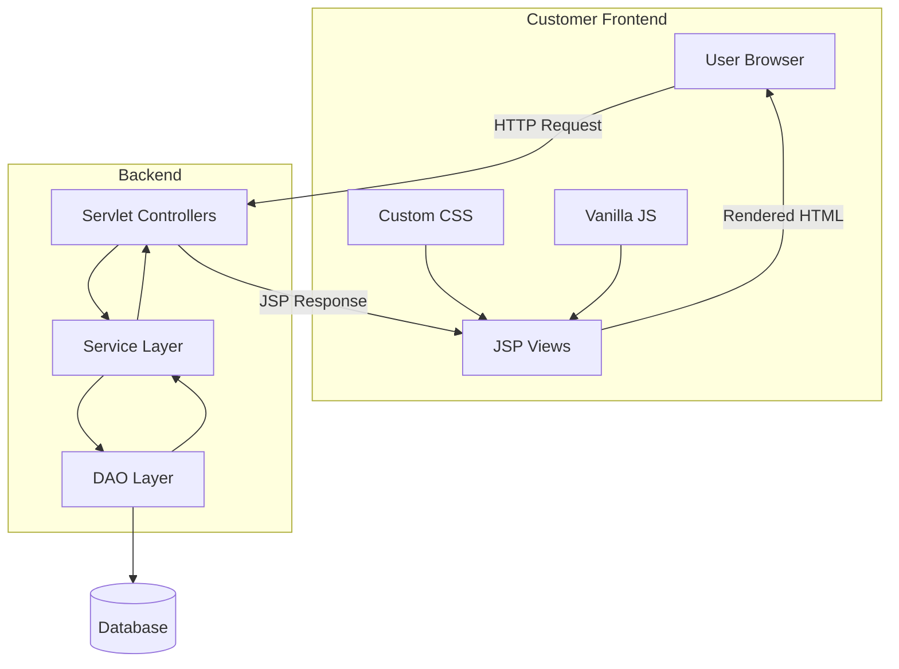
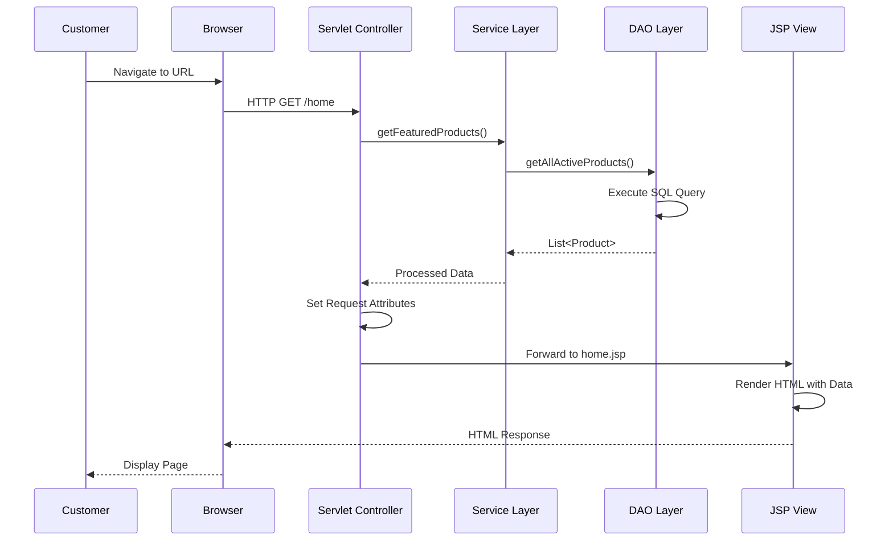
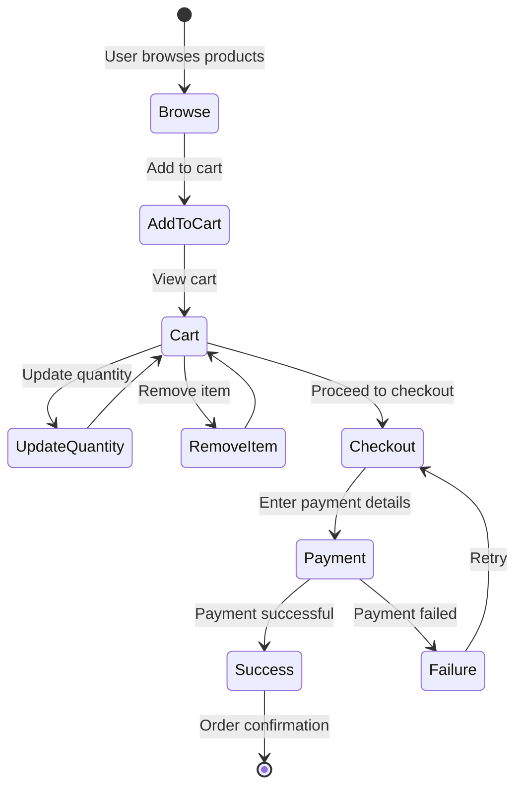
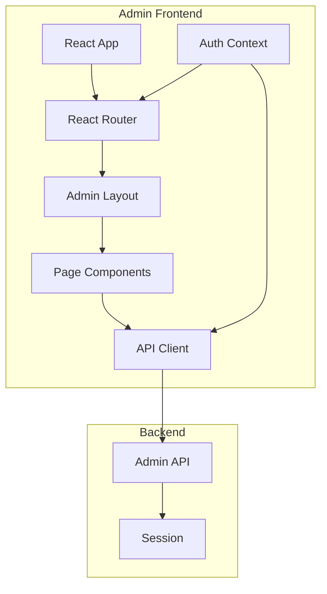
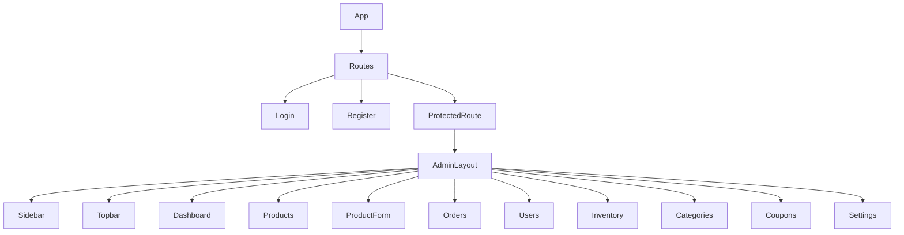

# FashionStore - Frontend Documentation

## Table of Contents
1. [Executive Summary](#executive-summary)
2. [Customer Frontend Architecture](#customer-frontend-architecture)
3. [JSP MVC Flow](#jsp-mvc-flow)
4. [Customer Frontend Components](#customer-frontend-components)
5. [Customer Frontend Styling](#customer-frontend-styling)
6. [Cart & Checkout Workflow](#cart--checkout-workflow)
7. [Admin Frontend Architecture](#admin-frontend-architecture)
8. [React Component Hierarchy](#react-component-hierarchy)
9. [Admin Frontend Routing](#admin-frontend-routing)
10. [Admin Frontend State Management](#admin-frontend-state-management)
11. [Admin Frontend Styling](#admin-frontend-styling)
12. [Frontend Communication](#frontend-communication)
13. [Performance Optimization](#performance-optimization)

---

## Executive Summary

FashionStore employs a **dual-frontend architecture** serving distinct user experiences:

1. **Customer Frontend**: Traditional JSP/Servlet MVC pattern with vanilla JavaScript, delivering a polished, luxury e-commerce experience
2. **Admin Frontend**: Modern React 18 SPA with Vite, providing a responsive, feature-rich admin dashboard

Both frontends communicate with a shared Java backend through different API endpoints, ensuring separation of concerns while maintaining data consistency.

**Key Frontend Characteristics:**
- **Customer**: Server-side rendering (JSP), progressive enhancement, luxury design system
- **Admin**: Client-side rendering (React), SPA architecture, component-based UI
- **Shared**: Same backend API, session-based authentication, CSRF protection

---

## Customer Frontend Architecture

### Technology Stack

| Technology | Version | Purpose |
|------------|---------|---------|
| JSP | 3.1 | Server-side templating |
| JSTL | 2.0 | Tag library for JSP |
| JavaScript | ES6+ | Client-side interactivity |
| CSS3 | Modern | Styling with design tokens |
| HTML5 | Standard | Markup structure |

### Architecture Pattern



### File Structure

```
src/main/webapp/
├── index.jsp                    # Entry point (redirects to home)
├── assets/
│   ├── css/
│   │   ├── design-tokens.css    # CSS custom properties
│   │   ├── reset.css            # CSS reset
│   │   ├── base.css             # Base styles
│   │   ├── components/          # Component styles
│   │   │   ├── navbar.css
│   │   │   ├── product-card.css
│   │   │   ├── footer.css
│   │   │   ├── buttons.css
│   │   │   ├── forms.css
│   │   │   └── mobile-nav.css
│   │   └── pages/               # Page-specific styles
│   ├── js/
│   │   ├── main.js              # Main JavaScript
│   │   ├── cart.js              # Cart functionality
│   │   ├── animations.js       # Animations
│   │   ├── lazy-loading.js     # Image lazy loading
│   │   └── splash-screen.js    # Splash screen
│   └── images/
└── WEB-INF/
    └── views/
        ├── partials/            # Reusable JSP partials
        │   ├── head.jsp         # HTML head
        │   ├── navbar.jsp       # Navigation bar
        │   └── footer.jsp       # Footer
        ├── home.jsp             # Homepage
        ├── products.jsp         # Product listing
        ├── product-details.jsp  # Product details
        ├── cart.jsp             # Shopping cart
        ├── checkout.jsp         # Checkout page
        ├── orders.jsp           # Order history
        ├── login.jsp            # Login page
        ├── register.jsp         # Registration page
        ├── wishlist.jsp         # Wishlist
        └── account/             # Account management
```

### JSP Architecture

**Partial System:**
- `head.jsp`: Shared HTML head, meta tags, CSS loading
- `navbar.jsp`: Navigation bar with cart count, user menu
- `footer.jsp`: Footer with links, newsletter signup

**Page Attributes:**
```jsp
<%
    request.setAttribute("_pageTitle", "Home");
    request.setAttribute("_pageCSS", "home");
%>
<jsp:include page="/WEB-INF/views/partials/head.jsp" />
```

**CSS Loading Strategy:**
1. Design tokens (always loaded first)
2. Reset and base styles
3. Component styles (single source of truth)
4. Page-specific styles (conditional)

---

## JSP MVC Flow

### Request-Response Cycle



### Controller Pattern

**Servlet Controllers:**
- `@WebServlet` annotation for URL mapping
- `doGet()` for GET requests (page loads)
- `doPost()` for POST requests (form submissions)
- Request attribute passing to JSP
- Forward vs Redirect pattern

**Example Controller:**
```java
@WebServlet("/home")
public class HomeServlet extends HttpServlet {
    protected void doGet(HttpServletRequest request, HttpServletResponse response) 
            throws ServletException, IOException {
        
        // Fetch data
        List<Product> products = productService.getFeaturedProducts(12);
        List<Category> categories = categoryService.getActiveCategories();
        List<Product> trending = productService.getTrendingProducts(8);
        
        // Set attributes
        request.setAttribute("products", products);
        request.setAttribute("categories", categories);
        request.setAttribute("trendingProducts", trending);
        
        // Forward to JSP
        request.getRequestDispatcher("/WEB-INF/views/home.jsp")
               .forward(request, response);
    }
}
```

### Data Binding in JSP

**Request Attribute Retrieval:**
```jsp
<%
    List<Product> products = new ArrayList<>();
    Object obj = request.getAttribute("products");
    if (obj != null && obj instanceof List<?>) {
        @SuppressWarnings("unchecked")
        List<Product> temp = (List<Product>) obj;
        products = temp;
    }
%>
```

**Iteration and Display:**
```jsp
<% for (Product p : products) { %>
    <article class="product-card">
        " alt="<%= p.getProductName() %>">
        <h3><%= p.getProductName() %></h3>
        <span>₹<%= p.getPrice() %></span>
    </article>
<% } %>
```

**XSS Prevention:**
```jsp
<%= org.apache.commons.text.StringEscapeUtils.escapeHtml4(p.getProductName()) %>
```

---

## Customer Frontend Components

### Component Categories

**1. Layout Components**
- **Navbar**: Navigation with search, cart, user menu
- **Footer**: Links, newsletter, social media
- **Mobile Nav**: Responsive navigation for mobile

**2. Product Components**
- **Product Card**: Product display with image, price, badges
- **Product Grid**: Responsive grid of product cards
- **Size Selector**: Size selection for products

**3. Form Components**
- **Login Form**: User authentication
- **Register Form**: User registration
- **Address Form**: Address management
- **Checkout Form**: Checkout information

**4. Interactive Components**
- **Cart Widget**: Mini cart in navbar
- **Wishlist Button**: Add to wishlist
- **Toast Notifications**: Success/error messages
- **Search Suggestions**: Real-time search results

### Product Card Component

**HTML Structure:**
```html
<article class="product-card">
    <div class="product-card-image-wrapper">
        
        <button class="product-card-wishlist" onclick="FashionStore.toggleWishlist(...)">
            <!-- Heart icon -->
        </button>
        <span class="product-card-badge badge-sale">Sale</span>
    </div>
    <div class="product-card-content">
        <span class="product-card-brand">Brand Name</span>
        <h3 class="product-card-name">Product Name</h3>
        <span class="product-card-category">Category</span>
        <div class="product-card-bottom">
            <div class="product-card-price">
                <span class="product-card-price-current">₹899.00</span>
                <span class="product-card-price-original">₹999.00</span>
            </div>
            <div class="product-card-actions">
                <a href="/product?id=1" class="btn btn-primary">View details</a>
            </div>
        </div>
    </div>
</article>
```

**Features:**
- Lazy loading images
- Wishlist toggle
- Badge display (Sale, New, Trending)
- Price calculation with discount
- Responsive design

---

## Customer Frontend Styling

### Design System Architecture

**CSS Custom Properties (Design Tokens):**
```css
:root {
    /* Colors */
    --color-ink-50: #fafafa;
    --color-ink-900: #0a0a0a;
    --color-accent: #1a1a1a;
    
    /* Typography */
    --font-serif: 'Cormorant Garamond', serif;
    --font-sans: 'Inter', sans-serif;
    
    /* Spacing */
    --space-xs: 0.5rem;
    --space-sm: 1rem;
    --space-md: 2rem;
    --space-lg: 4rem;
    
    /* Border Radius */
    --radius-sm: 4px;
    --radius-md: 8px;
    --radius-lg: 16px;
    
    /* Shadows */
    --shadow-sm: 0 1px 2px rgba(0,0,0,0.05);
    --shadow-md: 0 4px 6px rgba(0,0,0,0.1);
    --shadow-lg: 0 10px 15px rgba(0,0,0,0.15);
}
```

**CSS Architecture Layers:**
1. **Design Tokens**: CSS custom properties
2. **Reset**: Normalize browser styles
3. **Base**: Element-level styles
4. **Components**: Reusable component styles
5. **Pages**: Page-specific styles
6. **Utilities**: Helper classes

### Luxury Design Principles

**Typography:**
- **Serif Font**: Cormorant Garamond for headings (editorial feel)
- **Sans-Serif Font**: Inter for body text (readability)
- **Font Weights**: 300-700 range for hierarchy
- **Letter Spacing**: Tighter for headings, normal for body

**Color Palette:**
- **Primary**: Ink black (#0a0a0a)
- **Secondary**: Warm grays (#fafafa, #f5f5f5)
- **Accent**: Gold/bronze for luxury feel
- **Semantic Colors**: Success (green), Error (red), Warning (amber)

**Spacing:**
- **Generous whitespace**: Luxury aesthetic
- **Consistent rhythm**: 8px base unit
- **Section spacing**: 4rem (64px) between sections

**Micro-interactions:**
- **Hover effects**: Subtle transforms, shadows
- **Transitions**: 300ms ease-out
- **Animations**: Staggered reveals, smooth scrolling

---

## Cart & Checkout Workflow

### Cart Workflow



### Cart JavaScript Implementation

**Add to Cart:**
```javascript
FashionStore.addToCart = async function(productId, size, quantity) {
    const response = await fetch(`${window.contextPath}/cart`, {
        method: 'POST',
        headers: {
            'Content-Type': 'application/x-www-form-urlencoded',
            'X-CSRF-Token': window.csrfToken
        },
        body: `productId=${productId}&size=${size}&quantity=${quantity}`
    });
    
    if (response.ok) {
        FashionStore.updateCartCount();
        FashionStore.showToast('Added to cart');
    }
};
```

**Update Cart Count:**
```javascript
FashionStore.updateCartCount = async function() {
    const response = await fetch(`${window.contextPath}/cart/count`);
    const data = await response.json();
    document.querySelectorAll('.cart-count').forEach(el => {
        el.textContent = data.count;
    });
};
```

### Checkout Workflow

**Checkout Steps:**
1. **Review Cart**: View items, quantities, totals
2. **Shipping Address**: Select or add address
3. **Payment Method**: Choose payment option
4. **Review Order**: Confirm details
5. **Payment**: Process payment via Stripe
6. **Confirmation**: Order success/failure page

**Checkout Form:**
```html
<form action="<%= request.getContextPath() %>/checkout" method="post">
    <input type="hidden" name="csrfToken" value="<%= request.getAttribute("csrfToken") %>">
    
    <!-- Shipping Address -->
    <fieldset>
        <legend>Shipping Address</legend>
        <input type="text" name="fullName" required>
        <input type="text" name="address" required>
        <input type="text" name="city" required>
        <input type="text" name="state" required>
        <input type="text" name="zip" required>
        <input type="text" name="country" required>
    </fieldset>
    
    <!-- Payment Method -->
    <fieldset>
        <legend>Payment Method</legend>
        <select name="paymentMethod">
            <option value="card">Credit/Debit Card</option>
            <option value="upi">UPI</option>
            <option value="cod">Cash on Delivery</option>
        </select>
    </fieldset>
    
    <button type="submit" class="btn btn-primary">Place Order</button>
</form>
```

---

## Admin Frontend Architecture

### Technology Stack

| Technology | Version | Purpose |
|------------|---------|---------|
| React | 18.3.1 | UI library |
| Vite | 5.4.10 | Build tool and dev server |
| React Router DOM | 6.27.0 | Client-side routing |
| TailwindCSS | 3.4.14 | Utility-first CSS |
| Lucide React | 0.456.0 | Icon library |
| Recharts | 2.13.3 | Charting library |
| Axios | 1.7.7 | HTTP client |

### Architecture Pattern



### File Structure

```
fashionstore-admin/src/
├── main.jsx                 # App entry point
├── App.jsx                  # Root component with routes
├── api/
│   ├── axios.js             # Axios instance configuration
│   └── auth.js              # Authentication API
├── auth/
│   └── AuthContext.jsx      # Authentication context
├── components/
│   ├── AdminLayout.jsx      # Main layout wrapper
│   ├── Sidebar.jsx           # Navigation sidebar
│   ├── Topbar.jsx            # Top navigation bar
│   ├── DataTable.jsx        # Reusable data table
│   ├── StatCard.jsx         # Statistics card
│   ├── LoadingSpinner.jsx   # Loading indicator
│   └── Toast.jsx            # Toast notifications
├── context/
│   └── ThemeContext.jsx     # Theme context (dark/light)
├── pages/
│   ├── Login.jsx            # Login page
│   ├── Register.jsx         # Registration page
│   ├── dashboard/
│   │   └── Dashboard.jsx    # Dashboard with stats
│   ├── products/
│   │   ├── Products.jsx     # Product listing
│   │   └── ProductForm.jsx  # Product create/edit
│   ├── orders/
│   │   └── Orders.jsx       # Order management
│   ├── users/
│   │   └── Users.jsx        # User management
│   ├── inventory/
│   │   └── Inventory.jsx    # Inventory management
│   ├── categories/
│   │   └── Categories.jsx   # Category management
│   ├── coupons/
│   │   └── Coupons.jsx      # Coupon management
│   └── settings/
│       └── Settings.jsx     # Settings page
├── router/
│   └── ProtectedRoute.jsx   # Route protection wrapper
├── styles/
│   └── index.css            # Global styles
└── utils/
    └── formatters.js        # Utility functions
```

---

## React Component Hierarchy

### Component Tree



### Component Descriptions

**1. App Component**
- Root component with React Router
- Route definitions
- Error boundary

**2. AdminLayout Component**
- Main layout wrapper
- Sidebar and topbar integration
- Mobile responsive design
- Outlet for nested routes

**3. Sidebar Component**
- Navigation menu
- Active route highlighting
- Mobile toggle functionality
- Logout action

**4. Topbar Component**
- Header with breadcrumbs
- User menu
- Notifications
- Theme toggle

**5. Dashboard Component**
- Statistics cards
- Charts and graphs
- Recent activity
- Quick actions

**6. Products Component**
- Product data table
- Search and filter
- Pagination
- CRUD operations

**7. ProductForm Component**
- Product create/edit form
- Image upload
- Size management
- Category selection

**8. Orders Component**
- Order data table
- Status updates
- Order details view
- Filtering options

---

## Admin Frontend Routing

### Route Configuration

```jsx
<Routes>
  <Route path="/login" element={<Login />} />
  <Route path="/register" element={<Register />} />
  
  <Route
    element={
      <ProtectedRoute>
        <AdminLayout />
      </ProtectedRoute>
    }
  >
    <Route path="/" element={<Navigate to="/dashboard" replace />} />
    <Route path="/dashboard" element={<Dashboard />} />
    <Route path="/products" element={<Products />} />
    <Route path="/products/new" element={<ProductForm />} />
    <Route path="/products/:id/edit" element={<ProductForm />} />
    <Route path="/inventory" element={<Inventory />} />
    <Route path="/orders" element={<Orders />} />
    <Route path="/users" element={<Users />} />
    <Route path="/categories" element={<Categories />} />
    <Route path="/coupons" element={<Coupons />} />
    <Route path="/settings" element={<Settings />} />
  </Route>
  
  <Route path="*" element={<Navigate to="/dashboard" replace />} />
</Routes>
```

### Protected Routes

**ProtectedRoute Component:**
```jsx
function ProtectedRoute({ children }) {
  const { user, loading } = useAuth();
  
  if (loading) return <LoadingSpinner />;
  if (!user) return <Navigate to="/login" replace />;
  
  return children;
}
```

**Route Protection:**
- Session-based authentication
- Redirect unauthenticated users
- Admin role verification
- Loading state handling

---

## Admin Frontend State Management

### Authentication Context

**AuthContext Implementation:**
```jsx
const AuthContext = createContext();

export function AuthProvider({ children }) {
  const [user, setUser] = useState(null);
  const [loading, setLoading] = useState(true);
  
  useEffect(() => {
    checkAuth();
  }, []);
  
  const checkAuth = async () => {
    try {
      const response = await axios.get('/api/admin/me');
      setUser(response.data);
    } catch (error) {
      setUser(null);
    } finally {
      setLoading(false);
    }
  };
  
  const login = async (email, password) => {
    const response = await axios.post('/api/admin/login', { email, password });
    setUser(response.data);
    return response.data;
  };
  
  const logout = async () => {
    await axios.post('/api/admin/logout');
    setUser(null);
  };
  
  return (
    <AuthContext.Provider value={{ user, loading, login, logout }}>
      {children}
    </AuthContext.Provider>
  );
}
```

### Theme Context

**ThemeContext Implementation:**
```jsx
const ThemeContext = createContext();

export function ThemeProvider({ children }) {
  const [theme, setTheme] = useState(() => {
    return localStorage.getItem('theme') || 'dark';
  });
  
  useEffect(() => {
    document.documentElement.classList.toggle('dark', theme === 'dark');
    localStorage.setItem('theme', theme);
  }, [theme]);
  
  const toggleTheme = () => {
    setTheme(prev => prev === 'dark' ? 'light' : 'dark');
  };
  
  return (
    <ThemeContext.Provider value={{ theme, toggleTheme }}>
      {children}
    </ThemeContext.Provider>
  );
}
```

### Local State Management

**Component State:**
```jsx
function Products() {
  const [products, setProducts] = useState([]);
  const [loading, setLoading] = useState(true);
  const [error, setError] = useState(null);
  const [page, setPage] = useState(1);
  const [search, setSearch] = useState('');
  
  useEffect(() => {
    fetchProducts();
  }, [page, search]);
  
  const fetchProducts = async () => {
    try {
      setLoading(true);
      const response = await axios.get('/api/admin/products', {
        params: { page, search }
      });
      setProducts(response.data);
    } catch (err) {
      setError(err.message);
    } finally {
      setLoading(false);
    }
  };
  
  // ... rest of component
}
```

---

## Admin Frontend Styling

### TailwindCSS Configuration

**Design System:**
- **Color Palette**: Ink-based dark theme, warm neutrals
- **Typography**: Inter for body, custom font weights
- **Spacing**: 4px base unit, consistent scale
- **Border Radius**: Rounded corners for modern look
- **Shadows**: Layered shadows for depth

**Custom Theme:**
```javascript
// tailwind.config.js
module.exports = {
  darkMode: 'class',
  theme: {
    extend: {
      colors: {
        ink: {
          50: '#fafafa',
          100: '#f5f5f5',
          200: '#e5e5e5',
          300: '#d4d4d4',
          400: '#a3a3a3',
          500: '#737373',
          600: '#525252',
          700: '#404040',
          800: '#262626',
          900: '#171717',
        },
      },
      fontFamily: {
        sans: ['Inter', 'sans-serif'],
      },
    },
  },
};
```

### Component Styling

**Sidebar Styling:**
```jsx
<aside className={[
  'fixed inset-y-0 left-0 z-40 w-64 bg-white/98 dark:bg-ink-800/98 backdrop-blur-xl',
  'border-r border-ink-100 dark:border-ink-700',
  'flex flex-col px-4 py-5 transition-all duration-300 ease-out',
  mobileOpen ? 'translate-x-0' : '-translate-x-full',
  'lg:translate-x-0',
  'shadow-2xl lg:shadow-lg',
].join(' ')}>
```

**Data Table Styling:**
```jsx
<table className="w-full text-sm text-left">
  <thead className="text-xs uppercase bg-ink-50 dark:bg-ink-700">
    <tr>
      <th className="px-6 py-3">ID</th>
      <th className="px-6 py-3">Name</th>
      <th className="px-6 py-3">Price</th>
      <th className="px-6 py-3">Actions</th>
    </tr>
  </thead>
  <tbody>
    {/* Table rows */}
  </tbody>
</table>
```

**Button Styling:**
```jsx
<button className={[
  'px-4 py-2 rounded-lg font-medium transition-all duration-200',
  'bg-gradient-to-r from-ink-900 to-ink-800 text-white',
  'hover:shadow-lg hover:scale-105',
  'focus:ring-2 focus:ring-ink-500 focus:ring-offset-2',
].join(' ')}>
  Button
</button>
```

---

## Frontend Communication

### Customer Frontend API Communication

**Form Submission:**
```javascript
// Traditional form submission with CSRF token
<form action="${contextPath}/cart" method="post">
    <input type="hidden" name="csrfToken" value="${csrfToken}">
    <input type="hidden" name="productId" value="${product.productId}">
    <input type="hidden" name="size" value="M">
    <input type="hidden" name="quantity" value="1">
    <button type="submit">Add to Cart</button>
</form>
```

**AJAX Requests:**
```javascript
// Fetch API for dynamic content
async function addToCart(productId, size, quantity) {
    const response = await fetch(`${window.contextPath}/cart`, {
        method: 'POST',
        headers: {
            'Content-Type': 'application/x-www-form-urlencoded',
            'X-CSRF-Token': window.csrfToken
        },
        body: `productId=${productId}&size=${size}&quantity=${quantity}`
    });
    return response.json();
}
```

### Admin Frontend API Communication

**Axios Configuration:**
```javascript
// api/axios.js
import axios from 'axios';

const api = axios.create({
    baseURL: '/api/admin',
    withCredentials: true,
    headers: {
        'Content-Type': 'application/json',
    },
});

// Request interceptor for CSRF token
api.interceptors.request.use((config) => {
    const csrfToken = document.querySelector('meta[name="csrf-token"]')?.content;
    if (csrfToken) {
        config.headers['X-CSRF-Token'] = csrfToken;
    }
    return config;
});

// Response interceptor for error handling
api.interceptors.response.use(
    (response) => response,
    (error) => {
        if (error.response?.status === 401) {
            window.location.href = '/login';
        }
        return Promise.reject(error);
    }
);

export default api;
```

**API Usage:**
```javascript
import api from './api/axios';

// Get products
const getProducts = async (params) => {
    const response = await api.get('/products', { params });
    return response.data;
};

// Create product
const createProduct = async (productData) => {
    const response = await api.post('/products', productData);
    return response.data;
};

// Update product
const updateProduct = async (id, productData) => {
    const response = await api.put(`/products/${id}`, productData);
    return response.data;
};

// Delete product
const deleteProduct = async (id) => {
    const response = await api.delete(`/products/${id}`);
    return response.data;
};
```

---

## Performance Optimization

### Customer Frontend Optimization

**1. Image Optimization**
- Lazy loading with `loading="lazy"`
- WebP format support
- Responsive images with `srcset`
- Fallback images for errors

**2. CSS Optimization**
- Critical CSS inline
- CSS minification in production
- Component-based CSS loading
- Design tokens for consistency

**3. JavaScript Optimization**
- Async script loading
- Code splitting (future)
- Tree shaking (Vite)
- Debounced event handlers

**4. Caching Strategy**
- Browser cache headers
- Service worker (future)
- Local storage for cart
- Session storage for preferences

### Admin Frontend Optimization

**1. Build Optimization**
- Vite for fast builds
- Code splitting by route
- Tree shaking
- Minification

**2. Runtime Optimization**
- React.memo for component memoization
- useMemo for expensive calculations
- useCallback for function references
- Virtual scrolling for large lists

**3. Network Optimization**
- Axios request caching
- API response caching
- Debounced search
- Pagination for large datasets

**4. Bundle Optimization**
- Dynamic imports for routes
- Lazy loading components
- Chunk splitting
- Gzip compression

---

## Conclusion

The FashionStore frontend architecture demonstrates a **thoughtful dual-frontend approach**:

**Customer Frontend:**
- Traditional JSP/Servlet MVC for stability and SEO
- Luxury design system with custom CSS
- Progressive enhancement with vanilla JavaScript
- Optimized for performance and accessibility

**Admin Frontend:**
- Modern React SPA for interactivity
- Component-based architecture for reusability
- TailwindCSS for rapid development
- Context API for state management

Both frontends share the same backend API and authentication system, ensuring data consistency while providing distinct user experiences tailored to their respective use cases.
