# FashionStore - Workflow Diagrams

## Table of Contents
1. [User Workflows](#user-workflows)
2. [Admin Workflows](#admin-workflows)
3. [System Workflows](#system-workflows)
4. [Data Workflows](#data-workflows)

---

## User Workflows

### Customer Registration Workflow

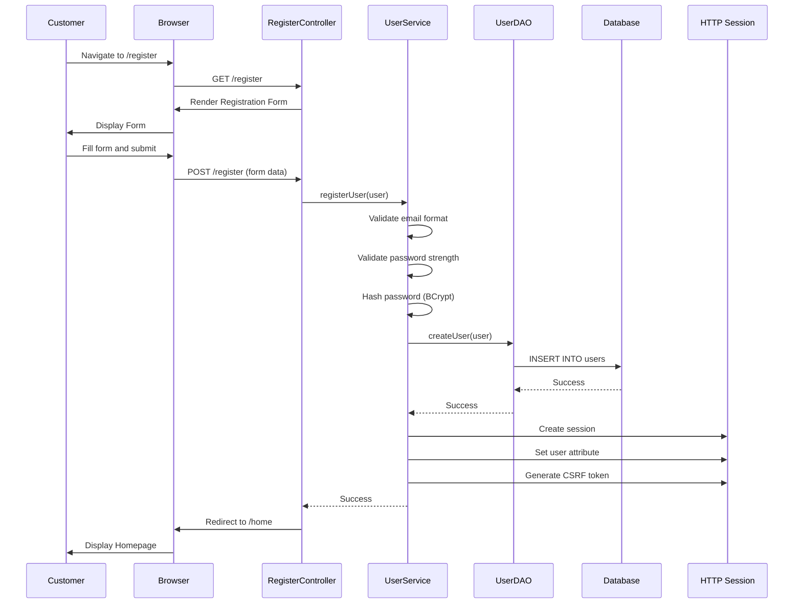

### Customer Login Workflow

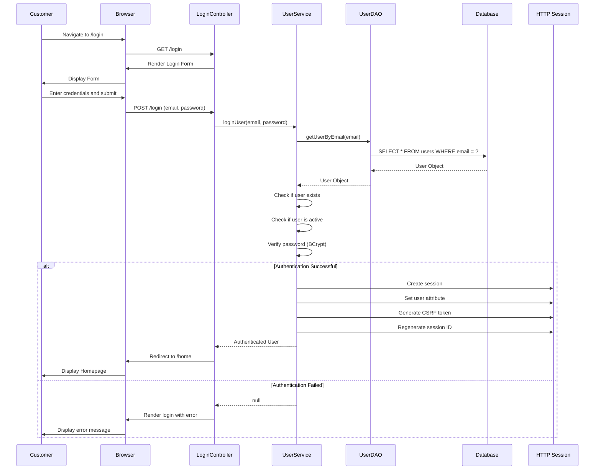

### Product Browsing Workflow

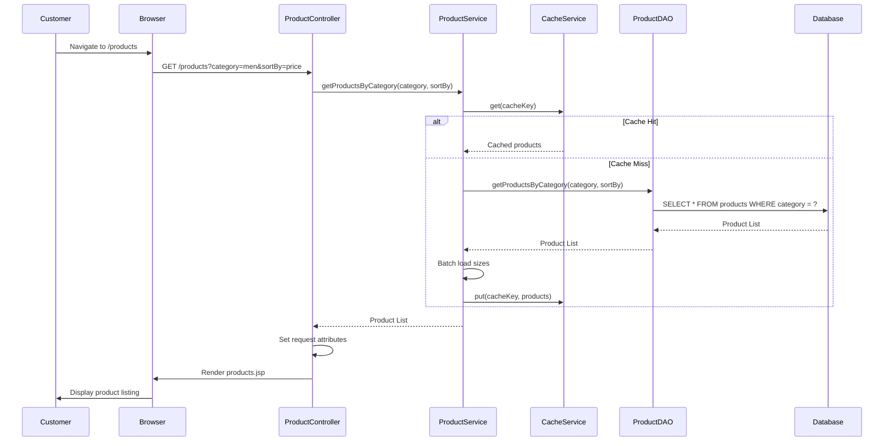

### Add to Cart Workflow

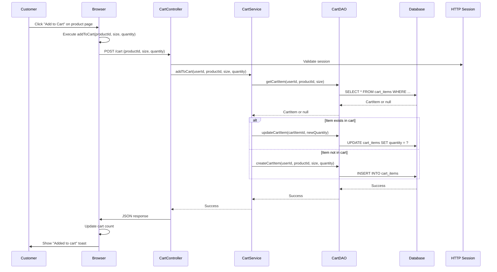

### Checkout Workflow

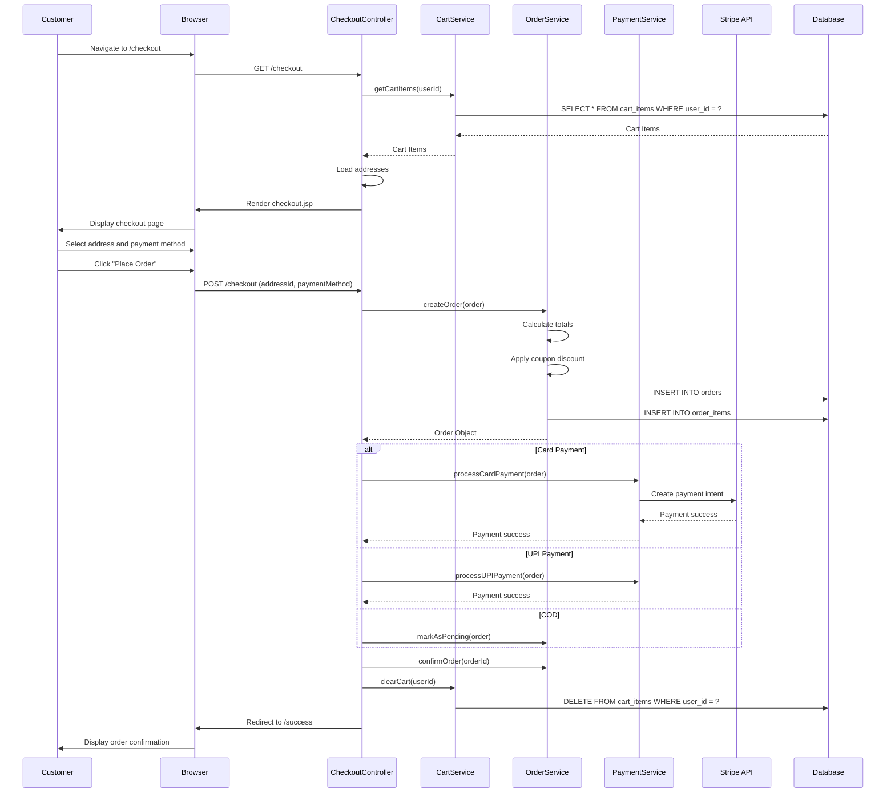

---

## Admin Workflows

### Admin Login Workflow

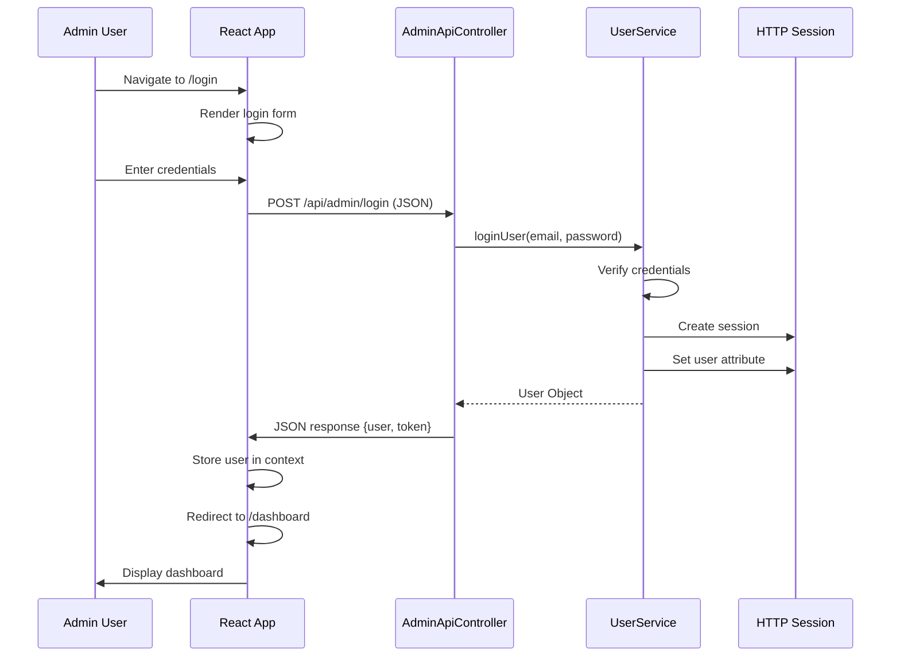

### Product Creation Workflow

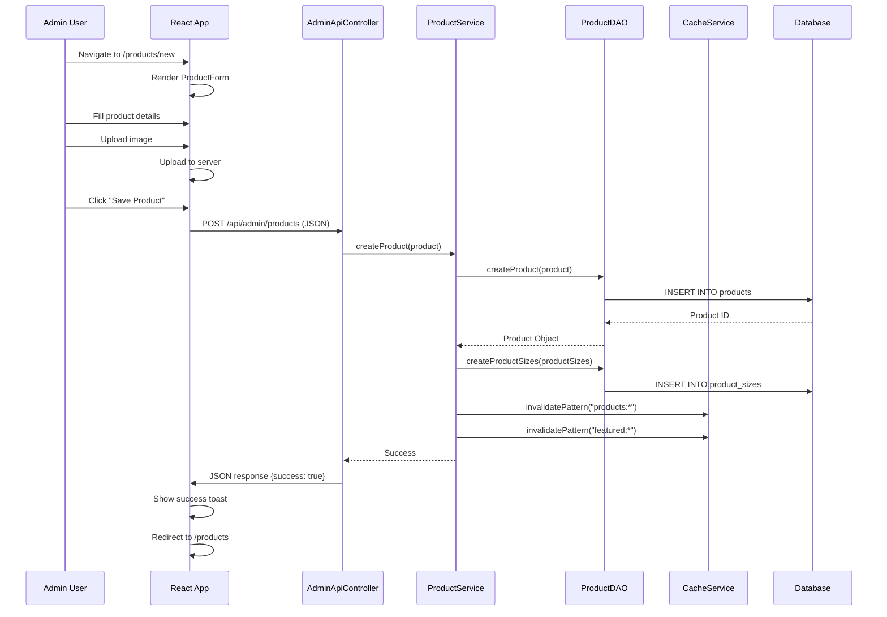

### Order Status Update Workflow

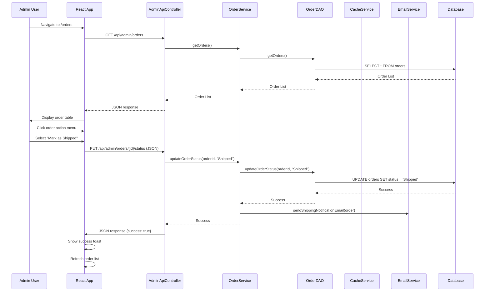

---

## System Workflows

### Request Processing Workflow

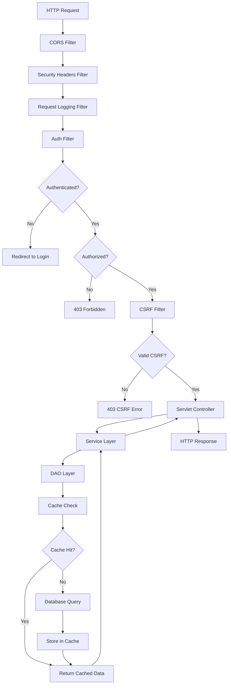

### Cache Invalidation Workflow

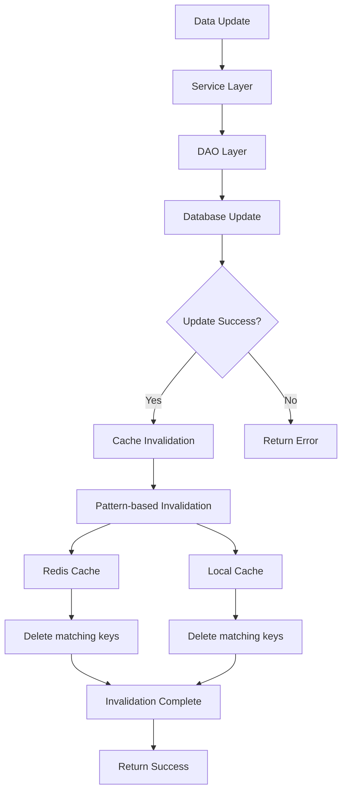

### Error Handling Workflow

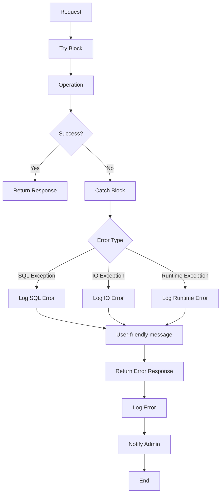

---

## Data Workflows

### Product Data Flow

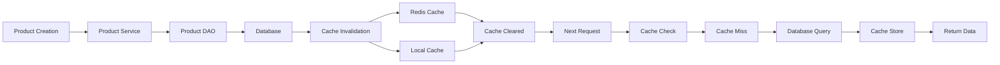

### Order Data Flow

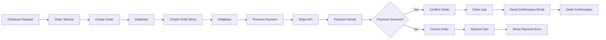

### User Session Flow

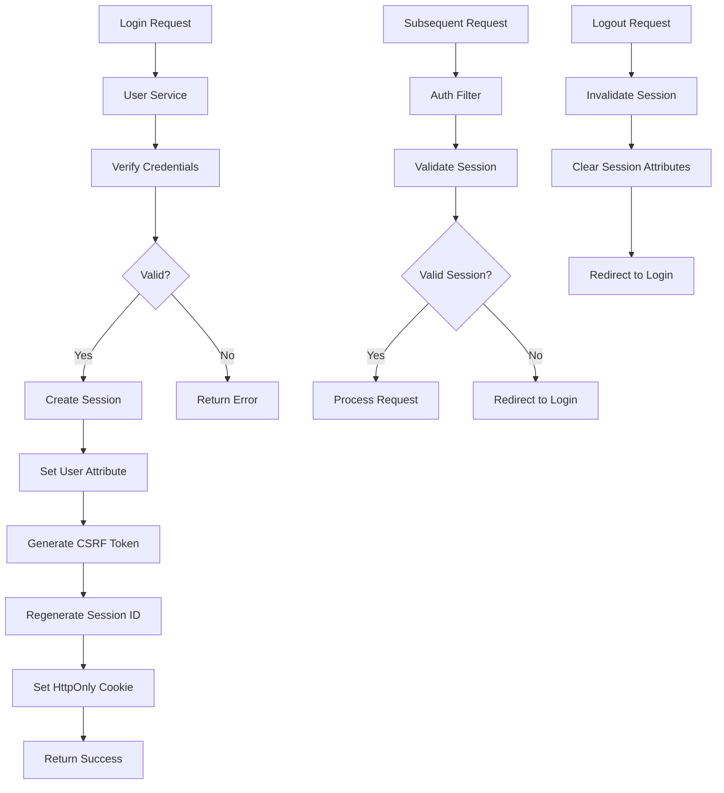

---

## Conclusion

The workflow diagrams provided in this document illustrate the key processes and data flows within the FashionStore e-commerce platform. These diagrams serve as valuable references for understanding:

- **User Workflows**: Customer registration, login, product browsing, cart management, and checkout processes
- **Admin Workflows**: Admin authentication, product management, and order processing
- **System Workflows**: Request processing, cache invalidation, and error handling
- **Data Workflows**: Product data flow, order data flow, and session management

These workflows demonstrate the system's design patterns, security measures, and data integrity mechanisms, providing a comprehensive view of how the FashionStore platform operates.
