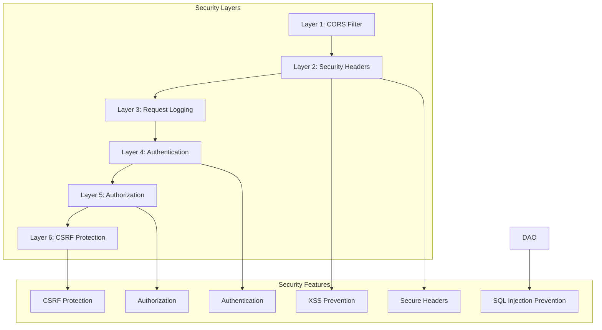
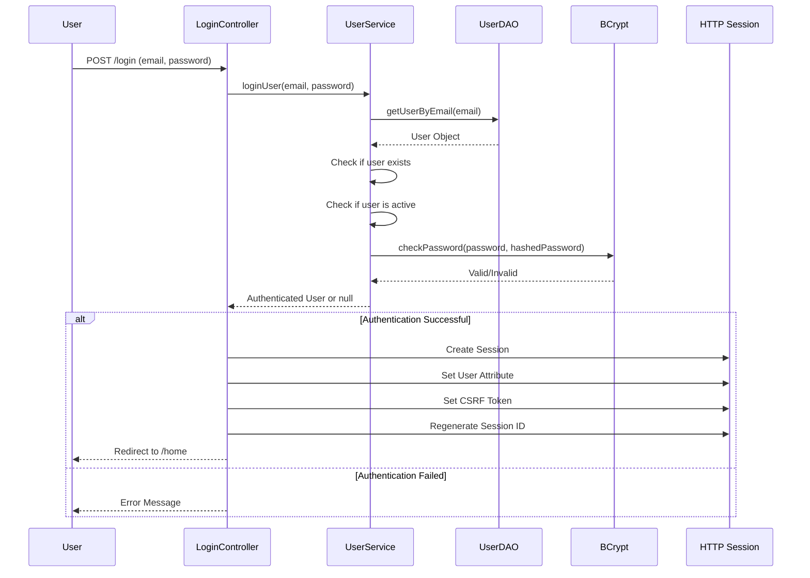
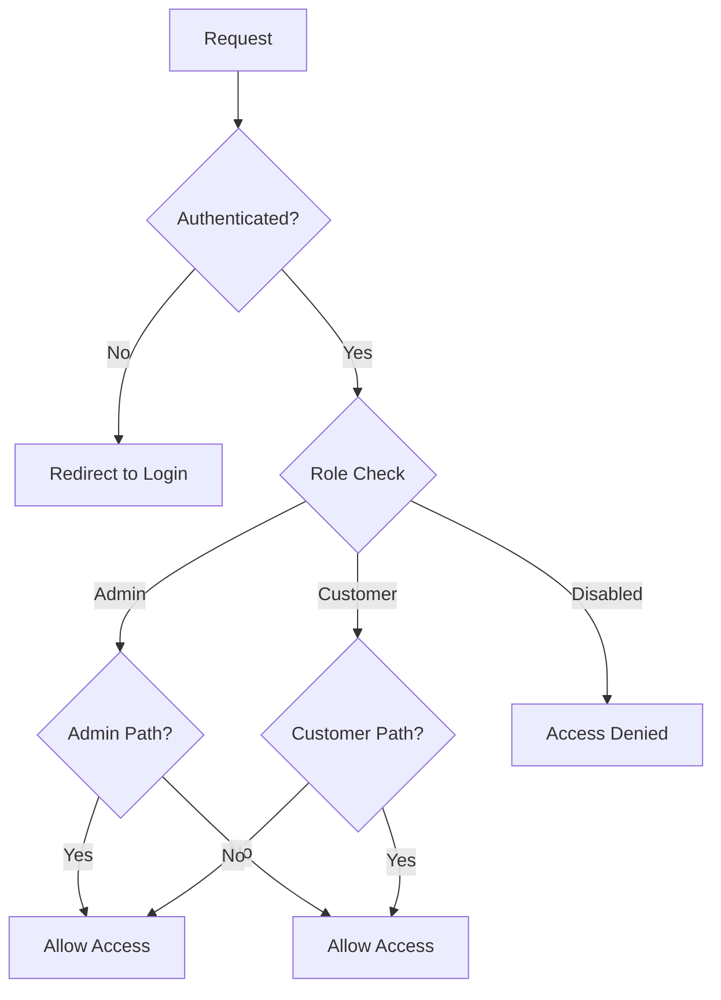

# FashionStore - Security Documentation

## Table of Contents
1. [Executive Summary](#executive-summary)
2. [Security Architecture Overview](#security-architecture-overview)
3. [Authentication System](#authentication-system)
4. [Authorization System](#authorization-system)
5. [CSRF Protection](#csrf-protection)
6. [XSS Prevention](#xss-prevention)
7. [Password Hashing](#password-hashing)
8. [Session Security](#session-security)
9. [CORS Handling](#cors-handling)
10. [Admin Protection](#admin-protection)
11. [SQL Injection Prevention](#sql-injection-prevention)
12. [Input Validation](#input-validation)
13. [Security Headers](#security-headers)
14. [Security Best Practices](#security-best-practices)

---

## Executive Summary

The FashionStore platform implements a **multi-layer security architecture** designed to protect against common web vulnerabilities and ensure the confidentiality, integrity, and availability of user data and system resources. The security strategy follows defense-in-depth principles with multiple security controls at different layers of the application.

**Key Security Features:**
- **Authentication**: BCrypt password hashing with session-based authentication
- **Authorization**: Role-based access control (RBAC) with admin/customer/disabled roles
- **CSRF Protection**: Token-based CSRF protection for state-changing requests
- **XSS Prevention**: Input sanitization, output encoding, and Content Security Policy
- **Session Security**: HttpOnly cookies, session fixation prevention, secure session management
- **SQL Injection Prevention**: Prepared statements for all database queries
- **CORS Handling**: Configured CORS policies for cross-origin requests
- **Security Headers**: Comprehensive security headers for browser protection

---

## Security Architecture Overview

### Security Layers



### Security Filter Chain

```
HTTP Request
    ↓
CORS Filter
    ↓
Security Headers Filter
    ↓
Request Logging Filter
    ↓
Auth Filter (Authentication)
    ↓
Authorization Check (Role-based)
    ↓
CSRF Filter (State-changing requests)
    ↓
Servlet Controller
    ↓
HTTP Response
```

---

## Authentication System

### Authentication Flow



### Authentication Implementation

**UserService Authentication:**
```java
public User loginUser(String email, String password) {
    User user = userDAO.getUserByEmail(email);
    
    if (user == null) {
        logger.warn("Login attempt with non-existent email: {}", email);
        return null;
    }
    
    if (!user.isActive()) {
        logger.warn("Login attempt for disabled user: {}", email);
        return null;
    }
    
    if (!passwordUtil.checkPassword(password, user.getPassword())) {
        logger.warn("Login attempt with invalid password for: {}", email);
        return null;
    }
    
    logger.info("User logged in successfully: {}", email);
    return user;
}
```

**LoginController:**
```java
@WebServlet("/login")
public class LoginController extends HttpServlet {
    private UserService userService;
    
    @Override
    protected void doPost(HttpServletRequest request, HttpServletResponse response)
            throws ServletException, IOException {
        
        String email = request.getParameter("email");
        String password = request.getParameter("password");
        
        User user = userService.loginUser(email, password);
        
        if (user != null) {
            HttpSession session = request.getSession(true);
            session.setAttribute("user", user);
            session.setAttribute("userId", user.getUserId());
            session.setAttribute("role", user.getRole());
            
            // Regenerate session ID to prevent session fixation
            request.changeSessionId();
            
            // Generate CSRF token
            String csrfToken = UUID.randomUUID().toString();
            session.setAttribute("csrfToken", csrfToken);
            
            response.sendRedirect(request.getContextPath() + "/home");
        } else {
            request.setAttribute("error", "Invalid email or password");
            request.getRequestDispatcher("/WEB-INF/views/login.jsp")
                   .forward(request, response);
        }
    }
}
```

### Admin Authentication

**Admin Registration with Secret Key:**
```java
public boolean registerAdmin(User user, String secretKey) {
    // Validate secret key
    if (!ADMIN_SECRET_KEY.equals(secretKey)) {
        logger.warn("Admin registration attempt with invalid secret key");
        return false;
    }
    
    // Check if email exists
    if (userDAO.isEmailExists(user.getEmail())) {
        logger.warn("Admin registration attempt with existing email: {}", user.getEmail());
        return false;
    }
    
    // Hash password
    String hashedPassword = passwordUtil.hashPassword(user.getPassword());
    user.setPassword(hashedPassword);
    
    // Set admin role
    user.setRole("admin");
    user.setActive(true);
    
    return userDAO.createUser(user);
}
```

---

## Authorization System

### Role-Based Access Control (RBAC)

**User Roles:**
- **admin**: Full administrative access
- **customer**: Standard customer access
- **disabled**: Account disabled, no access

**Authorization Flow:**


### Authorization Implementation

**AuthFilter Authorization:**
```java
@Override
public void doFilter(ServletRequest request, ServletResponse response, FilterChain chain)
        throws IOException, ServletException {
    
    HttpServletRequest httpRequest = (HttpServletRequest) request;
    HttpServletResponse httpResponse = (HttpServletResponse) response;
    
    String path = normalizePath(httpRequest.getRequestURI());
    
    // Allow public paths
    if (isPublicPath(path)) {
        chain.doFilter(request, response);
        return;
    }
    
    // Check authentication
    HttpSession session = httpRequest.getSession(false);
    User user = session != null ? (User) session.getAttribute("user") : null;
    
    if (user == null) {
        handleUnauthenticated(httpRequest, httpResponse);
        return;
    }
    
    // Check if account is disabled
    if (!user.isActive()) {
        handleDisabledAccount(httpRequest, httpResponse);
        return;
    }
    
    // Check admin access
    if (isAdminPath(path) && !user.isAdmin()) {
        handleUnauthorized(httpRequest, httpResponse);
        return;
    }
    
    // Allow access
    chain.doFilter(request, response);
}

private boolean isAdminPath(String path) {
    return path.startsWith("/admin") || path.startsWith("/api/admin");
}

private void handleDisabledAccount(HttpServletRequest request, HttpServletResponse response)
        throws IOException {
    
    if (isAjaxRequest(request)) {
        response.setStatus(HttpServletResponse.SC_FORBIDDEN);
        response.setContentType("application/json");
        response.getWriter().write("{\"error\":\"Account disabled\"}");
    } else {
        request.setAttribute("error", "Your account has been disabled");
        request.getRequestDispatcher("/WEB-INF/views/login.jsp")
               .forward(request, response);
    }
}
```

### User Model Role Checks

```java
public class User {
    private String role;
    
    public boolean isAdmin() {
        return "admin".equalsIgnoreCase(role);
    }
    
    public boolean isCustomer() {
        return "customer".equalsIgnoreCase(role);
    }
    
    public boolean isDisabled() {
        return "disabled".equalsIgnoreCase(role);
    }
    
    public boolean isActive() {
        return !"disabled".equalsIgnoreCase(role);
    }
}
```

---

## CSRF Protection

### CSRF Protection Strategy

**Protection Mechanism:**
1. Generate unique CSRF token per session
2. Include token in all forms and AJAX requests
3. Validate token on state-changing requests (POST, PUT, DELETE)
4. Exclude public endpoints (login, register)

### CSRF Filter Implementation

```java
@WebFilter("/*")
public class CSRFFilter implements Filter {
    private static final Logger logger = LoggerFactory.getLogger(CSRFFilter.class);
    
    private static final Set<String> CSRF_EXCLUDED_PATHS = Set.of(
        "/login", "/register", "/api/admin/login", "/api/admin/register"
    );
    
    @Override
    public void doFilter(ServletRequest request, ServletResponse response, FilterChain chain)
            throws IOException, ServletException {
        
        HttpServletRequest httpRequest = (HttpServletRequest) request;
        HttpServletResponse httpResponse = (HttpServletResponse) response;
        
        String path = httpRequest.getRequestURI();
        
        // Generate CSRF token for GET requests
        if ("GET".equalsIgnoreCase(httpRequest.getMethod())) {
            generateCSRFToken(httpRequest);
        }
        
        // Validate CSRF token for state-changing requests
        if (isStateChangingRequest(httpRequest) && !isExcludedPath(path)) {
            if (!validateCSRFToken(httpRequest)) {
                logger.warn("CSRF token validation failed for: {}", path);
                handleCSRFError(httpResponse);
                return;
            }
        }
        
        chain.doFilter(request, response);
    }
    
    private void generateCSRFToken(HttpServletRequest request) {
        HttpSession session = request.getSession(true);
        String csrfToken = (String) session.getAttribute("csrfToken");
        
        if (csrfToken == null) {
            csrfToken = UUID.randomUUID().toString();
            session.setAttribute("csrfToken", csrfToken);
        }
        
        request.setAttribute("csrfToken", csrfToken);
    }
    
    private boolean validateCSRFToken(HttpServletRequest request) {
        HttpSession session = request.getSession(false);
        if (session == null) return false;
        
        String sessionToken = (String) session.getAttribute("csrfToken");
        String requestToken = request.getHeader("X-CSRF-Token");
        
        if (requestToken == null) {
            requestToken = request.getParameter("csrfToken");
        }
        
        return sessionToken != null && sessionToken.equals(requestToken);
    }
    
    private boolean isStateChangingRequest(HttpServletRequest request) {
        String method = request.getMethod();
        return "POST".equalsIgnoreCase(method) || 
               "PUT".equalsIgnoreCase(method) || 
               "DELETE".equalsIgnoreCase(method);
    }
    
    private boolean isExcludedPath(String path) {
        return CSRF_EXCLUDED_PATHS.stream().anyMatch(path::startsWith);
    }
    
    private void handleCSRFError(HttpServletResponse response) throws IOException {
        response.setStatus(HttpServletResponse.SC_FORBIDDEN);
        response.setContentType("application/json");
        response.getWriter().write("{\"error\":\"CSRF validation failed\"}");
    }
}
```

### CSRF Token in JSP

```jsp
<%-- Include CSRF token in forms --%>
<form action="${contextPath}/cart" method="post">
    <input type="hidden" name="csrfToken" value="${csrfToken}">
    <!-- Other form fields -->
    <button type="submit">Submit</button>
</form>

<%-- Include CSRF token in JavaScript --%>
<script>
    window.csrfToken = '${csrfToken}';
</script>
```

### CSRF Token in React

```javascript
// Include CSRF token in Axios headers
api.interceptors.request.use((config) => {
    const csrfToken = document.querySelector('meta[name="csrf-token"]')?.content;
    if (csrfToken) {
        config.headers['X-CSRF-Token'] = csrfToken;
    }
    return config;
});
```

---

## XSS Prevention

### XSS Prevention Strategy

**Protection Mechanisms:**
1. **Input Sanitization**: Sanitize user input before processing
2. **Output Encoding**: Encode output to prevent script execution
3. **Content Security Policy**: Restrict script sources
4. **HttpOnly Cookies**: Prevent JavaScript access to cookies

### Input Sanitization

**ValidationUtil:**
```java
public class ValidationUtil {
    private static final Logger logger = LoggerFactory.getLogger(ValidationUtil.class);
    
    public static String sanitizeInput(String input) {
        if (input == null || input.isEmpty()) {
            return input;
        }
        
        // Remove potentially dangerous characters
        String sanitized = input.replaceAll("[<>\"'&]", "");
        
        // Trim whitespace
        sanitized = sanitized.trim();
        
        logger.debug("Sanitized input: {} -> {}", input, sanitized);
        return sanitized;
    }
    
    public static boolean isValidEmail(String email) {
        if (email == null || email.isEmpty()) {
            return false;
        }
        
        String emailRegex = "^[A-Za-z0-9+_.-]+@[A-Za-z0-9.-]+$";
        return email.matches(emailRegex);
    }
    
    public static boolean isValidPhoneNumber(String phone) {
        if (phone == null || phone.isEmpty()) {
            return false;
        }
        
        String phoneRegex = "^[0-9+\\-\\s()]{10,20}$";
        return phone.matches(phoneRegex);
    }
}
```

### Output Encoding in JSP

```jsp
<%-- Use Apache Commons Text for HTML escaping --%>
<%@ page import="org.apache.commons.text.StringEscapeUtils" %>

<%-- Escape HTML in output --%>
<h1><%= StringEscapeUtils.escapeHtml4(product.getProductName()) %></h1>
<p><%= StringEscapeUtils.escapeHtml4(product.getDescription()) %></p>

<%-- Escape JavaScript in script tags --%>
<script>
    const productName = '<%= StringEscapeUtils.escapeEcmaScript(product.getProductName()) %>';
</script>
```

### Content Security Policy

**SecurityHeadersFilter:**
```java
@Override
public void doFilter(ServletRequest request, ServletResponse response, FilterChain chain)
        throws IOException, ServletException {
    
    HttpServletResponse httpResponse = (HttpServletResponse) response;
    
    httpResponse.setHeader("Content-Security-Policy", 
        "default-src 'self'; " +
        "script-src 'self' 'unsafe-inline' https://fonts.googleapis.com; " +
        "style-src 'self' 'unsafe-inline' https://fonts.googleapis.com https://fonts.gstatic.com; " +
        "img-src 'self' data: https:; " +
        "font-src 'self' https://fonts.gstatic.com; " +
        "connect-src 'self'; " +
        "frame-ancestors 'none'; " +
        "form-action 'self';");
    
    chain.doFilter(request, response);
}
```

---

## Password Hashing

### Password Hashing with BCrypt

**PasswordUtil:**
```java
public class PasswordUtil {
    private static final Logger logger = LoggerFactory.getLogger(PasswordUtil.class);
    private static final int BCRYPT_ROUNDS = 10;
    
    /**
     * Hash a password using BCrypt
     */
    public String hashPassword(String plainPassword) {
        if (plainPassword == null || plainPassword.isEmpty()) {
            throw new IllegalArgumentException("Password cannot be null or empty");
        }
        
        String hashed = BCrypt.hashpw(plainPassword, BCrypt.gensalt(BCRYPT_ROUNDS));
        logger.debug("Password hashed successfully");
        return hashed;
    }
    
    /**
     * Check if a plain password matches a hashed password
     */
    public boolean checkPassword(String plainPassword, String hashedPassword) {
        if (plainPassword == null || hashedPassword == null) {
            return false;
        }
        
        try {
            return BCrypt.checkpw(plainPassword, hashedPassword);
        } catch (Exception e) {
            logger.error("Error checking password", e);
            return false;
        }
    }
    
    /**
     * Validate password strength
     */
    public boolean isStrongPassword(String password) {
        if (password == null || password.length() < 8) {
            return false;
        }
        
        boolean hasUppercase = !password.equals(password.toLowerCase());
        boolean hasLowercase = !password.equals(password.toUpperCase());
        boolean hasDigit = password.matches(".*\\d.*");
        boolean hasSpecial = password.matches(".*[!@#$%^&*()_+\\-=\\[\\]{};':\"\\\\|,.<>/?].*");
        
        return hasUppercase && hasLowercase && hasDigit && hasSpecial;
    }
}
```

### Password Policy

**Password Requirements:**
- Minimum 8 characters
- At least one uppercase letter
- At least one lowercase letter
- At least one digit
- At least one special character

**Password Validation in Registration:**
```java
public boolean registerUser(User user) {
    // Validate password strength
    if (!passwordUtil.isStrongPassword(user.getPassword())) {
        logger.warn("Registration attempt with weak password for: {}", user.getEmail());
        return false;
    }
    
    // Hash password
    String hashedPassword = passwordUtil.hashPassword(user.getPassword());
    user.setPassword(hashedPassword);
    
    // Set default role
    if (user.getRole() == null || user.getRole().isEmpty()) {
        user.setRole("customer");
    }
    
    // Set active status
    user.setActive(true);
    
    return userDAO.createUser(user);
}
```

---

## Session Security

### Session Configuration

**web.xml Configuration:**
```xml
<session-config>
    <session-timeout>30</session-timeout>
    <cookie-config>
        <http-only>true</http-only>
        <secure>false</secure> <!-- Set to true in production with HTTPS -->
    </cookie-config>
    <tracking-mode>COOKIE</tracking-mode>
</session-config>
```

### Session Security Measures

**1. HttpOnly Cookies**
- Prevents JavaScript access to session cookies
- Mitigates XSS attacks targeting session cookies

**2. Secure Flag (Production)**
- Ensures cookies are only sent over HTTPS
- Prevents cookie interception over HTTP

**3. Session Fixation Prevention**
```java
// Regenerate session ID after login
request.changeSessionId();
```

**4. Session Timeout**
- 30-minute inactivity timeout
- Automatic session invalidation

**5. Session Attributes**
```java
// Store user object in session
session.setAttribute("user", user);

// Store CSRF token
session.setAttribute("csrfToken", csrfToken);

// Store recently viewed products
session.setAttribute("recentlyViewed", productIds);
```

### Session Invalidation

**Logout Controller:**
```java
@WebServlet("/logout")
public class LogoutController extends HttpServlet {
    @Override
    protected void doPost(HttpServletRequest request, HttpServletResponse response)
            throws ServletException, IOException {
        
        HttpSession session = request.getSession(false);
        if (session != null) {
            logger.info("Invalidating session for user: {}", 
                session.getAttribute("user"));
            session.invalidate();
        }
        
        response.sendRedirect(request.getContextPath() + "/login");
    }
}
```

---

## CORS Handling

### CORS Configuration

**CORSFilter:**
```java
@WebFilter("/*")
public class CORSFilter implements Filter {
    @Override
    public void doFilter(ServletRequest request, ServletResponse response, FilterChain chain)
            throws IOException, ServletException {
        
        HttpServletResponse httpResponse = (HttpServletResponse) response;
        HttpServletRequest httpRequest = (HttpServletRequest) request;
        
        // Set CORS headers
        httpResponse.setHeader("Access-Control-Allow-Origin", "*");
        httpResponse.setHeader("Access-Control-Allow-Methods", "GET, POST, PUT, DELETE, OPTIONS");
        httpResponse.setHeader("Access-Control-Allow-Headers", 
            "Content-Type, Authorization, X-Requested-With, X-CSRF-Token");
        httpResponse.setHeader("Access-Control-Max-Age", "3600");
        httpResponse.setHeader("Access-Control-Allow-Credentials", "true");
        
        // Handle preflight requests
        if ("OPTIONS".equalsIgnoreCase(httpRequest.getMethod())) {
            httpResponse.setStatus(HttpServletResponse.SC_OK);
            return;
        }
        
        chain.doFilter(request, response);
    }
}
```

### CORS Best Practices

**Production CORS Configuration:**
```java
// Restrict to specific origins in production
String allowedOrigin = System.getenv("ALLOWED_ORIGIN");
if (allowedOrigin != null) {
    httpResponse.setHeader("Access-Control-Allow-Origin", allowedOrigin);
} else {
    httpResponse.setHeader("Access-Control-Allow-Origin", 
        httpRequest.getHeader("Origin"));
}
```

---

## Admin Protection

### Admin Access Control

**Admin Path Protection:**
```java
private static final Set<String> ADMIN_PATHS = Set.of(
    "/admin", "/api/admin"
);

private boolean isAdminPath(String path) {
    return ADMIN_PATHS.stream().anyMatch(path::startsWith);
}
```

**Admin Role Verification:**
```java
if (isAdminPath(path) && !user.isAdmin()) {
    handleUnauthorized(httpRequest, httpResponse);
    return;
}
```

### Admin API Protection

**AdminApiController:**
```java
@Override
protected void doGet(HttpServletRequest request, HttpServletResponse response)
        throws ServletException, IOException {
    
    // Verify admin role
    HttpSession session = request.getSession(false);
    User user = session != null ? (User) session.getAttribute("user") : null;
    
    if (user == null || !user.isAdmin()) {
        sendError(response, HttpServletResponse.SC_FORBIDDEN, "Admin access required");
        return;
    }
    
    // Process request
    String pathInfo = request.getPathInfo();
    // ... handle admin endpoints
}
```

### Admin Registration Protection

**Secret Key Validation:**
```java
public boolean registerAdmin(User user, String secretKey) {
    // Validate secret key
    if (!ADMIN_SECRET_KEY.equals(secretKey)) {
        logger.warn("Admin registration attempt with invalid secret key");
        return false;
    }
    
    // Proceed with registration
    // ...
}
```

**Environment Variable Configuration:**
```java
private static final String ADMIN_SECRET_KEY = 
    System.getenv().getOrDefault("FASHIONSTORE_ADMIN_KEY", "default-secret-key");
```

---

## SQL Injection Prevention

### Prepared Statements

**All Database Queries Use Prepared Statements:**
```java
@Override
public User getUserByEmail(String email) {
    String sql = "SELECT * FROM users WHERE email = ?";
    
    try (Connection conn = DBConnection.getConnection();
         PreparedStatement stmt = conn.prepareStatement(sql)) {
        
        stmt.setString(1, email);
        ResultSet rs = stmt.executeQuery();
        
        if (rs.next()) {
            return mapResultSetToUser(rs);
        }
        
    } catch (SQLException e) {
        logger.error("Error getting user by email: {}", email, e);
    }
    
    return null;
}
```

### Parameterized Queries

**No String Concatenation in SQL:**
```java
// BAD: Vulnerable to SQL injection
String sql = "SELECT * FROM users WHERE email = '" + email + "'";

// GOOD: Parameterized query
String sql = "SELECT * FROM users WHERE email = ?";
PreparedStatement stmt = conn.prepareStatement(sql);
stmt.setString(1, email);
```

### Input Validation

**Validate Input Before Database Operations:**
```java
public boolean createUser(User user) {
    // Validate email format
    if (!ValidationUtil.isValidEmail(user.getEmail())) {
        logger.warn("Invalid email format: {}", user.getEmail());
        return false;
    }
    
    // Sanitize input
    user.setFullName(ValidationUtil.sanitizeInput(user.getFullName()));
    user.setAddress(ValidationUtil.sanitizeInput(user.getAddress()));
    
    // Proceed with database operation
    // ...
}
```

---

## Input Validation

### Validation Strategies

**1. Client-Side Validation**
- HTML5 form validation
- JavaScript validation
- User experience improvement

**2. Server-Side Validation**
- Mandatory validation (security)
- Business rule validation
- Data integrity enforcement

**3. Input Sanitization**
- Remove dangerous characters
- Normalize input format
- Prevent injection attacks

### ValidationUtil Implementation

```java
public class ValidationUtil {
    public static String sanitizeInput(String input) {
        if (input == null || input.isEmpty()) {
            return input;
        }
        
        // Remove potentially dangerous characters
        String sanitized = input.replaceAll("[<>\"'&]", "");
        sanitized = sanitized.trim();
        
        return sanitized;
    }
    
    public static boolean isValidEmail(String email) {
        if (email == null || email.isEmpty()) {
            return false;
        }
        
        String emailRegex = "^[A-Za-z0-9+_.-]+@[A-Za-z0-9.-]+$";
        return email.matches(emailRegex);
    }
    
    public static boolean isValidPhoneNumber(String phone) {
        if (phone == null || phone.isEmpty()) {
            return false;
        }
        
        String phoneRegex = "^[0-9+\\-\\s()]{10,20}$";
        return phone.matches(phoneRegex);
    }
    
    public static boolean isValidPrice(BigDecimal price) {
        return price != null && price.compareTo(BigDecimal.ZERO) >= 0;
    }
    
    public static boolean isValidQuantity(int quantity) {
        return quantity > 0 && quantity <= 1000;
    }
}
```

---

## Security Headers

### Security Headers Implementation

**SecurityHeadersFilter:**
```java
@WebFilter("/*")
public class SecurityHeadersFilter implements Filter {
    @Override
    public void doFilter(ServletRequest request, ServletResponse response, FilterChain chain)
            throws IOException, ServletException {
        
        HttpServletResponse httpResponse = (HttpServletResponse) response;
        
        // Prevent MIME type sniffing
        httpResponse.setHeader("X-Content-Type-Options", "nosniff");
        
        // Prevent clickjacking
        httpResponse.setHeader("X-Frame-Options", "DENY");
        
        // Enable XSS filtering
        httpResponse.setHeader("X-XSS-Protection", "1; mode=block");
        
        // HSTS (HTTP Strict Transport Security)
        httpResponse.setHeader("Strict-Transport-Security", 
            "max-age=31536000; includeSubDomains");
        
        // Content Security Policy
        httpResponse.setHeader("Content-Security-Policy", 
            "default-src 'self'; " +
            "script-src 'self' 'unsafe-inline' https://fonts.googleapis.com; " +
            "style-src 'self' 'unsafe-inline' https://fonts.googleapis.com https://fonts.gstatic.com; " +
            "img-src 'self' data: https:; " +
            "font-src 'self' https://fonts.gstatic.com; " +
            "connect-src 'self'; " +
            "frame-ancestors 'none'; " +
            "form-action 'self';");
        
        // Referrer Policy
        httpResponse.setHeader("Referrer-Policy", "strict-origin-when-cross-origin");
        
        // Permissions Policy
        httpResponse.setHeader("Permissions-Policy", 
            "geolocation=(), microphone=(), camera=()");
        
        chain.doFilter(request, response);
    }
}
```

### Security Headers Explanation

| Header | Purpose | Value |
|--------|---------|-------|
| X-Content-Type-Options | Prevent MIME sniffing | nosniff |
| X-Frame-Options | Prevent clickjacking | DENY |
| X-XSS-Protection | Enable XSS filter | 1; mode=block |
| Strict-Transport-Security | Enforce HTTPS | max-age=31536000 |
| Content-Security-Policy | Restrict script sources | Custom policy |
| Referrer-Policy | Control referrer info | strict-origin |
| Permissions-Policy | Restrict browser features | geolocation=(), etc. |

---

## Security Best Practices

### 1. Defense in Depth

**Multiple Security Layers:**
- Network layer (firewall, DDoS protection)
- Application layer (authentication, authorization)
- Data layer (encryption, access controls)
- Monitoring layer (logging, alerting)

### 2. Principle of Least Privilege

**Minimal Access Rights:**
- Users only have access to what they need
- Database users have minimal permissions
- File system access is restricted

### 3. Secure by Default

**Default Secure Configuration:**
- Secure defaults for all settings
- No default passwords
- Secure session configuration

### 4. Regular Security Updates

**Dependency Management:**
- Regularly update dependencies
- Monitor security advisories
- Apply security patches promptly

### 5. Security Monitoring

**Logging and Monitoring:**
- Log all authentication attempts
- Monitor for suspicious activity
- Set up alerts for security events

### 6. Security Testing

**Testing Strategies:**
- Regular penetration testing
- Code security reviews
- Automated vulnerability scanning

### 7. Data Protection

**Data Security:**
- Encrypt sensitive data at rest
- Use HTTPS for data in transit
- Implement data retention policies

### 8. Incident Response

**Incident Response Plan:**
- Documented response procedures
- Team roles and responsibilities
- Communication plan

---

## Conclusion

The FashionStore security architecture implements a **comprehensive, multi-layer security strategy** following industry best practices:

- **Strong Authentication**: BCrypt password hashing with session-based authentication
- **Robust Authorization**: Role-based access control with admin protection
- **CSRF Protection**: Token-based CSRF protection for state-changing requests
- **XSS Prevention**: Input sanitization, output encoding, and Content Security Policy
- **Session Security**: HttpOnly cookies, session fixation prevention, secure session management
- **SQL Injection Prevention**: Prepared statements for all database queries
- **Security Headers**: Comprehensive security headers for browser protection

This security architecture provides a solid foundation for protecting the application against common web vulnerabilities while maintaining usability and performance.
